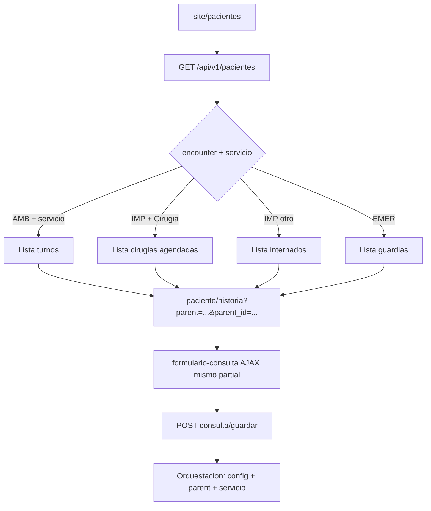

## Principio de arquitectura (entrada única)

- `**/site/pacientes**` es el **orquestador de listados**: según **encounter class** y **servicio actual** de sesión (`SiteController::actionPacientes` → `[views/pacientes/listado.php](web/frontend/views/pacientes/listado.php)` + `[GET /api/v1/pacientes](web/frontend/modules/api/v1/controllers/PacientesController.php)`) se muestra un **listado de “parents”** (turnos, internados, guardias, y **agenda quirúrgica** cuando corresponda).
- Ejemplos deseados:
  - **AMB** + servicio (ej. oftalmología) → listado de **turnos** (comportamiento actual de `kind: turnos`).
  - **IMP** + servicio **Cirugía** → listado de **pacientes/cirugías agendadas** (nuevo `kind` y renderer en el mismo listado), no el listado de camas/internados.
  - Otros **IMP** → sigue `**kind: internados`** (comportamiento actual).
- **Siempre** el siguiente paso es la **historia clínica** del paciente (`paciente/historia`).
- **Siempre** el mismo **formulario de consulta** en HC (partial + `consulta/analizar` / `consulta/guardar` según flujo actual). **No** existe carga de la CONSULTA desde `create_cirugia` ni `update_cirugia` (ni textarea ni atajo): esas vistas son **solo agenda**.
- En **POST** de la consulta, la **orquestación** de qué exige el guardado y cómo se estructura queda en **backend** (`ConsultaProcesamientoService`, `ConsultasConfiguracion`, reglas del modelo), no replicada en cada pantalla.

## Objetivo de dominio (quirófano + consulta)

- **Nivel 2 (agenda)**: persistencia en `**Cirugia`** vía API quirófano / vistas `create_cirugia` / `update_cirugia` **únicamente** (sin campos de texto clínico ni POST de consulta en esa UI).
- **Nivel 1 (informe clínico / “lo ocurrido”)**: una `**Consulta`** anclada con `**parent=CIRUGIA`** y `**parent_id=<id_cirugia>`**, persistida vía `**POST /api/v1/consulta/guardar`**.
- No depender de `Cirugia.procedimiento_descripcion` / `observaciones` para texto clínico nuevo.

## Diagrama (flujo unificado)

## Backend

1. `**Consulta` + `PARENT_CIRUGIA**` — `[web/common/models/Consulta.php](web/common/models/Consulta.php)`.
2. `**ConsultasConfiguracion::validarPermisoAtencion()**` — rama cirugía; coherente con encounter/servicio de sesión para resolver `id_configuracion`.
3. `**ConsultaProcesamientoService**` — confirmar que el cuerpo del guardado y la estructura salen del servicio + configuración según `parent` (sin ramas ad hoc en cada vista).
4. **API pacientes** — en `[PacientesController::actionIndex](web/frontend/modules/api/v1/controllers/PacientesController.php)`, hoy IMP siempre devuelve `internados`; añadir rama por **servicio actual** (ej. nombre/código de servicio Cirugía) que devuelva cirugías del efector/fecha con `id_persona`, `id` cirugía, sala, horarios, etc., y un `**kind`** nuevo consumido por `[listado.php](web/frontend/views/pacientes/listado.php)` (template + `fill*Card` análogo a turnos).
5. **Opcional** — `GET /api/v1/quirofano/cirugias/<id>/informe-clinico` si HC necesita precarga explícita de borrador/`id_consulta`.

## Frontend web

1. **Cards en `listado.php`** — al construir `data-action-url` hacia `[paciente/historia](web/frontend/controllers/PacienteController.php)`, incluir query `**parent**` y `**parent_id**` según el ítem (turno: `TURNO` + `id_turnos`; cirugía: `CIRUGIA` + `id` cirugía). Alinear con lo que ya consume `actionFormularioConsulta` (GET `parent`, `parent_id`, `id_consulta`).
2. `**[timeline.js](web/frontend/web/js/timeline.js)**` — al pedir `formulario-consulta`, anexar `**window.location.search**` para que el contexto de la URL llegue al mismo formulario.
3. `**[_formulario_consulta.php](web/frontend/views/paciente/_formulario_consulta.php)**` — hiddens o params para que el POST a API incluya `parent` / `parent_id` cuando el contexto sea cirugía.
4. `**create_cirugia` / `update_cirugia**` — **solo agenda** (datos de programación/sala/estado, etc.). **Eliminar** los textareas y la lógica asociada al informe clínico; opcionalmente un enlace a `site/pacientes` o `paciente/historia` para redactar la consulta. La CONSULTA **no** se redacta ni guarda desde quirófano.

## Móvil

- Replicar el mismo contrato: listado orquestado (equivalente a `/api/v1/pacientes` o endpoint dedicado), navegación a pantalla de HC con **mismos parámetros de contexto**, y llamadas a `**consulta/guardar`** con `parent`/`parent_id` alineados a web.

## Migración / compatibilidad

- Definir lectura/migración de `Cirugia.procedimiento_descripcion` / `observaciones` históricas.

## Criterios de aceptación

- Con sesión **IMP + Cirugía**, `site/pacientes` muestra agenda quirúrgica; al abrir un ítem, la HC carga el **mismo** formulario de consulta con contexto **cirugía**.
- `consulta/guardar` persiste `Consulta` con `parent` cirugía y la orquestación de estructura ocurre en **servicios/backend**, no en la vista de listado.
- Agenda sigue editable por flujo quirófano/API; en `create_cirugia`/`update_cirugia` **no** hay UI de consulta (textarea).
- El informe quirúrgico como CONSULTA existe **solo** tras entrar por HC con `parent=CIRUGIA`; no hay entrada paralela en formularios de cirugía.

## Archivos clave

- `[web/frontend/controllers/SiteController.php](web/frontend/controllers/SiteController.php)` (`actionPacientes`)
- `[web/frontend/views/pacientes/listado.php](web/frontend/views/pacientes/listado.php)` + `_listado_templates`
- `[web/frontend/modules/api/v1/controllers/PacientesController.php](web/frontend/modules/api/v1/controllers/PacientesController.php)`
- `[web/frontend/controllers/PacienteController.php](web/frontend/controllers/PacienteController.php)` (`actionFormularioConsulta`, `actionHistoria`)
- `[web/frontend/web/js/timeline.js](web/frontend/web/js/timeline.js)`
- `[web/common/models/Consulta.php](web/common/models/Consulta.php)`, `[web/common/models/ConsultasConfiguracion.php](web/common/models/ConsultasConfiguracion.php)`
- Servicio: `ConsultaProcesamientoService` (guardado/orquestación)
- Quirófano: API + `[views/quirofano/create_cirugia.php](web/frontend/views/quirofano/create_cirugia.php)` / `[update_cirugia.php](web/frontend/views/quirofano/update_cirugia.php)` (Nivel 2)

