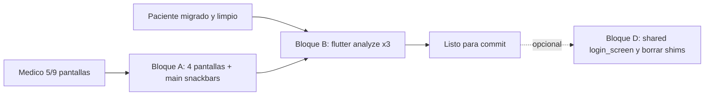

# Migración médico: cierre y verificación

> Plan operativo para terminar la migración de la app del médico al sistema de diseño "papel"
> (ver [design-system-papel.md](design-system-papel.md)).

## Contexto

- **Paciente**: 100% migrado, `flutter analyze lib/` en 0 errores. Archivos legacy
  (`paciente_theme_extensions.dart`, `lib/styles/button_styles.dart`) ya eliminados.
- **Médico**: 5/9 pantallas migradas en la sesión anterior
  (`main_screen`, `home_screen`, `appointments_screen`, `acciones_screen`,
  `configuracion_screen`).
- Quedan **4 pantallas + retoques** en `mobile/medico/lib/main.dart`
  (snackbars con `AppTheme.successColor / warningColor / dangerColor`).
- `mobile/packages/shared/lib/widgets/login_screen.dart` sigue 100% legacy
  (≈30 referencias a `AppTheme.*`), pero funciona porque los shims siguen vivos.
- `august-cirrus-482714-f4-237522942178.json` en la raíz del repo **no** está en
  `.gitignore`: es la credencial de service account de FCM y no debe entrar al repo.

## Bloque A — Terminar la app del médico (obligatorio)

Mismo patrón que las 5 pantallas ya hechas: `BioAppBar`, `BioCard`, `BioButton`,
`BioBadge`, `BioAlert`, `BioInput`, `BioSpacing`, `BioTypography`, `IntentPalette`,
`BioDivider`. Estados de turno → `UiIntent`
(`PENDIENTE=warning`, `ATENDIDO=success`, `CANCELADO=danger`, `EN_ATENCION=info`,
`EN_RESOLUCION=warning`). Sin retro-compatibilidad: cada `AppTheme.*`, `Card`,
`Chip`, `AppBar`, `ElevatedButton` se reemplaza por su equivalente Bio*.

- [`mobile/medico/lib/screens/config_wizard_screen.dart`](../medico/lib/screens/config_wizard_screen.dart)
  (544 líneas, wizard de efector/servicio/encounter).
  - Header con `BioAppBar`.
  - Un `BioCard` por paso.
  - Selección con `BioChip`.
  - Navegación: `BioButton.outlinePrimary` (atrás) y `BioButton.primary` (siguiente/finalizar).
  - Errores: `BioAlert.danger`.
- [`mobile/medico/lib/screens/patient_timeline_screen.dart`](../medico/lib/screens/patient_timeline_screen.dart)
  (527, timeline clínico).
  - Items del timeline como `BioCard.intent` con borde lateral según tipo de evento.
  - Loaders / errores con `BioAlert`.
  - FABs / CTAs con `BioButton`.
- [`mobile/medico/lib/screens/chat_consulta_screen.dart`](../medico/lib/screens/chat_consulta_screen.dart)
  (231). Mismo patrón que `chat_motivos_screen.dart` del paciente:
  - Burbujas propias con `IntentPalette.of(UiIntent.primary)`.
  - Burbujas ajenas con `tokens.paperSurfaceSunken` y borde sutil.
  - Barra inferior con `BioBorder.top`.
  - Snackbars de error con `IntentPalette.of(UiIntent.danger)`.
- [`mobile/medico/lib/screens/medico_signup_screen.dart`](../medico/lib/screens/medico_signup_screen.dart)
  (192). Misma forma que `signup_screen.dart` del paciente:
  - `BioAppBar`, `BioInput`.
  - `BioButton.primary` full width con `loading`.
  - Link a login con `BioButton.outlinePrimary` o `BioButton` neutral.
- [`mobile/medico/lib/main.dart`](../medico/lib/main.dart) — reemplazar las 4 referencias restantes:
  - `AppTheme.successColor` → `IntentPalette.of(UiIntent.success).base`
  - `AppTheme.warningColor` → `IntentPalette.of(UiIntent.warning).base`
  - `AppTheme.dangerColor`  → `IntentPalette.of(UiIntent.danger).base`
  - `AppTheme.lightTheme` (línea del `MaterialApp.theme`) se deja como está.

## Bloque B — Verificación

```powershell
cd mobile/paciente;        flutter analyze lib/
cd ../medico;              flutter analyze lib/
cd ../packages/shared;     flutter analyze lib/
```

- Paciente: debería seguir en 0 errores / 0 warnings.
- Médico: objetivo 0 errores. Aceptable: warnings `use_super_parameters` preexistentes.
- Shared: confirmar que la limpieza del paciente no rompió el paquete.

## Bloque C — Higiene del repo

Agregar al `.gitignore` raíz, antes de stagear, para evitar subir la credencial de FCM:

```gitignore
# Service accounts / credenciales locales (FCM, GCP, etc.)
*-firebase-adminsdk-*.json
august-cirrus-*.json
```

- La decisión sobre `mobile/.../google-services.json` queda a criterio del equipo
  (Android suele exigir versionarlo; si se decide no versionarlo, gitignorearlo aparte).
- No borrar ni mover el archivo `august-cirrus-482714-f4-237522942178.json` que ya
  está en la raíz: solo evitar que entre al staging.

## Bloque D — Opcional (siguiente iteración)

Identificado por si se quiere encarar en otra tanda. No se toca en este alcance
salvo indicación expresa.

- Migrar [`mobile/packages/shared/lib/widgets/login_screen.dart`](../packages/shared/lib/widgets/login_screen.dart)
  (≈30 referencias a `AppTheme.*`). Tras esto los shims
  `AppTheme.primaryColor / successColor / …` quedan sin uso.
- Borrar shims y archivos legacy:
  - [`mobile/packages/shared/lib/theme/color_palette.dart`](../packages/shared/lib/theme/color_palette.dart)
  - [`mobile/packages/shared/lib/theme/button_styles.dart`](../packages/shared/lib/theme/button_styles.dart)
  - Getters legacy de [`mobile/packages/shared/lib/theme/theme.dart`](../packages/shared/lib/theme/theme.dart)
    (`primaryColor`, `secondaryColor`, `successColor`, `warningColor`,
    `dangerColor`, `infoColor`, `dark`, `h1Style…h6Style`, `subTitleStyle`,
    `subTitleTextColor`, `backgroundColor`, `cardColor`).
  - Exports en [`mobile/packages/shared/lib/shared.dart`](../packages/shared/lib/shared.dart):
    `export 'theme/color_palette.dart';` y `export 'theme/button_styles.dart';`.
- Actualizar [`mobile/packages/shared/README.md`](../packages/shared/README.md) y
  [`design-system-papel.md`](design-system-papel.md) para reflejar que ya no hay legacy.

## Diagrama de estado



## Notas

- **Sin retro-compatibilidad**: no se mantienen estilos legacy nuevos en código migrado.
- `BioInput` usa `hint` (no `hintText`); `BioAppBar` recibe `title` como `String?`
  (no `Widget`). Ya pisamos estos baches en las pantallas anteriores.
- Si alguna pantalla del Bloque A revela un componente que falta en el shared
  (p. ej. stepper, timeline tile, file uploader "papel"), se agrega al shared con
  su entrada en [`mobile/packages/shared/lib/ui/README.md`](../packages/shared/lib/ui/README.md)
  antes de seguir.

## To-dos

- [ ] Migrar `config_wizard_screen.dart`.
- [ ] Migrar `patient_timeline_screen.dart`.
- [ ] Migrar `chat_consulta_screen.dart`.
- [ ] Migrar `medico_signup_screen.dart`.
- [ ] Reemplazar snackbars con `AppTheme.*` en `mobile/medico/lib/main.dart`.
- [ ] `flutter analyze` en paciente, medico y shared (objetivo: 0 errores).
- [ ] Agregar credenciales FCM al `.gitignore` raíz.
