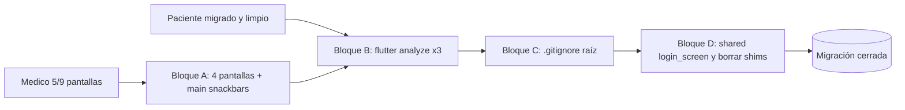

# Migración médico: cierre y verificación

> Plan operativo para terminar la migración de la app del médico al sistema de diseño "papel"
> (ver [design-system-papel.md](design-system-papel.md)).
>
> Estado: **Bloques A, B, C y D cerrados**. La migración al sistema "papel"
> está completa en paciente, médico y `packages/shared`. No quedan shims
> legacy ni archivos `color_palette.dart` / `button_styles.dart`.

## Contexto

- **Paciente**: 100% migrado, `flutter analyze lib/` en 0 errores. Archivos
  legacy (`paciente_theme_extensions.dart`, `lib/styles/button_styles.dart`)
  ya eliminados.
- **Médico**: 9/9 pantallas migradas. Las 4 que faltaban en la sesión anterior
  (`config_wizard_screen`, `patient_timeline_screen`, `chat_consulta_screen`,
  `medico_signup_screen`) ya están en `Bio*` y los snackbars de `main.dart`
  usan `IntentPalette`. La única referencia restante a `AppTheme` es
  `AppTheme.lightTheme` en `MaterialApp.theme` (intencional).
- **Shared**: `lib/widgets/login_screen.dart` ahora consume `BioAppBar`,
  `BioAlert.success`, `BioButton.primary` (`lg`, `fullWidth`, `loading`),
  `BioButton.softPrimary` (signup) y `BioButton(intent: info, variant: soft)`
  (modo visitante). Los shims `AppTheme.primaryColor / successColor / …`
  fueron eliminados junto con `theme/color_palette.dart`,
  `theme/button_styles.dart` y sus `export` en `shared.dart`.
- `.gitignore` raíz creado con reglas para credenciales (`*-firebase-adminsdk-*.json`,
  `august-cirrus-*.json`, `*-service-account-*.json`) y artefactos IDE/OS.
  La credencial `august-cirrus-…json` ya no estaba en la raíz al momento
  del cierre.

## Bloque A — Terminar la app del médico (✅ cerrado)

Mismo patrón que las 5 pantallas ya hechas: `BioAppBar`, `BioCard`, `BioButton`,
`BioBadge`, `BioAlert`, `BioInput`, `BioSpacing`, `BioTypography`, `IntentPalette`,
`BioDivider`. Estados de turno → `UiIntent`
(`PENDIENTE=warning`, `ATENDIDO=success`, `CANCELADO=danger`, `EN_ATENCION=info`,
`EN_RESOLUCION=warning`).

| Pantalla | Estado | Notas relevantes |
|----------|--------|------------------|
| [`config_wizard_screen.dart`](../medico/lib/screens/config_wizard_screen.dart) | ✅ | `BioAppBar`, indicador de paso con `IntentPalette.primary/success`, cada paso es `BioCard` clickeable. Navegación con `BioButton.primary` (`Siguiente`/`Finalizar`) + `BioButton.outlinePrimary` (`Anterior`). Errores con `BioAlert.danger`, warning de efectores incompletos con `BioAlert.warning`. |
| [`patient_timeline_screen.dart`](../medico/lib/screens/patient_timeline_screen.dart) | ✅ | Header, signos vitales, condición actual y motivos como `BioCard.intent` (primary/info/warning/success). Badges de diagnósticos con `BioBadge.info`. Barra inferior de consulta con `BioBorder.top`. |
| [`chat_consulta_screen.dart`](../medico/lib/screens/chat_consulta_screen.dart) | ✅ | Burbujas propias con `IntentPalette.of(UiIntent.primary)`, ajenas con `tokens.paperSurfaceSunken` + borde sutil. Input bar con `BioBorder.top`. Snackbar de error con `IntentPalette.danger`. |
| [`medico_signup_screen.dart`](../medico/lib/screens/medico_signup_screen.dart) | ✅ | `BioAppBar`, copy en `BioTypography`, ícono de identidad sobre `softBg` primary. CTA `BioButton.primary` `lg` `fullWidth` con `loading`. |
| [`main.dart`](../medico/lib/main.dart) | ✅ | Snackbars de la simulación: `IntentPalette.of(UiIntent.success/warning/danger).base`. `MaterialApp.theme: AppTheme.lightTheme` queda intacto. |

## Bloque B — Verificación (✅ cerrado)

```powershell
cd mobile/paciente;        flutter analyze lib/ --no-fatal-infos --no-fatal-warnings
cd ../medico;              flutter analyze lib/ --no-fatal-infos --no-fatal-warnings
cd ../packages/shared;     flutter analyze lib/ --no-fatal-infos --no-fatal-warnings
```

Resultado del último corrido:

| Paquete | Errores | Warnings | Infos preexistentes |
|---------|---------|----------|---------------------|
| paciente | 0 | 0 | 55 (avoid_print, use_super_parameters, use_build_context_synchronously, deps) |
| medico | 0 | 0 | 45 (avoid_print, use_super_parameters, deps) |
| shared | 0 | 0 | 18 → 2 tras Bloque D (deprecated_member_use de `Radio.groupValue/onChanged` en `ui_json_screen.dart`) |

Las infos quedan para limpieza dedicada; no bloquean el cierre. Tras
Bloque D, las 16 infos restantes de `shared` (MaterialStateProperty y
`withOpacity` de `button_styles.dart`) desaparecieron al borrar el archivo.

## Bloque C — Higiene del repo (✅ cerrado)

`.gitignore` raíz creado con:

```gitignore
# Service accounts / credenciales locales (FCM, GCP, etc.)
*-firebase-adminsdk-*.json
august-cirrus-*.json
*-service-account-*.json

# Editor / OS
.idea/
.vscode/
*.swp
.DS_Store
Thumbs.db
```

- La decisión sobre `mobile/.../google-services.json` queda a criterio del
  equipo (Android suele exigir versionarlo; si se decide no versionarlo,
  gitignorearlo aparte; cada subcarpeta `android/` ya tiene su `.gitignore`
  propio).
- No se borró ni movió ningún archivo de credenciales en este pasaje; solo
  se previene futura subida accidental.

## Bloque D — Limpieza final (✅ cerrado)

1. ✅ Migrado [`mobile/packages/shared/lib/widgets/login_screen.dart`](../packages/shared/lib/widgets/login_screen.dart)
   a `Bio*`. Sin referencias a `AppTheme.*` salvo `AppTheme.lightTheme`
   (que sigue siendo el único punto de entrada del theme).
2. ✅ Borrados los shims y archivos legacy:
   - `mobile/packages/shared/lib/theme/color_palette.dart`.
   - `mobile/packages/shared/lib/theme/button_styles.dart`.
   - Getters legacy en `mobile/packages/shared/lib/theme/theme.dart`
     (la sección "Compatibilidad temporal" ya no existe).
   - Exports en `mobile/packages/shared/lib/shared.dart`:
     `export 'theme/color_palette.dart';` y `export 'theme/button_styles.dart';`.
3. ✅ Borrado de yapa el archivo huérfano
   `mobile/paciente/lib/styles/color_palette.dart` (copia local de `AppColors`,
   no la importaba nadie). Su carpeta `styles/` quedó vacía y también se
   eliminó.
4. ✅ Las 16 infos preexistentes de `shared` por `MaterialStateProperty` /
   `withOpacity` en `button_styles.dart` desaparecieron al borrar el archivo.
   Quedan 2 infos en `shared` por `Radio.groupValue` / `Radio.onChanged`
   deprecados en `ui_json/ui_json_screen.dart` (no relacionado con el
   sistema "papel").
5. ✅ Actualizados `mobile/packages/shared/README.md` y
   [`design-system-papel.md`](design-system-papel.md): se reemplazó la
   sección "Compatibilidad temporal" por un bloque de estado y la tabla
   de equivalencias quedó como referencia histórica de qué reemplazó a qué.

| Paquete | Errores | Warnings | Infos tras Bloque D |
|---------|---------|----------|---------------------|
| paciente | 0 | 0 | 55 (pre-existentes) |
| medico | 0 | 0 | 45 (pre-existentes) |
| shared | 0 | 0 | **2** (antes 18; deprecaciones `Radio` en `ui_json_screen.dart`) |

## Lecciones del cierre (Bloques A–D)

- `BioButton.primary` **no expone** `iconRight` en su firma de fábrica. Si se
  necesita un icono a la derecha, usar `BioButton(intent: UiIntent.primary,
  iconRight: ...)` directamente, no el atajo.
- En SnackBars con `backgroundColor: AppTheme.warningColor` el constructor no
  puede ser `const` (los shims no eran `const`). Tras borrar los shims el
  problema desaparece porque los snackbars ahora usan helpers con
  `IntentPalette.of(...).base` (que tampoco es `const`).
- `BioCard.intent` queda muy bien para secciones de detalle clínico (header
  paciente / signos vitales / condición actual / motivos): cada uno con su
  intent distinto se lee como post-its con cinta lateral.
- En `LoginScreen` el botón "Ir al inicio (visitante)" quedó como
  `BioButton(intent: UiIntent.info, variant: BioButtonVariant.soft)` para
  diferenciarlo visualmente del CTA primario sin gritar con un filled azul.
- Limpiar shims muchas veces limpia también infos del analyzer "gratis":
  18 → 2 en `shared` sin tocar producción.

## Diagrama de estado



## Notas

- **Sin retro-compatibilidad**: no se mantienen estilos legacy nuevos en
  código migrado.
- `BioInput` usa `hint` (no `hintText`); `BioAppBar` recibe `title` como
  `String?` (no `Widget`). Para títulos no triviales usar `titleWidget`.
- Si alguna pantalla nueva revela un componente que falta en el shared
  (p. ej. stepper, timeline tile, file uploader "papel"), agregarlo al
  shared con su entrada en
  [`mobile/packages/shared/lib/ui/README.md`](../packages/shared/lib/ui/README.md)
  antes de seguir.

## To-dos

- [x] Migrar `config_wizard_screen.dart`.
- [x] Migrar `patient_timeline_screen.dart`.
- [x] Migrar `chat_consulta_screen.dart`.
- [x] Migrar `medico_signup_screen.dart`.
- [x] Reemplazar snackbars con `AppTheme.*` en `mobile/medico/lib/main.dart`.
- [x] `flutter analyze` en paciente, médico y shared (0 errores).
- [x] Agregar credenciales FCM al `.gitignore` raíz.
- [x] **(Bloque D)** Migrar `shared/lib/widgets/login_screen.dart` a `Bio*`.
- [x] **(Bloque D)** Borrar shims (`theme/color_palette.dart`,
  `theme/button_styles.dart`, getters legacy de `theme.dart`) y los
  `export` correspondientes en `shared.dart`.
- [x] **(Bloque D)** Borrar también `mobile/paciente/lib/styles/color_palette.dart`
  (huérfano) y su carpeta vacía.
- [x] **(Bloque D)** Actualizar `mobile/packages/shared/README.md` y
  `design-system-papel.md`.
