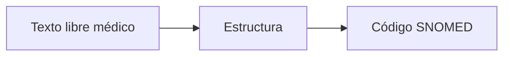
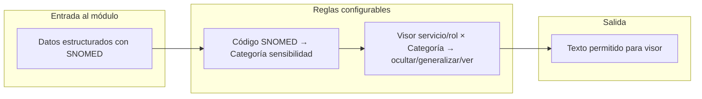

# Plan: Resumen del timeline del paciente con IA y control de sensibilidad

Documento de diseño para el módulo de resumen con IA del historial del paciente, texto base en BD, resúmenes por servicio/consulta y control de sensibilidad por códigos SNOMED.

---

## 1. Objetivos

- Generar un **resumen con IA** del historial del paciente (timeline de consultas) para que el médico vea un panorama útil sin recorrer todo el historial.
- Guardar en **base de datos** el texto base y los resúmenes; actualizarlos cuando haya nueva consulta o datos nuevos, **sin re-fetchear todas las consultas** cuando sea posible (actualización incremental).
- Ofrecer **resúmenes por necesidad**: uno por servicio (y opcionalmente uno por consulta actual), con estadísticas relevantes si aplica.
- Aplicar **restricciones de visibilidad**: ocultar o generalizar información sensible según el visor (especialidad/servicio), usando **solo códigos SNOMED y datos estructurados**, sin usar texto libre del médico ni del paciente.

---

## 2. Flujo de datos existente (contexto)

- El sistema ya transforma: **texto libre del médico → dato estructurado → código SNOMED**.
- Para sensibilidad y resumen se trabaja **solo desde el código SNOMED hacia el dato estructurado**; no se usa texto libre (ni del médico ni del paciente).

---

## 3. Arquitectura propuesta

### 3.1 Texto base del paciente

- **Una vez** (o de forma incremental) se recorre el historial del paciente y se arma un **texto estructurado** con todos los datos relevantes ya codificados: consultas con fecha, servicio, motivo (si está codificado), diagnósticos (códigos SNOMED + términos), hallazgos, antecedentes, etc.
- Este **texto base** se guarda en BD (una fila por paciente, ej. tabla `resumen_paciente_texto_base` o similar: `id_persona`, `texto_base`, `ultima_actualizacion`).
- Cuando hay **nueva consulta**: se actualiza el texto base **añadiendo** (o regenerando solo el bloque nuevo) la información de esa consulta, sin tener que volver a leer todas las consultas antiguas si ya están en el texto base.

### 3.2 Resúmenes por "necesidad"

- **Resumen por servicio**: para cada servicio en el que el paciente tuvo atención, se genera un resumen (vía IA) a partir del texto base **ya filtrado** por reglas de sensibilidad para ese servicio (ver sección 3.3). Se guarda en una tabla tipo `resumen_paciente_servicio` (`id_persona`, `id_servicio`, `resumen`, `ultima_actualizacion`).
- **Resumen para la consulta actual** (opcional): se puede generar bajo demanda (texto base filtrado + contexto "motivo de esta consulta") o precalculado al abrir/finalizar la consulta y cacheado por `(id_persona, id_consulta)`.
- La IA **solo recibe** el texto ya filtrado/generalizado para ese visor; no recibe texto libre ni datos que ese visor no puede ver.

### 3.3 Control de sensibilidad (solo SNOMED → dato estructurado)

- **Clasificación**: cada **código SNOMED** (o rango jerárquico) se mapea a una **categoría de sensibilidad** (ej. `violencia_sexual`, `salud_mental_detallada`, `consumo_sustancias`). El mapeo es **solo por código**, no por texto libre.
- **Visibilidad**: para cada **visor** (especialidad o servicio o rol) y cada categoría se define: **ocultar** (no incluir ese concepto en la vista), **generalizar** (sustituir por un concepto genérico, también por código o etiqueta), o **ver completo**.
- **Aplicación**: al armar el "texto permitido" para un visor, se recorren los **datos estructurados** del paciente; por cada ítem con código SNOMED se consulta la categoría y la regla del visor; se incluye, se generaliza o se omite. **No se usa en ningún paso el texto libre** del médico ni del paciente.

### 3.4 Configurable, reseteable, actualizable

- **Configurable**: categorías de sensibilidad, mapeo SNOMED → categoría, y matriz (visor × categoría → acción) en tablas o config editables por administración.
- **Reseteable**: al cambiar categorías o reglas se marcan como inválidos los resúmenes afectados; un proceso (job/comando) regenera los resúmenes con las nuevas reglas.
- **Actualizable**: ante nueva consulta o dato, se actualiza el texto base y, para cada visor que corresponda, se vuelve a aplicar el filtro de sensibilidad y se regenera el resumen con IA, guardando en BD.

---

## 4. Modelo de datos sugerido (alto nivel)

- **Texto base**: `resumen_paciente_texto_base` — `id_persona`, `texto_base` (texto/clob), `ultima_actualizacion`.
- **Resumen por servicio**: `resumen_paciente_servicio` — `id_persona`, `id_servicio`, `resumen`, `ultima_actualizacion`.
- **Sensibilidad**:
  - `sensibilidad_categoria` — id, nombre, descripción.
  - `sensibilidad_mapeo_snomed` — código (o raíz jerárquica) SNOMED → id_categoria.
  - `sensibilidad_regla_visor` — visor (id_servicio o id_rol), id_categoria, accion (`ver_completo` | `generalizar` | `ocultar`), opcional: código/etiqueta de generalización.

No se almacena ni se usa texto libre del médico/paciente en este módulo.

---

## 5. Integración con el código existente

- **Timeline y consultas**: reutilizar la lógica que ya arma el historial (ej. en `PersonaController::actionTimeline`) para alimentar la construcción del texto base; extender si hace falta con motivo_consulta y diagnósticos por consulta cuando estén en datos estructurados con SNOMED.
- **IA**: usar el componente existente `IAManager::consultarIA` para los prompts de resumen (texto base ya filtrado por visor).
- **Eventos que disparan actualización**: al guardar una nueva consulta (o al actualizar datos estructurados relevantes), disparar la actualización del texto base y de los resúmenes afectados (idealmente en cola/job asíncrono).

---

## 6. Orden de implementación sugerido

1. **Tablas y modelos**: texto base, resumen por servicio, categorías de sensibilidad, mapeo SNOMED → categoría, reglas visor × categoría.
2. **Servicio de texto base**: construir y actualizar el texto base por paciente (incremental al agregar consulta).
3. **Módulo de sensibilidad**: dado un texto base (o lista de ítems con SNOMED) y un visor, producir el "texto permitido" (ocultar/generalizar según reglas).
4. **Generación de resúmenes**: para cada visor (servicio), aplicar sensibilidad sobre el texto base, llamar a la IA, guardar en `resumen_paciente_servicio`.
5. **Disparadores**: al crear/actualizar consulta (y opcionalmente otros datos), encolar actualización de texto base y de resúmenes del paciente.
6. **API y UI**: endpoint(s) para leer resumen por paciente/servicio (y opcional por consulta actual); en la app móvil (`PatientTimelineScreen`) y/o web, mostrar el resumen correspondiente al servicio/consulta actual.
7. **Admin**: pantallas o comandos para mantener categorías, mapeos SNOMED y reglas de visor; y para marcar como inválidos y regenerar resúmenes (reseteable).

---

## 7. Consideraciones de seguridad y auditoría

- Registrar qué visor (servicio/rol) accedió a qué resumen y cuándo, para auditoría.
- Asegurar que en ningún flujo del módulo se envíe a la IA ni se muestre texto libre del médico o del paciente; solo datos estructurados y códigos SNOMED ya filtrados.
