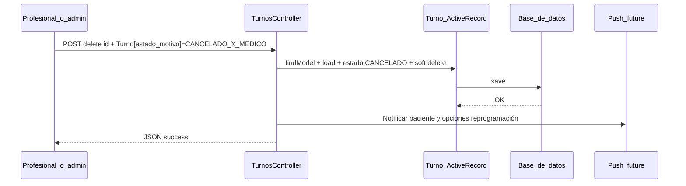

# Caso de uso: cancelación por el médico (o efector)

## Objetivo

Registrar que el turno fue **anulado por decisión del profesional o del establecimiento** (agenda, sobrecarga, feriado, cambio de cobertura, etc.), dejando trazabilidad con `CANCELADO_X_MEDICO`.

## Modelo de datos

En `Turno`:

- `estado` → `CANCELADO`.
- `estado_motivo` → `CANCELADO_X_MEDICO` (constante `Turno::ESTADO_MOTIVO_CANCELADO_MEDICO`).
- Soft delete: `deleted_at`, `deleted_by` (usuario que ejecutó la acción en el sistema).

Motivos de cancelación **no atribuibles al paciente** que también pueden figurar en el mismo desplegable de alta:

- `ERROR_CARGA` — corrección administrativa; conviene trazarlo aparte en reportes.

## Flujo actual (aplicación web — calendario)

Es el **mismo endpoint y la misma pantalla** que la cancelación “por paciente”; la diferencia es **solo el valor** de `Turno[estado_motivo]` elegido en el combo (`Turno::getMotivosCancelacion()`).

1. Selección de turno `PENDIENTE` en el modal.
2. Elección del motivo **CANCELADO POR MEDICO** en el desplegable.
3. `POST` a `turnos/delete/{id_turno}` con `Turno[estado_motivo] = CANCELADO_X_MEDICO`.
4. `TurnosController::actionDelete` persiste `CANCELADO` + soft delete.

## Reglas de negocio recomendadas

1. **Auditoría:** `deleted_by` identifica al usuario logueado; útil para distinguir quién registró la baja en el efector.
2. **Comunicación al paciente:** En este caso el paciente suele ser quien **debe ser notificado** (a diferencia de la cancelación por paciente, donde el paciente ya tomó la decisión). El canal acordado para el proyecto es **solo push** (ver roadmap global en `README.md`).
3. **Reprogramación:** Ofrecer en el mismo flujo (pantalla o push con deep link) **alternativas de horario** usando la misma lógica de disponibilidad que el resto del módulo (`TurnoSlotFinder` / agenda `Agenda_rrhh`).
4. **Hueco liberado:** Tras cancelación por médico, el slot queda libre; si no se reasigna en el acto, puede ofrecerse a **derivaciones en espera** (`ConsultaDerivaciones::ESTADO_EN_ESPERA`) del mismo servicio/efector.

## Diferencias frente a cancelación por paciente

| Aspecto | Paciente | Médico / efector |
|---------|----------|------------------|
| `estado_motivo` | `CANCELADO_X_PACIENTE` | `CANCELADO_X_MEDICO` |
| Notificación push al paciente | Opcional / confirmación | **Recomendada** (cambio unilateral) |
| Oferta de nuevos turnos | Según producto | **Recomendada** |

## Efectos colaterales deseables (roadmap)

| Efecto | Descripción |
|--------|-------------|
| Push al paciente | “Tu turno del … fue cancelado por el consultorio; podés reprogramar”. |
| Push con payload | Incluir `id_turno`, `id_servicio`, fechas y tipo `TURNO_CANCELADO_EFECTOR` para abrir flujo en la app. |
| Recordatorios | Cancelar notificaciones futuras del turno anulado. |
| Lista de espera | Notificar candidatos con slot liberado (TTL corto + confirmación transaccional). |

## Diagrama (flujo lógico)

