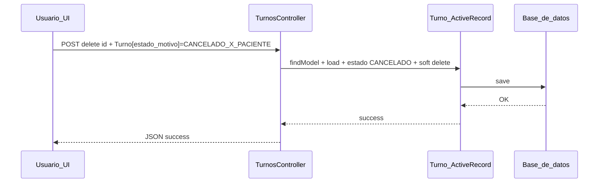

# Caso de uso: cancelación por el paciente

## Objetivo

Registrar que un turno **dejó de ser válido** porque la **decisión u omisión corresponde al paciente**, y dejar trazabilidad con el motivo estándar `CANCELADO_X_PACIENTE`.

## Modelo de datos

En `Turno`:

- `estado` → `CANCELADO`.
- `estado_motivo` → `CANCELADO_X_PACIENTE` (constante `Turno::ESTADO_MOTIVO_CANCELADO_PACIENTE`).
- Soft delete: suelen completarse `deleted_at` y `deleted_by` al persistir la cancelación desde el controlador web.

Otros motivos relacionados con el paciente en el mismo dominio (no son “cancelación voluntaria”):

- `SIN_ATENDER_X_PACIENTE` — ausencia sin cancelación previa (flujo distinto, p. ej. `Turno::NoSePresento`).

## Flujo actual (aplicación web — calendario)

1. El usuario abre el modal de turnos en el calendario y selecciona un evento con `estado-turno == PENDIENTE`.
2. Se muestran el desplegable de motivos de cancelación y el botón **Cancelar turno** (`_calendario.php`, `turnos_calendario.js`).
3. El operador elige en el combo el motivo que corresponde a **cancelación por paciente** (`CANCELADO_X_PACIENTE` aparece como etiqueta legible según `Turno::ESTADO_MOTIVO`).
4. Al confirmar, se envía `POST` AJAX a `turnos/delete/{id_turno}` con el cuerpo:
   - `Turno[estado_motivo]` = valor seleccionado (debe ser uno de los permitidos por `Turno::getMotivosCancelacion()`).
5. `TurnosController::actionDelete`:
   - carga el modelo, aplica `estado = CANCELADO`, soft delete y guarda.

> **Nota de producto:** Hoy la UI del calendario es usada en contexto de **efector / agenda**; quien dispara la acción es un usuario del sistema que **registra** que el paciente canceló. Si el paciente cancela desde **app móvil** u otro canal, el flujo debería ser equivalente a nivel de datos (mismo `estado` y `estado_motivo`), expuesto por un endpoint dedicado.

## Reglas de negocio recomendadas

1. Solo cancelar turnos en estado **PENDIENTE** (o el conjunto de estados que negocio defina como “aún modificables”).
2. Exigir **motivo** antes de enviar (la UI ya evita envío si el combo está vacío).
3. Si el turno estaba ligado a una **derivación** en espera con turno, revisar si hace falta revertir o actualizar el estado de la derivación (lógica en creación de turno en `TurnosController::actionCreate` — al cancelar puede requerir simetría según reglas del efector).

## Efectos colaterales deseables (roadmap)

| Efecto | Descripción |
|--------|-------------|
| Recordatorios | Anular envíos pendientes vinculados al `id_turno`. |
| Push al paciente | Opcional: confirmación “Tu turno del … fue cancelado” si la cancelación la inició un tercero (p. ej. administrativo). |
| Push al médico | Informar liberación del slot si aplica. |
| Hueco liberado | Ofrecer el horario a lista de espera / derivaciones `EN_ESPERA` del mismo servicio. |

## Diagrama (flujo lógico)

