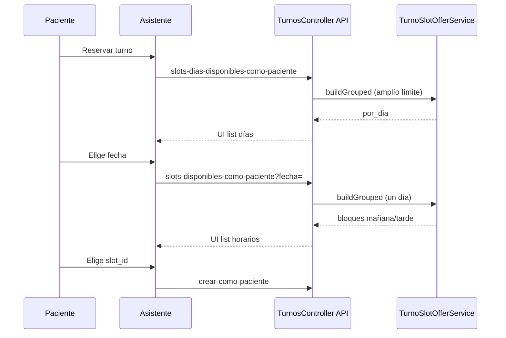

# Turnos — Diseño

## Por qué está estructurado así

### API v1 como canal de producto

La autogestión y el asistente consumen **JSON** vía `frontend/modules/api/v1`. El MVC Yii de turnos en `frontend/controllers` queda para operación legacy o calendario interno; las reglas de negocio compartidas viven en `common/components/Scheduling/Service`.

**Alternativa descartada:** duplicar lógica en controladores web y API. Se centralizó en servicios + `TurnosController` API delgado.

### Identidad PES (profesional–efector–servicio)

El cupo pertenece a un vínculo **PES**, no solo a “un médico”. La oferta de slots, la reserva y el `slot_id` referencian `id_profesional_efector_servicio`.

**Alternativa descartada:** seguir con columnas sueltas `id_rrhh` + servicio sin PES como eje. Quedó PES-first con sinónimos legacy donde aún hace falta (ver [dominio/MIGRACION_PES_ESTADO.md](../dominio/MIGRACION_PES_ESTADO.md)).

### Agenda versionada e intervalo fijo

La grilla por fecha sale de **versiones** con `vigente_desde` e **intervalo** en {15, 20, 30, 45, 60} minutos. La ocupación es por **solapamiento** de intervalo, no solo igualdad de hora.

**Alternativa descartada:** `duracion_slot_minutos` libre y agenda única sin versionar. Imposibilitaba preview de impacto y conflictos predecibles.

Detalle operativo: [flows/agenda-intervalo-y-reservas.md](./flows/agenda-intervalo-y-reservas.md).

### Oferta de turnos en dos pasos (día → horario)

El intent `turnos.crear-como-paciente` separa:

1. `select_dia` — `turnos.slots-dias-disponibles-como-paciente` → `draft.fecha_turno`
2. `select_slot` — `turnos.slots-disponibles-como-paciente` con parámetro `fecha` → `draft.slot_id`

**Alternativa descartada:** un solo listado con todos los días y franjas (demasiados ítems en UI JSON / SPA).

**Alternativa descartada:** filtros tipo “chips” solo en cliente sin paso explícito en el flow del asistente (menos claro en conversación).

La leyenda de política de cancelación se muestra **solo en el paso de horarios**, debajo de los listados.

### Corte autogestión vs operativo

Rutas y permisos distinguen **como paciente** (recurso propio) vs **para paciente** / por día en efector. El rol paciente no recibe permisos operativos.

Detalle de nombres y RBAC: [flows/API-nomenclatura-y-RBAC.md](./flows/API-nomenclatura-y-RBAC.md).

### Intents y UI JSON

Los flujos conversacionales se declaran en **YAML** (`SubIntentEngine/schemas/intents/`). Las pantallas embebibles usan **UI JSON** (`ui_type: ui_json`) servidas por la misma ruta que el catálogo `action_id`.

**Alternativa descartada:** pantallas Yii por paso del wizard en autogestión móvil.

## Decisiones con impacto en otros dominios

| Tema | Dónde se registró |
|------|------------------|
| Dominio clínico FHIR, canal API | [decisions/fhir-clinical.md](../decisions/fhir-clinical.md) |
| Tabla `turnos` como Appointment | [decisions/fhir-clinical.md](../decisions/fhir-clinical.md) |

## Diagrama — reserva autogestión (simplificado)

## Servicios principales (anclas)

| Responsabilidad | Servicio / método |
|-----------------|-------------------|
| Buscar libres | `TurnoSlotFinder::findAvailableSlots` |
| Agrupar oferta | `TurnoSlotOfferService::buildGrouped` |
| UI listas | `TurnoSlotOfferUiPresenter::buildDayPickerBlocks`, `buildSlotListBlocks` |
| Persistir reserva | `TurnoPersistService`, `TurnoReservaSlotService::aplicarCamposReserva` |
| Ciclo de vida | `TurnoLifecycleService` |
| Política cancelación app | `TurnoCancellationPolicyService` |
