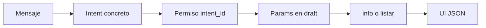

# Asistente: lecturas genéricas (DataAccess)

Cómo el chat **consulta datos** sin un YAML one-off por cada pregunta. Complementa [asistente-motores.md](./asistente-motores.md) y el ADR [autorizacion-solo-por-intents.md](../decisions/autorizacion-solo-por-intents.md). Narrativa de producto: [asistente-y-chat.md](../producto/asistente-y-chat.md).

## Idea

Una lectura es un **motor**: clasificar → comprobar **RBAC del intent** → hidratar parámetros (efector, oferta del centro, alcance, límite) → ejecutar una **query genérica** (`DataAccess.info` o `DataAccess.list`) → mostrar el resultado.

No se reintroduce `data-access.info` / `data-access.listar` como intents de lenguaje natural. Esos ids son **transporte HTTP** (`/api/info`, `/api/listar`) para el `open_ui` de intents concretos.

## Dónde vive cada YAML

| Carpeta | Uso |
|---------|-----|
| `assistant/intents/read/` | Métricas: `metric_id` + `open_ui` a `data-access.info` o `data-access.listar` |
| `assistant/intents/read/flows/` | Consultas de producto que aún no son métrica (listados paciente, tableros, wizards) |

El descubrimiento de manifiestos es **recursivo** bajo `create/`, `read/`, `update/`, `delete/` (`IntentSchemaPaths`). La categoría CRUD es el primer segmento (`read/flows/x.yaml` sigue siendo `read`).

## Cuándo crear un intent de métrica

1. La pregunta es conteo, listado o agregado con filtros declarables.
2. Hay (o se puede agregar) una entrada en `data-access-config`.
3. El YAML declara `metric_id`, `domain_operation` y params hidratados — no `if (intent_id)` en el orquestador.

Hoy en raíz de `read/`: `profesionales.conteo-efector`, `profesionales.listado-efector`, `profesionales.distribucion-servicio-efector`. No se borran: **son** las puertas NL+RBAC del motor.

## Cuándo no forzar DataAccess

- Wizard con fechas / PES / ocupación del día.
- Tablero, mapa de camas, adherencia, indicadores de agenda.
- Listados paciente con API de dominio propia (turnos, laboratorio, recetas, atenciones) hasta que exista métrica con sujeto = persona de sesión.

Candidato: `turnos.ver-ultimo-en-oferta-como-paciente` — hoy hidrata `TurnoPacienteListadoService`; debería ser `DataAccess.list` con `id_servicio`, `alcance` y `limit` cuando `Turno` tenga métrica.

## RBAC

El grant assignable es el **`intent_id` concreto**. QueryAuthorizationService autoriza la métrica vía `IntentMetricIndex` (enlace `metric_id` ↔ intent). El usuario solo obtiene lo que ese intent permite.

## Referencias de código

- `IntentSchemaPaths`, `IntentMetricIndex`, `QueryAuthorizationService`
- `common/components/Platform/Core/DataAccess/README.md`
- `common/metadata/bioenlace/assistant/intents/read/`
