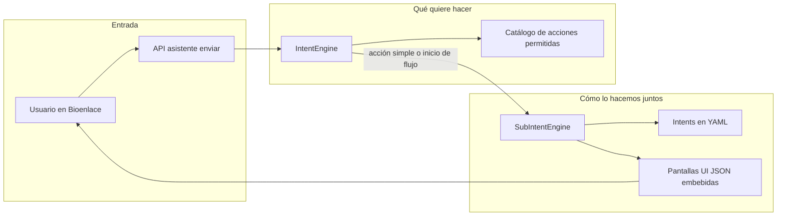
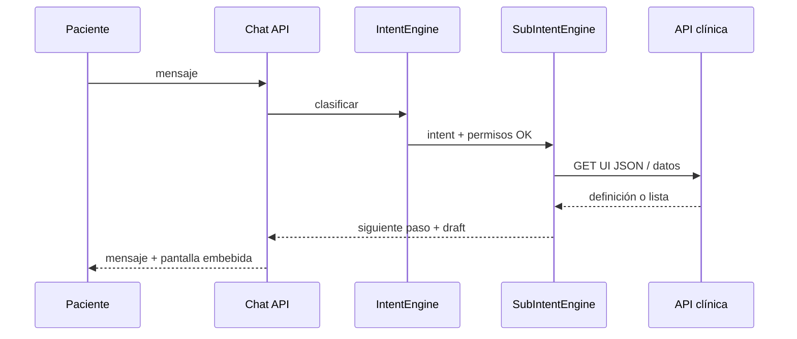

# Asistente: IntentEngine y SubIntentEngine

## Introducción

Cuando un usuario escribe en el chat de Bioenlace, el sistema no responde con una sola pieza de software. Primero **entiende qué quiere hacer** (reservar un turno, ver un resultado de laboratorio, abrir un formulario), y después **lo guía paso a paso** si hace falta elegir fechas, confirmar datos o completar pantallas.

Dos motores cooperan en esa tarea. Están en `web/common/components/Platform/Assistant/`, sobre todo en las carpetas `IntentEngine/` y `SubIntentEngine/`.

---

## Vista general

---

## IntentEngine — “¿Qué quiere el usuario?”

**Rol:** elegir la **acción** más acorde al mensaje, entre solo las opciones que el usuario **tiene permiso** de usar (por rol, efector y rutas de la API).

**Piezas principales (nombres de archivo):**

| Pieza | Ubicación aproximada | Idea en una frase |
|-------|----------------------|-------------------|
| Clasificador | `IntentEngine/IntentClassifier.php` | Primero reglas por palabras clave; si no alcanza, ayuda de IA entre candidatos permitidos |
| Catálogo de acciones | `IntentEngine/UiActionCatalog.php` y `Catalog/*` | Lista de “cosas que se pueden abrir” (turnos, laboratorio, recetas…) con rutas API asociadas |
| Orquestador del chat | `Chat/ChatOrchestrator.php` | Recibe el mensaje, arma el contexto y delega al canal operativo o informativo |

**Qué NO hace:** no lleva el paso a paso de un formulario largo; solo **dispara** la acción correcta o **entrega** el control al SubIntentEngine cuando el intent es conversacional.

**Señales que usa:**

- Texto del usuario.
- Permisos (qué rutas API puede llamar).
- Metadatos del intent (objetivo, palabras clave, restricciones) definidos en YAML bajo `common/metadata/bioenlace/assistant/intents/`.

---

## SubIntentEngine — “¿Cómo lo hacemos juntos?”

**Rol:** dentro de un intent ya elegido (por ejemplo “crear turno como paciente”), ejecutar un **guion** de pasos: mostrar una lista, pedir confirmación, abrir una pantalla, guardar datos en un “borrador” compartido entre pasos.

**Piezas principales:**

| Pieza | Ubicación aproximada | Idea en una frase |
|-------|----------------------|-------------------|
| Motor | `SubIntentEngine/SubIntentEngine.php` | Lee el YAML del intent y avanza según sub-pasos (`subintents`) |
| Definiciones | `common/metadata/bioenlace/assistant/intents/*.yaml` | Guion: textos del asistente, qué pantalla abrir, qué datos pedir |
| Manifiesto de flujo | `FlowManifest/FlowManifest.php` | Describe en runtime qué pasos tiene el flujo (sin duplicar pantallas en otro sitio) |
| Reglas de negocio | `SubIntentEngine/IntentBusinessRules.php` | Comprueba condiciones antes de entrar al flujo (por ejemplo “falta efector”) |
| Pantallas embebibles | `frontend/modules/api/v1/views/json/…` | JSON que la interfaz renderiza como formularios y listas |

**Estado entre pasos:** un **draft** (borrador) acumula lo elegido (fecha, profesional, id de encounter, etc.). El normalizador `Service/AssistantDraftNormalizer.php` unifica nombres de campos entre chat y API clínica.

**Qué NO hace:** no reemplaza la lógica de negocio de turnos, laboratorio o recetas; esas reglas viven en **servicios de dominio** detrás de la API. El SubIntentEngine **orquesta la conversación** y llama a esas APIs cuando el YAML indica `open_ui` o envío de formulario.

**Enriquecimiento del borrador (`draft_hydrator`):** algunos pasos envían solo parte de los datos (p. ej. el cliente manda `id_servicio` pero no el PES). Eso **no** se resuelve con `if (intent_id)` en el orquestador: el YAML del intent declara un `handler` registrado; `FlowDraftHydratorService` lo ejecuta en la capa de dominio antes de avanzar el flow. Ver contrato en `SubIntentEngine/schemas/SUBINTENT_CONTRACT.md`.

---

## Cómo se encadenan en un ejemplo

**Paciente:** “Quiero ver mis resultados de laboratorio”.

1. **API** `asistente/enviar` recibe el mensaje (`ChatController` → orquestador).
2. **IntentEngine** busca en el catálogo acciones de laboratorio permitidas para ese usuario, clasifica el texto y elige el intent `laboratorio.ver-resultados-como-paciente`.
3. **SubIntentEngine** carga el YAML de ese intent: primer sub-paso muestra listado (UI JSON); al elegir un informe, siguiente sub-paso abre detalle.
4. La **interfaz** muestra las pantallas JSON; los datos vienen de la API clínica de laboratorio (persistencia ya hecha por ingestas previas).

---

## Otros entrypoints (mismo stack, otro canal)

No todo pasa por el chat genérico:

| Canal | Entry | Uso |
|-------|-------|-----|
| Motivos de consulta | `Clinical/Assistant/AppointmentReasonEntry` | Conversación previa al turno |
| Captura clínica | `Clinical/Assistant/ClinicalEncounterEntry` | Analizar/guardar texto o audio del encuentro |

Comparten ideas de draft y permisos, pero **no siempre** pasan por el clasificador de intents del chat operativo.

---

## Dónde profundizar en producto

- Experiencia de usuario: [producto/asistente-y-chat.md](../producto/asistente-y-chat.md)
- Turnos, laboratorio, recetas, guardia, internación: [producto/README.md](../producto/README.md)
- Intents clínicos recientes (tabla resumida): sección “Intents de dominio” en [asistente-y-chat.md](../producto/asistente-y-chat.md)
