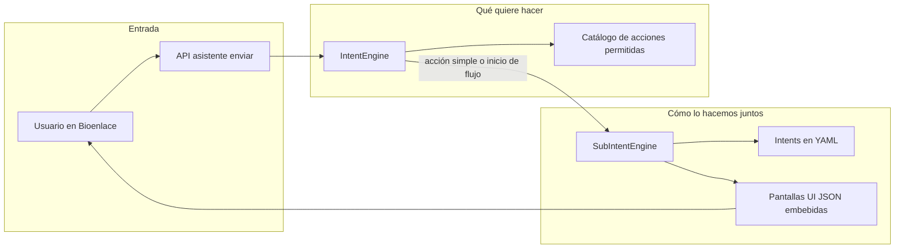
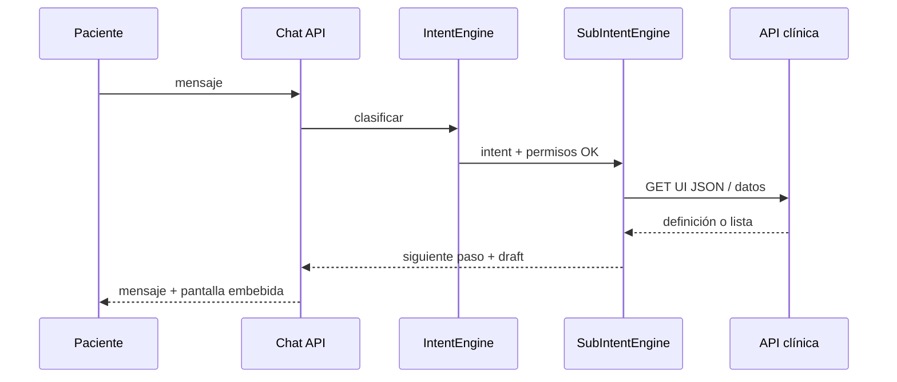

# Asistente: IntentEngine y SubIntentEngine

## Introducción

Cuando un usuario escribe en el chat de Bioenlace, el sistema no responde con una sola pieza de software. Primero **entiende qué quiere hacer** (reservar un turno, ver un resultado de laboratorio, abrir un formulario), y después **lo guía paso a paso** si hace falta elegir fechas, confirmar datos o completar pantallas.

Dos motores cooperan en esa tarea. Están en `web/common/components/Platform/Assistant/`, sobre todo en las carpetas `IntentEngine/` y `SubIntentEngine/`.

---

## Vista general

```mermaid
flowchart LR
  subgraph entrada [Entrada]
    U[Usuario en Bioenlace]
    API[API asistente enviar]
  end
  subgraph clasificacion [Qué quiere hacer]
    IE[IntentEngine]
    CAT[Catálogo de acciones permitidas]
  end
  subgraph conversacion [Cómo lo hacemos juntos]
    SIE[SubIntentEngine]
    YAML[Intents en YAML]
    UI[Pantallas UI JSON embebidas]
  end
  U --> API --> IE
  IE --> CAT
  IE -->|acción simple o inicio de flujo| SIE
  SIE --> YAML
  SIE --> UI
  UI --> U
```

---

## IntentEngine — “¿Qué quiere el usuario?”

**Rol:** elegir la **acción** más acorde al mensaje, entre solo las opciones que el usuario **tiene permiso** de usar (por rol, efector y rutas de la API).

**Piezas principales (nombres de archivo):**

| Pieza | Ubicación aproximada | Idea en una frase |
|-------|----------------------|-------------------|
| Clasificador | `IntentEngine/IntentClassifier.php` | Primero reglas por palabras clave; si no alcanza, ayuda de IA entre candidatos permitidos |
| Catálogo de acciones | `IntentEngine/UiActionCatalog.php` y `Catalog/*` | Lista de “cosas que se pueden abrir” (turnos, laboratorio, recetas…) con rutas API asociadas |
| Orquestador del chat | `Chat/ChatOrchestrator.php` | Recibe el mensaje, arma el contexto y delega al canal operativo o informativo |

**Qué NO hace:** no lleva el paso a paso de un formulario largo; solo **dispara** la acción correcta o **entrega** el control al SubIntentEngine cuando el intent es conversacional.

**Señales que usa:**

- Texto del usuario y permisos (rutas API del catálogo).
- `keywords` e `intent_semantics` del YAML de cada intent.
- Si dos intents empatan de cerca → **desambiguación** (botones); no boosts entre `intent_id`.
- Canal (síntoma → conversational, etc.): `ChatChannelPolicy` (PHP). Copy: `conversational-channel.yaml`.

---

## SubIntentEngine — “¿Cómo lo hacemos juntos?”

**Rol:** dentro de un intent ya elegido (por ejemplo “crear turno como paciente”), ejecutar un **guion** de pasos: mostrar una lista, pedir confirmación, abrir una pantalla, guardar datos en un “borrador” compartido entre pasos.

**Piezas principales:**

| Pieza | Ubicación aproximada | Idea en una frase |
|-------|----------------------|-------------------|
| Motor | `SubIntentEngine/SubIntentEngine.php` | Lee el YAML del intent y avanza según sub-pasos (`subintents`) |
| Definiciones | `common/metadata/bioenlace/assistant/intents/*.yaml` | Guion: textos del asistente, qué pantalla abrir, qué datos pedir |
| Manifiesto de flujo | `FlowManifest/FlowManifest.php` | Describe en runtime qué pasos tiene el flujo (sin duplicar pantallas en otro sitio) |
| Reglas de negocio | `SubIntentEngine/IntentBusinessRules.php` | Comprueba condiciones antes de entrar al flujo (por ejemplo “falta efector”) |
| Pantallas embebibles | `frontend/modules/api/v1/views/json/…` | JSON que la interfaz renderiza como formularios y listas |

**Estado entre pasos:** un **draft** (borrador) acumula lo elegido (fecha, profesional, id de encounter, etc.). El normalizador `Service/AssistantDraftNormalizer.php` unifica nombres de campos entre chat y API clínica.

**Qué NO hace:** no reemplaza la lógica de negocio de turnos, laboratorio o recetas; esas reglas viven en **servicios de dominio** detrás de la API. El SubIntentEngine **orquesta la conversación** y llama a esas APIs cuando el YAML indica `open_ui` o envío de formulario.

Los YAML de flujo viven en `common/metadata/bioenlace/assistant/intents/`. Contrato de pasos: `SubIntentEngine/schemas/SUBINTENT_CONTRACT.md`. Las **lecturas** (conteo, listado, último X) no son un YAML por pregunta: motor DataAccess + params hidratados + permiso del intent concreto — [asistente-lectura-data-access.md](./asistente-lectura-data-access.md).

**Enriquecimiento del borrador (`draft_hydrator`):** algunos pasos envían solo parte de los datos (p. ej. el cliente manda `id_servicio` pero no el PES). Eso **no** se resuelve con `if (intent_id)` en el orquestador: el YAML del intent declara un `handler` registrado; `FlowDraftHydratorService` lo ejecuta en la capa de dominio antes de avanzar el flow.

---

## Cómo se encadenan en un ejemplo

**Paciente:** “Quiero ver mis resultados de laboratorio”.

1. **API** `asistente/enviar` recibe el mensaje (`ChatController` → orquestador).
2. **IntentEngine** busca en el catálogo acciones de laboratorio permitidas para ese usuario, clasifica el texto y elige el intent `laboratorio.ver-resultados-como-paciente`.
3. **SubIntentEngine** carga el YAML de ese intent: primer sub-paso muestra listado (UI JSON); al elegir un informe, siguiente sub-paso abre detalle.
4. La **interfaz** muestra las pantallas JSON; los datos vienen de la API clínica de laboratorio (persistencia ya hecha por ingestas previas).

```mermaid
sequenceDiagram
  participant P as Paciente
  participant Chat as Chat API
  participant IE as IntentEngine
  participant SIE as SubIntentEngine
  participant Clin as API clínica
  P->>Chat: mensaje
  Chat->>IE: clasificar
  IE->>SIE: intent + permisos OK
  SIE->>Clin: GET UI JSON / datos
  Clin-->>SIE: definición o lista
  SIE-->>Chat: siguiente paso + draft
  Chat-->>P: mensaje + pantalla embebida
```

---

## Contenido informativo (InfoContentResolverService)

Cuando el paciente pregunta "¿qué es X?" o "¿cómo funciona X?", antes de caer a la IA conversacional o al menú de capacidades, el asistente busca en la tabla `info_content_article` un artículo editorial que matchee por keywords.

**Resolución jerárquica:** efector → provincia → producto (global). Si el centro tiene un artículo específico sobre el topic, ese prevalece.

**Integración:** `InformationalChannel` llama a `InfoContentAssistantService::tryResolveFromText()`. Si hay match visible (RBAC), responde con IA anclada a la fuente + botones CTA; si la IA falla, dump del artículo (sin inventar).

**Administración:** CRUD en `/admin/info-content-article`. Producto: [contenido-informativo.md](../producto/contenido-informativo.md).

## Sinónimos de servicios (HintServiceSynonyms)

El matcher fuzzy de hints (`HintEntityMatcher`) enriquece los terms del usuario con sinónimos de servicios de salud cuando la entidad es `servicio`. Mapa en `terminology/servicio-synonyms.yaml` (ej. "dentista" → odontología, "oculista" → oftalmología). Esto permite que "turno para mi dentista" preseleccione el servicio ODONTOLOGIA sin depender del LLM para generar el sinónimo.

---

## Otros entrypoints (mismo stack, otro canal)

WhatsApp Cloud API (paciente) entra por `whatsapp/webhook`, resuelve identidad y llama al **mismo** `ChatOrchestrator`; solo cambia el transporte y el render (texto/botones/listas). **Alcance:** mensajes iniciados por el paciente; utility proactiva **no** habilitada — [costos-api §7](../costos/costos-api.md#7-whatsapp-cloud-api-paciente). Smoke: [qa/paciente/asistente-whatsapp.md](../qa/paciente/asistente-whatsapp.md).

No todo pasa por el chat genérico:

| Canal | Entry | Uso |
|-------|-------|-----|
| Motivos de consulta | `Clinical/Assistant/AppointmentReasonEntry` | Conversación previa al turno |
| Captura clínica | `Clinical/Assistant/ClinicalEncounterEntry` | Analizar/guardar texto o audio del encuentro |

Comparten ideas de draft y permisos, pero **no siempre** pasan por el clasificador de intents del chat operativo.

---

## Dónde profundizar en producto

- Experiencia de usuario: [producto/asistente-y-chat.md](../producto/asistente-y-chat.md)
- Lecturas genéricas (DataAccess): [asistente-lectura-data-access.md](./asistente-lectura-data-access.md)
- Turnos, laboratorio, recetas, guardia, internación: [producto/README.md](../producto/README.md)
- Intents y frases paciente: [producto/asistente-y-chat.md](../producto/asistente-y-chat.md), [qa/paciente/asistente-consultas.md](../qa/paciente/asistente-consultas.md)
