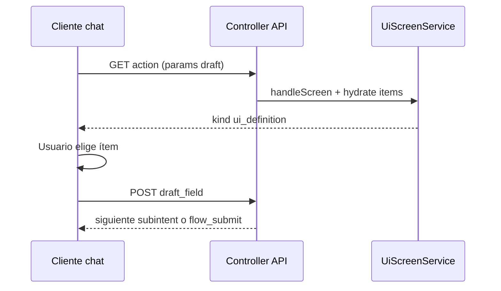

# Asistente — Diseño

## Por qué está estructurado así

### YAML como fuente de verdad del flujo

Cada producto (`turnos.crear-como-paciente`, etc.) declara `subintents` con `requires`, `provides`, `open_ui.action_id` y `flow_submit` en `SubIntentEngine/schemas/intents/*.yaml`.

**Alternativa descartada:** `ui_type: flow` estático en JSON bajo `views/json` para cada paso. Dificultaba revisión y duplicaba el grafo que ya describe el YAML.

El **flow_manifest** se genera en runtime (`FlowManifest.php`) para el cliente.

### `action_id` = ruta API (sin `v1`)

El catálogo y RBAC usan identificadores como `turnos.slots-disponibles-como-paciente` mapeados a `/api/turnos/...` en permisos webvimark.

**Alternativa descartada:** permisos por pantalla Yii (`controller/action`). No alineaba con móvil ni SPA API-first.

### UI JSON (`ui_definition`) para selección

Pasos de lista/campos usan plantillas en `frontend/modules/api/v1/views/json/{dominio}/{entidad}/{accion}.json` y datos rellenados en el controller.

**Alternativa descartada:** HTML/JS por pantalla en `views/` para flujos de paciente. Se mantiene solo donde legacy lo exige.

**Alternativa descartada:** descargar HTML del descriptor en Flutter; los clientes nativos implementan widgets propios contra el mismo JSON.

### Separación IntentEngine vs SubIntentEngine

- **IntentEngine:** clasificar qué producto quiere el usuario y si puede ejecutarlo.
- **SubIntentEngine:** ordenar pasos, draft acumulado, abrir UI, cerrar con `flow_submit`.

**Alternativa descartada:** un solo motor monolítico por pantalla.

## Contratos detallados

Los documentos en [flows/](./flows/) son la referencia de forma (envelope, bloques `list`/`fields`, draft fields, etc.). No repiten el “por qué” de este archivo.

## Diagrama — paso con `open_ui`

## Anclas

| Pieza | Clase / ruta |
|-------|----------------|
| Pantalla UI | `UiScreenService::handleScreen` |
| Plantillas JSON | `UiDefinitionTemplateManager`, `UiJsonDomain` |
| Reglas YAML | `SubIntentContract` / validación de schemas |
| Permisos | `AllowedRoutesResolver`, `ApiGhostAccessControl` |
