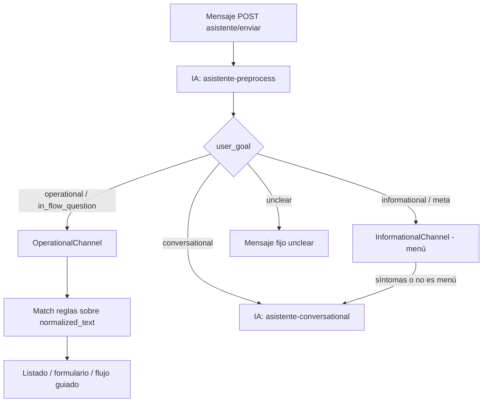

# Matriz de casos de uso × estrategias de ahorro

Documento alineado con **cómo está el código hoy** y con el diseño que describe el producto. Identificadores `IAManager`: [catálogo de IA](../../producto/catalogo-usos-ia.md). Para COGS base usar la columna **sin context caching** de [costos-api.md](../costos-api.md); la columna **con caché** es escenario favorable.

## Implícito vs explícito (Vertex / Gemini)

| | **Implícito** | **Explícito / simulado** |
|---|---------------|---------------------------|
| **Quién lo gestiona** | El **servicio de Google** (Vertex / Generative Language API) | Google (`cachedContents`) o **simulación local** (`vertex_context_cache_simulado`) |
| **Qué hacés en Bioenlace** | Estructurar el prompt (bloque estable al inicio); medir `usageMetadata.cachedContentTokenCount` | Crear/renovar caché vía API **o** `VertexContextCacheSimulator` (systemInstruction + user variable) |
| **Coste extra nuestro** | Ninguno de almacenamiento | **$/M tokens·hora** (explícito real); simulado: ninguno |
| **Estado en repo** | Activo si el prefijo se repite entre llamadas | **Simulado en local**; API explícita pendiente |

La caché **de aplicación** (Yii, `ia_cache_*`) es otra capa: evita la llamada entera; no es context caching de Google. Ver [cache-aplicacion.md](./cache-aplicacion.md).

---

## Caso 1 — Conversación con el paciente (chat asistente)

Incluye preprocess, canal operativo, conversacional, informativo.

### Flujo real (`ChatOrchestrator` → `ChatRouter`)

En **cada mensaje raíz** (sin `intent_id` en curso), **siempre** corre preprocess; después el **`user_goal`** decide si hay **otra** llamada a IA o solo reglas/UI.

Código: [`ChatRouter.php`](../../common/components/Assistant/EntryPoints/Chat/Routing/ChatRouter.php).

| `user_goal` (preprocess) | Segunda llamada IA | Contexto `IAManager` | Qué hace el producto |
|--------------------------|-------------------|----------------------|----------------------|
| *(siempre)* | **Sí** (1.ª) | `asistente-preprocess` | `normalized_text`, goal, extracciones |
| `operational`, `in_flow_question` | **No** (clasificación) | — | Match reglas → **listado**, **formulario** o **flujo guiado** (SubIntentEngine; pasos sin IA) |
| `conversational` | **Sí** (2.ª, **por mensaje**) | `asistente-conversational` | Varios ida y vuelta posibles en la consulta; cada mensaje conversacional suma preprocess + respuesta |
| `informational`, `meta` | **Casi no** | — | Menú de acciones; si hay síntomas → deriva a **conversacional** (2.ª IA) |
| `unclear` | **No** | — | Mensaje guía sin IA |

**Detalles de producción:**

1. Preprocess clasifica si el usuario quiere **operar en el sistema** o **conversar** (reglas en `ChatPreprocessService`; prompt con bloque estable al inicio).
2. **Operativo:** tras preprocess, reglas sobre `normalized_text` → puede iniciar **flujo guiado** (formularios en chat), abrir **listado** de pantallas o **formulario** directo; no hay 2.ª IA de clasificación.
3. **Conversacional:** **cada mensaje** del paciente → preprocess + respuesta automática (varios turnos posibles en la misma consulta).
4. Con `intent_id` en curso, **`SubIntentEngine`** avanza el flujo; preprocess solo si el body trae `content` nuevo.

### Llamadas IA por mensaje (para costos y caché)

| Camino típico | # llamadas Vertex | ¿Pesa en §1 costos-api? |
|---------------|-------------------|-------------------------|
| Solo preprocess → unclear | 1 | Parcial |
| Preprocess → conversacional (síntomas) | **2** | **Sí** |
| Preprocess → operativo → flujo / listado / formulario | **1** (por mensaje raíz) | **Sí** |
| Preprocess → conversacional (cada turno) | **2** | **Sí** |
| Preprocess → informational (menú) | 1 | Poco |
| Pasos de flujo operativo (`intent_id`, sin texto nuevo) | 0 | No |

### Context caching (Vertex) **por camino**

| Camino | Implícito / simulado | Notas |
|--------|----------------------|--------|
| **Preprocess** (todas las rutas) | Medio (~**40 %** input cacheado, conservador) | Instrucciones + JSON al inicio; mensaje al final (`ChatPreprocessService`) |
| **Conversational** | Medio (~**40 %**) | Prefijo fijo cacheable; **contexto clínico** semi-estable por paciente; historial acotado variable |
| **Operativo (match PHP + flujo)** | Solo preprocess | Sin 2.ª IA de clasificación |
| **Informational sin 2.ª IA** | Solo preprocess | Ahorro = no segunda llamada |

**Clasificación operativa:** keywords del YAML alimentan reglas PHP; la IA de preprocess normaliza texto y fija `user_goal`. El flujo guiado no usa IA en cada paso.

---

## Caso 2 — Motivos de consulta (lote)

`AppointmentReasonBatchService`: 1× `motivos-consulta-batch` por encounter; transcript único + **contexto clínico acotado** (`PatientAiContextBuilder`, perfil `motivos`).

| Estrategia | Aplica |
|------------|--------|
| Implícito | Poco (plantilla + contexto variable por paciente; ~**25 %** input cacheado en COGS favorable) |
| Explícito / simulado | No rentable (1 uso por consulta) |
| Caché app | Casi no |
| Producto | **Idempotencia** (`motivos_ia_processed_at`) |

---

## Caso 3 — Consulta del médico (captura clínica)

**Costo en [costos-api §4](../costos-api.md#4-captura-clínica-encounter):** cada encounter incluye **STT + IA** (dictado en audio); no hay variante solo texto en el presupuesto.

### Corrección / preparación de texto

`ProcesadorTextoMedico::prepararParaIAConFormato` → **SymSpell** + diccionario de abreviaturas **en CPU**, antes de `ConsultaProcesamientoService::analizar`.

### Análisis (`analisis-consulta`)

Prompt: categorías del servicio + **contexto clínico acotado** + texto de consulta (`PatientAiContextBuilder` + `generarPromptEspecializado`).

| Estrategia | Aplica |
|------------|--------|
| Implícito | Medio si categorías + instrucciones van **al inicio** (~**25 %** en tablas); bloque clínico variable por paciente |
| Explícito | Bloque por **servicio/configuración** si ≥2k tokens |
| Caché app | Baja (cada dictado distinto) |

---

## Caso 4 — Onboarding / tareas del día

| Estrategia | Aplica |
|------------|--------|
| Context caching | Casi irrelevante (~**25 %** favorable) |
| **Diccionario / reglas** | **Alta** para intents repetitivos |
| Preprocess + reglas sin segunda IA | Alineado con canal operativo |

---

## Resumen ejecutivo

| Caso | Contextos (`IAManager`) | Palanca principal hoy | Context caching (COGS) |
|------|-------------------------|------------------------|-------------------------|
| 1 Chat paciente | `asistente-preprocess`, `asistente-conversational` | Preprocess + 2.ª IA conversacional con **historial acotado** | ~**40 %** preprocess · ~**40 %** conversacional — [costos-api §1](../costos-api.md#1-conversación-con-el-paciente) |
| 2 Motivos | `motivos-consulta-batch`, `motivos-consulta-insights` (+ STT) | 1 lote + idempotencia; **subir modelo** solo en insights — [proveedor-modelo-tokens](./proveedor-modelo-tokens.md) | ~**25 %** favorable |
| 3 Médico | `analisis-consulta` (+ STT) | SymSpell + 1 analizar | ~**25 %** favorable |
| 4 Onboarding | mismo asistente | Reglas / FAQ | No priorizar |

**Calibración:** `ia_usage_tracking_habilitado`, `vertex_context_cache_simulado` y `por_contexto` en `AICostTracker` — ver [monitoreo.md](./monitoreo.md).
