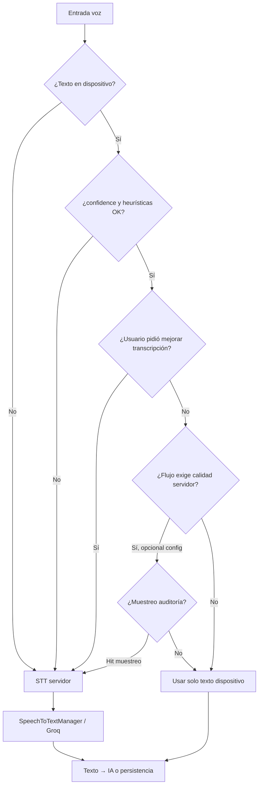

# STT (transcripción de audio)

Baseline en [costos-api.md](../costos-api.md): **Groq Whisper** ~**$0,0007/min** ⇒ **~$0,28/médico/mes** (400 min intensivas). El código usa **Hugging Face** por defecto (`SpeechToTextManager`, `hf_stt_model`); Groq aplica cuando se externaliza STT.

Hoy el flujo dominante es **audio en cliente → STT en servidor** (`POST /api/v1/audio/transcribir`, lote de motivos en `AppointmentReasonBatchService`). En web existe dictado parcial vía `frontend/web/js/speech-input.js` (`webkitSpeechRecognition`), aún no unificado con captura clínica ni motivos móviles.

## Escalera de proveedores (servidor)

| Orden | Proveedor | Cuándo | Coste orientativo |
|-------|-----------|--------|-------------------|
| 0 | **Dispositivo** (SO / Web Speech / futuro on-device) | Camino feliz; ver § STT en dispositivo | **$0** minutos facturables en Bioenlace |
| 1 | Hugging Face | Fallback servidor; volumen bajo–medio | Plan HF |
| 2 | Groq Whisper | Fallback batch, &lt; 25 MB/archivo | ~$0,0007/min |
| 3 | Together / Fireworks | Si Groq limita | ~$0,001/min |
| 4 | Deepgram | Streaming / Nova-3 | ~$0,004/min batch |
| 5 | AssemblyAI | Streaming, extras | ~$0,002/min Slim |
| 6 | Whisper GPU propia | Alto volumen solo servidor | [infra-costos.md](../infra-costos.md) |

A **5.000+ profesionales**, Groq en servidor puede costar del orden de **~$1.400/mes** (400 min/prof × 5.000). La API sigue siendo razonable frente a una GPU dedicada, pero **no es el piso**: el mínimo es **no transcribir en servidor** cuando el dispositivo entrega texto usable.

## Reducir minutos facturables (servidor)

- Transcribir **solo bajo demanda** (**50–100 %** del escenario 400 min automáticos).
- FFmpeg: silencios, compresión (ya en `SpeechToTextManager`).
- Caché por hash de audio.
- Batch async (motivos, lotes nocturnos).
- **STT en dispositivo** + fallback servidor solo si falla calidad (§ siguiente).

---

## STT en dispositivo (estrategia de reducción)

### Objetivo

El micrófono produce **texto en el cliente**; el backend recibe `texto` (y metadatos) y **omite** `SpeechToTextManager` salvo fallback. La **IA** (Gemini, etc.) sigue en servidor sobre ese texto.

### Encaje por flujo (producto)

| Flujo | § costos-api | Prioridad dispositivo | Notas |
|-------|--------------|----------------------|--------|
| Captura clínica (dictado médico) | §4 | Alta | Máximo volumen y calidad; fallback servidor para términos médicos |
| Motivos de consulta (audio paciente) | §2 caso B | Alta | Transcribir al **cerrar grabación** y guardar mensaje tipo texto; el lote no llama STT |
| Chat asistente / motivos | §1 / §2 | Media | Preferir dictado en el input frente a nota de voz |
| Onboarding | §3 | Baja | Mayormente texto |

### Contrato API (orientativo, sin implementar aquí)

- Entrada: `texto` + `stt_provenance` (`device` | `server`) + opcional `audio` (respaldo).
- Metadatos útiles para decisión y telemetría: `confidence`, `engine` (p. ej. `web_speech`, `android_speech`, `ios_speech`), `locale`, `duration_ms`, `client_edit_ratio` (si el usuario editó antes de enviar).
- Reglas de negocio en **servicio de dominio** + umbrales en **`params.php`** / catálogo — no `if` por pantalla en orquestadores.

### Escenario de costo (no en COGS base hasta validar)

Si **≥80 %** de los minutos de §2 y §4 llegan ya como texto desde dispositivo, el STT servidor del escenario intensivo (**~$0,28/prof/mes** en [costos-api](../costos-api.md)) puede bajar a **~20 %** de ese valor (solo fallbacks y audios sin transcripción). Calibrar con telemetría (§ Monitoreo).

---

## Calidad de transcripción: cómo detectarla

No hay una señal perfecta sin comparar con otra transcripción. Se combinan **señales del motor**, **heurísticas baratas**, **señales del usuario** y **muestreo** en servidor.

### 1. Confianza del motor (cuando existe)

| Fuente | Qué devuelve | Limitación |
|--------|--------------|------------|
| Web Speech API | Resultados `isFinal` / alternativas; confianza **no estandarizada** en todos los navegadores | Solo Chromium/Edge fiable para producto web |
| Android `SpeechRecognizer` | Scores en algunos OEMs | Muy variable entre fabricantes |
| iOS `SFSpeechRecognizer` | Confianza en segmentos (según versión) | Requiere permisos y red en algunos modos |
| Flutter `speech_to_text` | `confidence` en eventos (si el plugin lo expone) | Depende del backend nativo |

**Regla:** si `confidence` &lt; umbral configurado → marcar `needs_server_stt` antes de enviar, o enviar audio junto al texto para fallback en servidor.

Umbrales iniciales sugeridos (calibrar en staging): **0,75** para motivos del paciente; **0,85** para dictado médico §4.

### 2. Heurísticas en cliente (sin costo API)

Aplicar sobre el **texto final** (tras pausa o stop) y, si hay audio local, sobre **duración**:

| Señal | Condición orientativa | Interpretación |
|-------|----------------------|----------------|
| Vacío o casi vacío | `len(trim(texto)) < 3` | Fallo de reconocimiento o silencio |
| Muy poco texto para la duración | `palabras / (duration_ms/60000) < 20` (ajustable) | Audio largo con transcript corto → mala captura |
| Repetición | Misma palabra ≥4 veces seguidas | Artefacto del motor |
| Solo rellenos | Regex de fillers (`eh`, `um`, `este`) &gt; 70 % tokens | No usable para IA clínica |
| Caracteres no alfabéticos | &gt; 50 % de caracteres no letras (español) | Ruido o idioma incorrecto |
| Idioma | Detector ligero ≠ `es` esperado | Pedir servidor o cambiar locale |
| Duración mínima | `duration_ms < 500` con texto no vacío | Posible falso positivo; revisar |

Estas reglas son **baratas** y deben vivir en un componente reutilizable (web + Flutter en `mobile/packages/shared`), con umbrales en configuración.

### 3. Señales del usuario (muy fiables)

| Señal | Acción |
|-------|--------|
| Toca **«Transcribir de nuevo»** / **«Mejorar transcripción»** | Forzar STT servidor (Groq/Whisper) sobre el audio guardado |
| **Edita mucho** el texto antes de enviar | `client_edit_ratio = (levenshtein inicial vs final) / len` alto → opcional re-transcribir en servidor si ratio &gt; 0,35 |
| Elige **«Enviar solo audio»** sin aceptar preview de texto | Siempre servidor |
| Rechaza preview y vuelve a grabar | No facturar servidor hasta envío definitivo |

### 4. Señales en servidor (sin STT completo)

| Señal | Cuándo |
|-------|--------|
| Llega **solo audio**, sin `texto` | STT servidor (comportamiento actual) |
| `stt_provenance=device` pero heurísticas servidor rechazan texto | STT servidor sobre el audio adjunto |
| `texto` presente y heurísticas OK | **Saltar** STT; ir directo a IA o guardar mensaje |
| Muestreo **1–5 %** aleatorio | Transcribir en servidor y comparar con texto dispositivo (auditoría de calidad; no bloquea al usuario) |

Comparación muestreada: distancia de edición normalizada o proporción de palabras distintas; si media móvil supera umbral, subir `stt_server_fallback_rate` o bajar umbral de confianza en dispositivo para ese `engine`/plataforma.

### 5. Señales posteriores (después del envío)

| Señal | Uso |
|-------|-----|
| IA de captura devuelve «texto insuficiente» / campos vacíos con transcript corto | Marcar encounter para **re-transcripción servidor** o pedir al médico que repita |
| Preprocess clasifica `unclear` con texto que venía de voz | Correlacionar con `engine` para ajustar umbrales |
| Quejas / re-apertura del formulario con mismo audio | Métrica de calidad percibida |

---

## Cuándo usar la API de STT en servidor

Árbol de decisión (política `stt_policy` por flujo en metadata/params):

### Tabla resumen

| Situación | STT servidor |
|-----------|--------------|
| Sin texto, solo audio | **Sí** |
| Texto dispositivo + confianza/heurísticas **fallan** | **Sí** (si hay audio; si no, pedir regrabación) |
| Usuario **«Transcribir de nuevo»** | **Sí** |
| Texto dispositivo **OK** y usuario acepta preview | **No** |
| Motor dispositivo **no disponible** (navegador, permisos) | **Sí** si hay audio; si no, UI solo texto |
| Flujo configurado `server_only` (piloto calidad) | **Sí** siempre |
| Muestreo de auditoría | **Sí** en background; no bloquea UX |
| Mensaje ya `TYPE_TEXTO` en motivos | **No** (ya es el modelo deseado) |

### Prioridad de proveedor en fallback

Misma [escalera de proveedores](#escalera-de-proveedores-servidor): HF/Groq según `params.php`; para §4 (médico) preferir **modelo con mejor español clínico** en servidor aunque cueste más por minuto, porque ese volumen será **minoritario** si el dispositivo funciona bien.

---

## Implementación (captura clínica §4)

| Capa | Componente |
|------|------------|
| Servidor | `DeviceSttQualityAssessor`, `EncounterSpeechInputResolver`; integrado en `ConsultaProcesamientoService::analizar` y `AudioController::actionTranscribir` |
| Config | `stt_device` en `frontend/config/params.php` |
| Web | `frontend/web/js/encounter-capture-form.js`, `_formulario_consulta.php` (dictado + analizar + fallback) |
| Móvil médico | `shared`: `DeviceSpeechDictation`, `EncounterCaptureApi`; `PatientTimelineScreen` |

No requiere migración de BD: metadatos STT viajan en el body del request (`stt`, `audio` opcional).

## Monitoreo (pendiente de implementación)

Extender [monitoreo.md](./monitoreo.md) con métricas STT (memoria, log `stt-cost`, o BD futura):

| Métrica | Para qué |
|---------|----------|
| `stt_minutes_server` | Minutos facturables reales |
| `stt_fallback_rate` | % que pasó por servidor |
| `stt_by_provenance` | device vs server |
| `stt_by_engine` | web_speech / android / ios |
| `stt_heuristic_reject_count` | Cuántas veces el cliente pidió fallback |
| `stt_sample_wer_proxy` | En muestreo, distancia texto device vs servidor |

Objetivo operativo inicial: **`stt_fallback_rate` &lt; 15–25 %** en §4 y **&lt; 20 %** en motivos, sin subir quejas de «no entendió el dictado».

---

## Referencias

- [Groq pricing](https://groq.com/pricing)
- [costos-api.md § STT](../costos-api.md#stt)
- [motivos-consulta.md](./motivos-consulta.md)
- `SpeechToTextManager`, `AudioController::actionTranscribir`, `AppointmentReasonBatchService`
- `frontend/web/js/speech-input.js`
