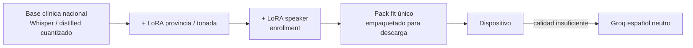
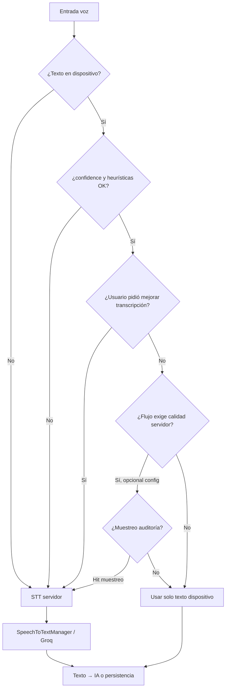

# STT (transcripción de audio)

No usa `IAManager`; en el [catálogo de IA](../../producto/catalogo-usos-ia.md) figura como capacidad aparte (captura §4, motivos §2, `audio/transcribir`).

Baseline en [costos-api.md](../costos-api.md): **Groq Whisper** ~**$0,0007/min** ⇒ bruto **~$1,40**/médico/mes en §4 (**5 min** × 400) y **~$1,12** en §2 caso B (**4 min** × 400). `SpeechToTextManager` usa **Groq por defecto** (`whisper-large-v3-turbo`) para el fallback servidor; Hugging Face queda disponible solo mediante selección explícita en configuración.

**Lista comercial:** se aplica **−30 %** al STT bruto por probabilidad on-device → add-on **audio = 0,98** (matriz / calculador). Total voz planificación **~$1,76**/prof/mes. Ver [costos-api § STT — COGS de planificación](../costos-api.md#cogs-de-planificación-lista-comercial--30--on-device).

**Videollamada post-call:** STT de la llamada está en §2/§4 (~5+~4 min con VAD), no en el add-on video (**$1,75** self-host sala/storage @ **40 %** tele). En el calculador institucional se cobra **una sola vez** (dictado no se suma encima de videollamada). Histórico Deepgram vía Daily (~$6,19 @ 30 %) ya no es lista; techo @ 80 % era **$3,50**. Detalle: [videollamadas.md](./videollamadas.md), [analisis-videollamada-self-host.md](../analisis-videollamada-self-host.md).

Hoy el flujo dominante es **audio en cliente → STT en servidor** (`POST /api/v1/audio/transcribir`, lote de motivos en `AppointmentReasonBatchService`). En web existe dictado parcial vía `frontend/web/js/speech-input.js` (`webkitSpeechRecognition`), aún no unificado con captura clínica ni motivos móviles.

## Escalera de proveedores (servidor)

| Orden | Proveedor | Cuándo | Coste orientativo |
|-------|-----------|--------|-------------------|
| 0 | **Dispositivo** (SO / Web Speech / [modelo fit on-device](./stt.md#modelo-fit-on-device-base-clínica-nacional--lora-provincia--lora-speaker)) | Camino feliz; ver § STT en dispositivo | **$0** minutos facturables en Bioenlace |
| 1 | **Groq Whisper** | Fallback servidor predeterminado, &lt; 25 MB/archivo | ~$0,0007/min |
| 2 | Hugging Face | Alternativa opt-in por configuración | Plan HF |

A **5.000+ profesionales**, Groq en servidor puede costar del orden de **~$12.600/mes** (3.600 min/prof × 5.000 en el COGS de referencia: 5 min médico + 4 min paciente). El piso de costo es **no transcribir en servidor** cuando el dispositivo entrega texto usable (§ STT en dispositivo).

Estrategia documentada: **STT en dispositivo** + fallback en servidor (Groq) por calidad. El preprocesado técnico en servidor (FFmpeg en `SpeechToTextManager`) es optimización de pipeline.

## Edge-Cloud Routing (STT)

Patrón de enrutado **edge → cloud** para voz clínica: el **edge** (teléfono, navegador) intenta producir texto localmente; la **nube** (Bioenlace API + `SpeechToTextManager` / Groq) solo entra si hace falta calidad, no hay texto, o el usuario pide re-transcribir.

| Capa | Rol |
|------|-----|
| **Edge** | Micrófono → motor local (SO, Web Speech, futuro modelo fit) → `texto` + `stt_provenance=device` |
| **Cloud** | `ClinicalSpeechInputResolver` + `DeviceSttQualityAssessor` deciden si transcribir en servidor; IA (Gemini) siempre en cloud sobre el texto final |

No es un producto aparte: es la política de costo y UX de STT. El diagrama y reglas están en [§ Cuándo usar la API de STT en servidor](#cuándo-usar-la-api-de-stt-en-servidor); la escalera [§ Escalera de proveedores](#escalera-de-proveedores-servidor) pone al dispositivo en el **orden 0**.

Índice general de palancas: [estrategias-api.md](./estrategias-api.md).

## Facturación Groq (proveedor de referencia en COGS)

Fuente: [groq.com/pricing](https://groq.com/pricing), [Speech to Text – GroqDocs](https://console.groq.com/docs/speech-to-text) (revisar cada 6–12 meses).

| Regla | Detalle | Impacto en Bioenlace |
|-------|---------|----------------------|
| Modelo COGS | **Whisper Large v3 Turbo** (`whisper-large-v3-turbo`) | Alineado a [costos-api § Precios](../costos-api.md#precios-de-referencia-mayo-2026) |
| Tarifa | **USD 0,04 por hora** de audio transcrito (~**USD 0,00067/min**; redondeo doc **~0,0007**) | §2 ~4 min + §4 ~5 min → bruto **~$2,52**/médico/mes; planificación **−30 %** → **~$1,76** |
| Unidad de cobro | Duración del audio **enviado en cada request** (no tokens) | Un archivo de 45 s factura ~45 s (salvo mínimo) |
| **Mínimo por request** | **10 s** facturados aunque el clip sea más corto | Varios audios cortos en motivos = **una llamada STT por mensaje** → cada uno cuenta ≥10 s si va a Groq |
| Tamaño máx. | Hasta **25 MB** por archivo (~30 min de audio según Groq) | Por encima del uso clínico típico (dictados cortos) |
| Otros modelos ASR | Whisper Large v3: **USD 0,111/h**; Distil-Whisper (inglés): **USD 0,02/h** | No usados en el COGS actual |

**Implicaciones de modelado:**

El [COGS](../costos-api.md#cogs-abreviatura) supone **400 consultas/médico/mes** y, cuando el audio va a Groq:

| Flujo | Minutos / encounter | Minutos / mes | USD / mes |
|-------|---------------------|---------------|-----------|
| **§4 Captura clínica** (médico) | **~5** | 2.000 | Bruto **~$1,40** · lista **~$0,98** (−30 %) |
| **§2 Motivos** caso B (paciente) | **~4** | 1.600 | Bruto **~$1,12** · planificación **~$0,78** |

Eso encaja distinto según el flujo (misma tabla en [costos-api § STT](../costos-api.md#supuesto-del-cogs-por-flujo)):

| Flujo | Qué pasa en producto | ¿Cuadra con el supuesto? |
|-------|----------------------|--------------------------|
| **§4 Captura clínica** | Audio del médico (dictado o pista de videollamada con VAD); si falla el STT local, va a Groq (~5 min de voz). | **Sí** como techo de planificación. Dictados muy cortos quedan por debajo. |
| **§2 Motivos de consulta** (caso B) | El paciente puede mandar **varias** notas de voz; el lote concatena y hace **una** llamada Groq (`transcribirLote`). | **Sí** como techo de planificación. Notas cortas ya no multiplican el mínimo de 10 s. **STT en dispositivo** evita la llamada. |

- **FFmpeg** (silencios, compresión): puede acortar el archivo enviado; Groq cobra por **duración transcrita del audio recibido**. No reemplaza el mínimo de 10 s por request.

## STT en dispositivo (estrategia de reducción)

### Objetivo

El micrófono produce **texto en el cliente**; el backend recibe `texto` (y metadatos) y **omite** `SpeechToTextManager` salvo fallback. La **IA** (Gemini, etc.) sigue en servidor sobre ese texto.

### Encaje por flujo (producto)

| Flujo | § costos-api | Prioridad dispositivo | Notas |
|-------|--------------|----------------------|--------|
| Captura clínica (dictado médico) | §4 | Alta | Implementado: dictado local + fallback servidor; ver § Implementación |
| Motivos de consulta (audio paciente) | §2 caso B | Alta | Implementado en app paciente: dictado local al grabar; si calidad OK → `TYPE_TEXTO` (sin Groq). Si no → audio al lote (`transcribirLote`). |

### Contrato API (orientativo, sin implementar aquí)

- Entrada: `texto` + `stt_provenance` (`device` | `server`) + opcional `audio` (respaldo).
- Metadatos útiles para decisión y telemetría: `confidence`, `engine` (p. ej. `web_speech`, `android_speech`, `ios_speech`), `locale`, `duration_ms`, `client_edit_ratio` (si el usuario editó antes de enviar).
- Reglas de negocio en **servicio de dominio** + umbrales en **`params.php`** / catálogo — no `if` por pantalla en orquestadores.

### Escenario de costo (planificación vs aspiracional)

| Escenario | % minutos que no van a Groq | STT efectivo vs bruto **$2,52** | Estado |
|-----------|----------------------------|--------------------------------|--------|
| **Lista comercial (vigente)** | **~30 %** on-device | **~$1,76** (−30 %); audio matriz **0,98** | En matriz / calculador |
| Conservador validado | ~50 % | ~$1,26 | Tras telemetría |
| Objetivo maduro | ~70–80 % | ~$0,50–0,76 | Modelo fit / calidad estable |

Si **≥80 %** de los minutos de §2 y §4 llegan ya como texto desde dispositivo, el STT servidor del escenario intensivo puede bajar a **~20 %** del bruto (solo fallbacks). Calibrar con telemetría (§ Monitoreo); **no** bajar el −30 % de lista hasta tener datos.

La implementación actual usa motores del **SO / Web Speech** (ver § Implementación). La evolución prevista para maximizar calidad y minimizar fallback Groq es un **modelo fit on-device** entrenado para Bioenlace (§ siguiente).

---

## Modelo fit on-device (base clínica nacional + LoRA provincia + LoRA speaker)

**Estado:** estrategia de producto / ML — **no implementada**; **fuera del COGS** hasta piloto y telemetría. Complementa (no reemplaza) Groq como red de seguridad.

### Objetivo

Que cada profesional transcriba en el **dispositivo** con un motor **ajustado a clínica argentina, tonada regional y su voz**, de modo que la mayoría de dictados §4 (y futuro §2) **no requieran** `SpeechToTextManager` / Groq. Groq sigue disponible con **español neutro** cuando el texto local no pasa calidad o el usuario pide «Transcribir de nuevo».

### Principio de producto

| Regla | Detalle |
|-------|---------|
| **Un solo artefacto por profesional** | Descarga **únicamente** el pack que le corresponde (`fit_<prof>` o provincial equivalente). **Nunca** varios modelos en paralelo ni packs con regiones ajenas. |
| **No es feature premium** | Transcripción rápida y exacta es el comportamiento por defecto esperado por el médico. |
| **Curación de datos** | Corpus clínico curado + servicio continuo de re-entrenamiento cuando el volumen y el ahorro lo justifiquen. |

### Arquitectura en capas

| Capa | Qué aporta | Datos típicos |
|------|------------|---------------|
| **Base clínica nacional** | Vocabulario médico, siglas, plantillas de consulta, español argentino general | Corpus curado multi-provincia |
| **LoRA provincia / tonada** | Acento, seseo/yeísmo, ritmo, nombres propios regionales | Dictados de la jurisdicción o cluster lingüístico |
| **LoRA speaker** | Errores sistemáticos de **ese** médico (velocidad, micrófono, términos propios) | Muestra de voz en onboarding + opt-in de audios productivos |

El **empaquetado** fusiona base + adaptadores en **un blob** listo para el cliente (o base compartida en app + patch speaker; en ambos casos el usuario vive **una** actualización de dictado, no un catálogo de regiones).

**LoRA vs fine-tuning completo:** para provincia, calidad similar si hay datos suficientes; el full fine-tune puede rascar algo más en acento fuerte. Para **hablante**, LoRA/enrollment suele ser más eficiente con pocos minutos de audio. En **MB al dispositivo**, la diferencia es pequeña si el entregable es un **monolito cuantizado** (~150–320 MB); LoRA aporta ~5–30 MB antes de fusionar.

### Asignación de tonada (secundaria)

La provincia del efector puede ser **prior** para elegir el LoRA provincial, pero la **detección de tonada es secundaria**: muestra de voz en onboarding (y señales posteriores) confirman o corrigen el `pack_id` antes de la descarga. Objetivo: un solo download correcto, no heurística solo administrativa.

Escala **24 provincias** (o clusters tonales) es viable en **catálogo servidor/CDN**; no multiplica almacenamiento en el teléfono del médico.

### Tamaño: dispositivo vs catálogo

| Inventario | Quién paga | Orden de magnitud |
|------------|------------|-------------------|
| **Dispositivo del profesional** | Usuario (una descarga activa) | **~80–350 MB** según arquitectura y cuantización (independiente de «global» vs «provincial» vs «fit personal» empaquetado) |
| **Catálogo en servidor** | Bioenlace | N variantes provinciales + builds `fit_<prof>`; costo de almacenamiento, CI de entrenamiento y versionado — **no** × N en el móvil |

### Calidad esperada por capa (orientativo, sin cifras Bioenlace hasta piloto)

| Escalera | Tipo de mejora | Nota |
|----------|---------------|------|
| Base clínica nacional vs Whisper genérico / Web Speech | **Grande** en términos médicos | Suele ser el salto más visible |
| + LoRA provincia | **Moderada** si el acento era problema; **pequeña** si el hablante ya es «estándar» y el base vio mucho de esa región | Depende del acento real, no solo del DNI provincial |
| + LoRA speaker | **Moderada a grande** para **ese** profesional | Segunda mejora más frecuente tras la base bien entrenada |

Las mejoras se miden en producto con **`stt_fallback_rate`**, **tasa de edición manual** y muestreo device vs Groq — no solo WER en laboratorio.

### Operación y mantenimiento

- **Groq:** sin mantenimiento de modelo; siempre fallback neutro.
- **Global clínico único:** mínimo pipelines (1 eval por ciclo).
- **Provincial + speaker:** ~N pipelines provinciales + generación de fits personales; automatizable; datos **desbalanceados** entre jurisdicciones al inicio — lanzar provincias cuando el volumen curado lo permita (en un despliegue regional acotado, provincial encaja desde el día 1).

Objetivo operativo alineado a § Monitoreo: **`stt_fallback_rate` &lt; 5–15 %** en §4 con modelo fit maduro (vs 15–25 % con solo Web Speech / nativo).

### Encaje técnico (cuando se implemente)

| Capa | Responsabilidad |
|------|-----------------|
| **Metadata / params** | `stt_device_pack_id`, umbrales de calidad, URL de descarga, versión del pack — sin `if` por pantalla |
| **API** | Endpoint de asignación/descarga del pack; telemetría `stt_provenance`, `stt_engine` (p. ej. `bioenlace_whisper_fit`) |
| **Cliente Flutter / web** | Runtime on-device (Whisper.cpp / equivalente), enrollment de voz, misma política de fallback que § Calidad |
| **Servicio ML** | Entrenamiento LoRA, fusión, publicación a CDN; **no** en orquestadores PHP |

La política de § [Cuándo usar la API de STT en servidor](#cuándo-usar-la-api-de-stt-en-servidor) **no cambia**: Groq entra cuando el texto local falla calidad o el usuario lo pide.

---

## Calidad de transcripción: cómo detectarla

No hay una señal perfecta sin comparar con otra transcripción. Se combinan **señales del motor**, **heurísticas baratas**, **señales del usuario** y **muestreo** en servidor.

### 1. Confianza del motor (cuando existe)

| Fuente | Qué devuelve | Limitación |
|--------|--------------|------------|
| Web Speech API | Resultados `isFinal` / alternativas; confianza **no estandarizada** en todos los navegadores | Solo Chromium/Edge fiable para producto web |
| Android `SpeechRecognizer` | Scores en algunos OEMs | Muy variable entre fabricantes |
| iOS `SFSpeechRecognizer` | Confianza en segmentos (según versión) | Requiere permisos y red en algunos modos |
| Flutter `speech_to_text` | `confidence` en eventos (si el plugin lo expone) | Depende del backend nativo |

**Regla:** si `confidence` &lt; umbral configurado → marcar `needs_server_stt` antes de enviar, o enviar audio junto al texto para fallback en servidor.

Umbrales iniciales sugeridos (calibrar en staging): **0,75** para motivos del paciente; **0,85** para dictado médico §4.

### 2. Heurísticas en cliente (sin costo API)

Aplicar sobre el **texto final** (tras pausa o stop) y, si hay audio local, sobre **duración**:

| Señal | Condición orientativa | Interpretación |
|-------|----------------------|----------------|
| Vacío o casi vacío | `len(trim(texto)) < 3` | Fallo de reconocimiento o silencio |
| Muy poco texto para la duración | `palabras / (duration_ms/60000) < 20` (ajustable) | Audio largo con transcript corto → mala captura |
| Repetición | Misma palabra ≥4 veces seguidas | Artefacto del motor |
| Solo rellenos | Regex de fillers (`eh`, `um`, `este`) &gt; 70 % tokens | No usable para IA clínica |
| Caracteres no alfabéticos | &gt; 50 % de caracteres no letras (español) | Ruido o idioma incorrecto |
| Idioma | Detector ligero ≠ `es` esperado | Pedir servidor o cambiar locale |
| Duración mínima | `duration_ms < 500` con texto no vacío | Posible falso positivo; revisar |

Estas reglas son **baratas** y deben vivir en un componente reutilizable (web + Flutter en `mobile/packages/shared`), con umbrales en configuración.

### 3. Señales del usuario (muy fiables)

| Señal | Acción |
|-------|--------|
| Toca **«Transcribir de nuevo»** / **«Mejorar transcripción»** | Forzar STT servidor (Groq/Whisper) sobre el audio guardado |
| **Edita mucho** el texto antes de enviar | `client_edit_ratio = (levenshtein inicial vs final) / len` alto → opcional re-transcribir en servidor si ratio &gt; 0,35 |
| Elige **«Enviar solo audio»** sin aceptar preview de texto | Siempre servidor |
| Rechaza preview y vuelve a grabar | Descartar transcript previo; nueva captura |

### 4. Señales en servidor (sin STT completo)

| Señal | Cuándo |
|-------|--------|
| Llega **solo audio**, sin `texto` | STT servidor (comportamiento actual) |
| `stt_provenance=device` pero heurísticas servidor rechazan texto | STT servidor sobre el audio adjunto |
| `texto` presente y heurísticas OK | **Saltar** STT; ir directo a IA o guardar mensaje |
| Muestreo **1–5 %** aleatorio | Transcribir en servidor y comparar con texto dispositivo (auditoría de calidad; no bloquea al usuario) |

Comparación muestreada: distancia de edición normalizada o proporción de palabras distintas; si media móvil supera umbral, subir `stt_server_fallback_rate` o bajar umbral de confianza en dispositivo para ese `engine`/plataforma.

### 5. Señales posteriores (después del envío)

| Señal | Uso |
|-------|-----|
| IA de captura devuelve «texto insuficiente» / campos vacíos con transcript corto | Marcar encounter para **re-transcripción servidor** o pedir al médico que repita |
| Preprocess clasifica `unclear` con texto que venía de voz | Correlacionar con `engine` para ajustar umbrales |
| Quejas / re-apertura del formulario con mismo audio | Métrica de calidad percibida |

---

## Cuándo usar la API de STT en servidor

Árbol de decisión (política `stt_policy` por flujo en metadata/params):

### Tabla resumen

| Situación | STT servidor |
|-----------|--------------|
| Sin texto, solo audio | **Sí** |
| Texto dispositivo + confianza/heurísticas **fallan** | **Sí** (si hay audio; si no, pedir regrabación) |
| Usuario **«Transcribir de nuevo»** | **Sí** |
| Texto dispositivo **OK** y usuario acepta preview | **No** |
| Motor dispositivo **no disponible** (navegador, permisos) | **Sí** si hay audio; si no, UI solo texto |
| Flujo configurado `server_only` (piloto calidad) | **Sí** siempre |
| Muestreo de auditoría | **Sí** en background; no bloquea UX |
| Mensaje ya `TYPE_TEXTO` en motivos | **No** (ya es el modelo deseado) |

### Prioridad de proveedor en fallback

Misma [escalera de proveedores](#escalera-de-proveedores-servidor): Groq es el fallback predeterminado; Hugging Face requiere selección explícita en `params.php`.

---

## Implementación (captura clínica §4)

| Capa | Componente |
|------|------------|
| Servidor | `DeviceSttQualityAssessor`, `ClinicalSpeechInputResolver`; integrado en `ConsultaProcesamientoService::analizar` y `AudioController::actionTranscribir` |
| Config | `stt_device` en `frontend/config/params.php` (perfiles `captura_clinica`, `motivos_consulta`) |
| Web | `frontend/web/js/encounter-capture-form.js`, `_formulario_consulta.php` (dictado + analizar + fallback) |
| Móvil médico | `shared`: `DeviceSpeechDictation`, `EncounterCaptureApi`; `PatientTimelineScreen` |
| Móvil paciente | `ChatMotivosScreen`: dictado local + audio de respaldo; texto OK → `/enviar`; si no → `/subir` audio |

No requiere migración de BD: metadatos STT viajan en el body del request (`stt`, `audio` opcional).

## Monitoreo (pendiente de implementación)

Extender [monitoreo.md](./monitoreo.md) con métricas STT (memoria, log `stt-cost`, o BD futura):

| Métrica | Para qué |
|---------|----------|
| `stt_minutes_server` | Minutos facturables reales |
| `stt_fallback_rate` | % que pasó por servidor |
| `stt_by_provenance` | device vs server |
| `stt_by_engine` | web_speech / android / ios / `bioenlace_whisper_fit` |
| `stt_pack_id` / `stt_pack_version` | Pack fit descargado (provincia + speaker); útil con modelo on-device |
| `stt_heuristic_reject_count` | Cuántas veces el cliente pidió fallback |
| `stt_sample_wer_proxy` | En muestreo, distancia texto device vs servidor |

Objetivo operativo inicial: **`stt_fallback_rate` &lt; 15–25 %** en §4 y **&lt; 20 %** en motivos, sin subir quejas de «no entendió el dictado».

---

## Referencias

- [Groq pricing](https://groq.com/pricing)
- [costos-api.md § STT](../costos-api.md#stt)
- [motivos-consulta.md](./motivos-consulta.md)
- `SpeechToTextManager`, `AudioController::actionTranscribir`, `AppointmentReasonBatchService`
- `frontend/web/js/speech-input.js`
