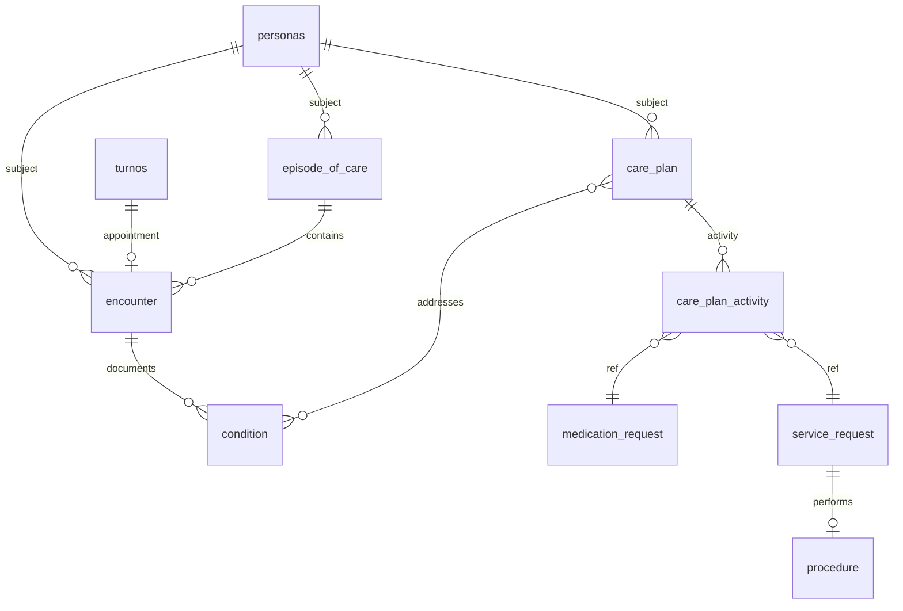

# Programa: dominio clínico FHIR-native (CarePlan)

## Objetivo

Reemplazar el modelo fragmentado (`consultas` + tablas hijas `consultas_*`, internación paralela `seg_nivel_internacion_*`) por un dominio **Clinical** alineado a FHIR R4, con **CarePlan** como agregado del tratamiento activo (medicación, prácticas, dispositivos, régimen, programas, crónicos).

- **Sin retrocompatibilidad** con tablas/clases legacy: migración directa, no dual-write.
- **Sin foco en interoperabilidad** en esta ola (bundles MSAL, export): solo modelado, BD, `common/`, API y clientes.
- **Canal principal:** API v1 + UI JSON (`views/json`) + móvil; Yii web clásico al final.

## Principios

1. **Un concepto → un dominio → un lugar:** AR en `common/models/{Dominio}/`, lógica en `common/components/{Dominio}/`.
2. **DTOs con nomenclatura FHIR** en `components/Clinical/Dto/`; no DTOs en `models/`.
3. **Controllers API delgados;** negocio en `*Service` (sin HTTP en services).
4. **`Persona` = Patient**, **`Turno` = Appointment** (tablas pueden conservar nombre; documentar gaps FHIR).
5. **Encounter** reemplaza **Consulta** como encuentro clínico (`encounter_class` AMB/IMP/EMER/VR ya existente).

## Arquitectura objetivo de `common/`

```text
common/
  models/
    Clinical/          # encounter, care_plan, medication_request, condition, …
    Scheduling/        # turno (appointment), agenda, …
    Person/            # persona
    Terminology/       # snomed_* (desde models/snomed/)
    Organization/      # efector, servicio, PES
    Core/              # device, notificaciones, …
  components/
    Clinical/          # Dto, Enum, Service, Repository, Workflow, Specialty
    Scheduling/        # ex Services/Turnos/*
    Person/
    Organization/
    Ui/                # UiScreenService, UiDefinitionTemplateManager
    Assistant/         # transversal (intents, chat)
    Ai/
    Integrations/
    Terminology/
    Infrastructure/    # Infra, Logging, Text
  docs/plans/          # este programa
```

**Eliminar al completar migración:** `common/components/Services/` (carpeta entera), AR `Consulta*` y `DiagnosticoConsulta` en raíz, `SegNivelInternacion*` duplicado.

## Hub CarePlan (resumen)

```text
Patient (personas)
  └── CarePlan (status, category, period, intent)
        ├── addresses → Condition
        ├── goal → Goal
        └── activity[] → MedicationRequest | ServiceRequest | DeviceRequest
                         | NutritionOrder | Procedure | …
Encounter (ex consultas) — contexto de la atención
EpisodeOfCare — internación / programas largos (admisión, kinesio N sesiones)
Appointment (turnos) — reserva; Encounter al atender
```

### Ciclo de vida CarePlan (decisiones)

| Escenario | Fin del plan |
|-----------|----------------|
| Internación | **Alta** → `CarePlan.status = completed`, `EpisodeOfCare` y `Encounter` IMP cerrados |
| Ambulatorio agudo | Cierre **manual** del médico o todas las actividades en estado terminal |
| Crónico | Plan longitudinal; no termina al cerrar un Encounter; `revoked` / `completed` manual o reemplazo por nuevo plan |
| Programa (kinesio, ortodoncia, psico) | `completed` por cantidad de sesiones / `period.end` / cierre manual; `on-hold` si suspende |

`CarePlan.category`: lista cerrada (ver [phases/05-care-plan-lifecycle.md](./phases/05-care-plan-lifecycle.md)).

## API v1 (orientación)

```text
frontend/modules/api/v1/
  controllers/clinical/     # Encounter, CarePlan, Condition, órdenes
  controllers/scheduling/   # Turnos (rutas /turnos/* estables si se desea)
  views/json/clinical/      # descriptores UI clínica (nuevo)
  views/json/scheduling/    # ex views/json/turnos, etc.
```

Reemplazos nominales:

| Hoy | Objetivo |
|-----|----------|
| `ConsultaController` | `clinical/EncounterController` |
| `MotivosConsultaController` | `clinical/ConditionController` o motivos en Encounter |
| `ConsultaAccessService` | `Clinical/Service/EncounterAccessService` |
| `ConsultaProcesamientoService` | `Clinical/Workflow/EncounterDocumentationService` |
| `Assistant/EntryPoints/ClinicalEncounter` | alinear a `Clinical` |

## Diagrama ER (referencia)



Detalle de tablas: [MIGRATION_STATUS.md](./MIGRATION_STATUS.md).

## Índice de fases

| Fase | Documento | Entregable principal |
|------|-----------|----------------------|
| 0 | [phases/00-governance.md](./phases/00-governance.md) | Convenciones, alcance, gobernanza del programa |
| 1 | [phases/01-foundation-db.md](./phases/01-foundation-db.md) | Esquema BD FHIR (encounter, care_plan, órdenes) |
| 2 | [phases/02-common-clinical.md](./phases/02-common-clinical.md) | `models/Clinical` + `components/Clinical` |
| 3 | [phases/03-reorder-common.md](./phases/03-reorder-common.md) | Disolver `Services/`, dominios Scheduling/Person/Ui |
| 4 | [phases/04-api-clinical-core.md](./phases/04-api-clinical-core.md) | API Encounter + CarePlan + acceso |
| 5 | [phases/05-care-plan-lifecycle.md](./phases/05-care-plan-lifecycle.md) | Reglas alta/crónico/programa + categorías |
| 6 | [phases/06-orders-medication-practice.md](./phases/06-orders-medication-practice.md) | MedicationRequest, ServiceRequest, Procedure |
| 7 | [phases/07-specialties.md](./phases/07-specialties.md) | Odonto, oftalmo, psico, obstetricia, … |
| 8 | [phases/08-inpatient-episode.md](./phases/08-inpatient-episode.md) | EpisodeOfCare + unificación internación |
| 9 | [phases/09-assistant.md](./phases/09-assistant.md) | Asistente, drafts, intents |
| 10 | [phases/10-mobile-paciente.md](./phases/10-mobile-paciente.md) | Inicio paciente, care plans activos |
| 11 | [phases/11-ui-json-clinical.md](./phases/11-ui-json-clinical.md) | `views/json/clinical`, UiScreenService |
| 12 | [phases/12-yii-web.md](./phases/12-yii-web.md) | Controllers/vistas Yii (si aplica) |

## Orden y paralelismo

- **Secuencial obligatorio:** 0 → 1 → 2 → 4 (mínimo viable clínico).
- **En paralelo posible:** documentación de especialidades (7) mientras 6; Flutter (10) tras 4+5.
- **Yii web (12)** al final si no es canal activo.

## Cómo usar estos planes con Cursor / equipo

- **Un chat / PR por fase** (o subfase), citando el MD de la fase.
- Actualizar [MIGRATION_STATUS.md](./MIGRATION_STATUS.md) al cerrar cada ítem.
- No implementar “todo el programa” en un solo plan de agente.

## Referencias internas

- [MIGRATION_STATUS.md](./MIGRATION_STATUS.md)
- Asistente (contrato actual): [../asistente/ASSISTANT_ENVELOPE_CONTRACT.md](../asistente/ASSISTANT_ENVELOPE_CONTRACT.md)
- UI JSON: [../asistente/UI_JSON_DESCRIPTOR_CONTRACT.md](../asistente/UI_JSON_DESCRIPTOR_CONTRACT.md)
