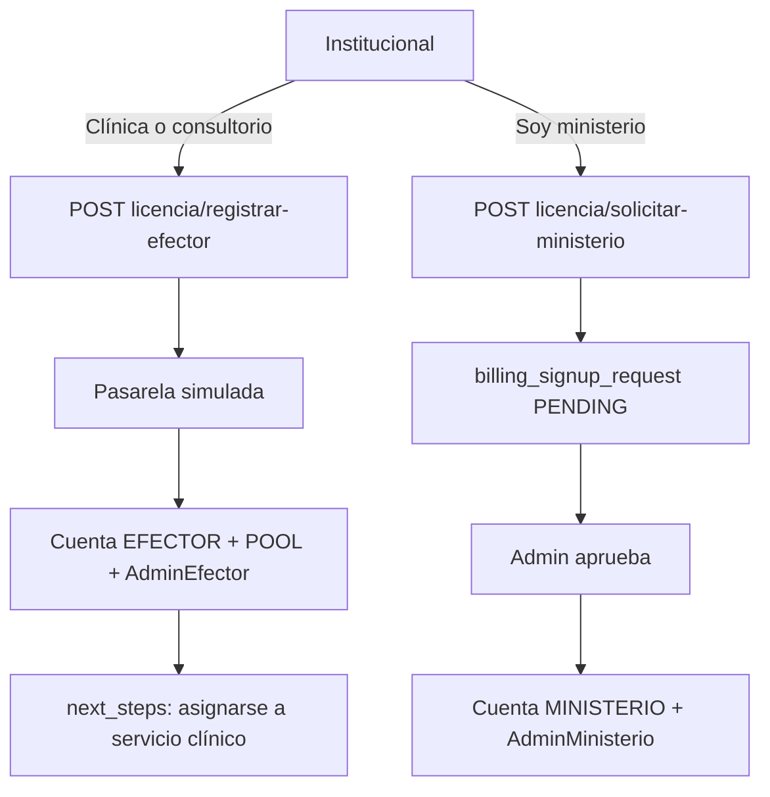

# Diseño — alta cuenta institucional

## Flujos

## Perfiles de alta efector

| Perfil | Defaults | Post-alta |
|--------|----------|-----------|
| `CLINICA` | AMB / EMER / IMP opcionales (mín. 1 clase) | Invitar staff / habilitar servicios |
| `CONSULTORIO` | Solo AMB, `max_pes` = 1; tipología consultorio; sin EMER/IMP ni sector público | Guiar autoasignación a servicio clínico |

## Sector vs pago

| Sector | Afiliación | Pago (POOL) |
|--------|------------|-------------|
| PRIVADO | Opcional | Cuenta propia EFECTOR |
| PUBLICO | AFILIADO al ministerio elegido (obligatorio) | Propia por defecto; o solicitud de cobertura ministerial |

## Tablas nuevas

- `billing_payment` — cobros (SIMULATED|…), estado, monto, referencia.
- `billing_signup_request` — solicitudes ministerio (y log de altas efector).
- `billing_account.owner_user_id` — titular comercial.

## API

Públicas: `catalogo-ministerios`, `planes`, `registrar-efector` (body `perfil`), `solicitar-ministerio`.  
Auth AdminEfector: `mi-licencia`, `desvincular-pago-ministerio`, `asociar-pago-ministerio` (solicitud o switch si hay invitación/aprobación admin).
