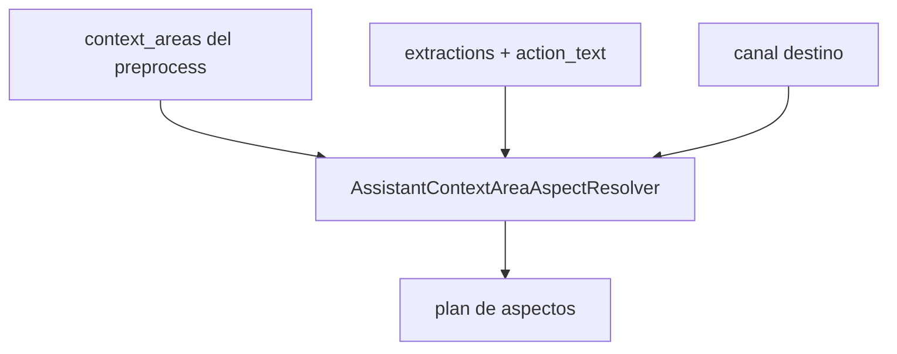

# Design — Contexto HIS (áreas + aspectos)

## Glosario (nomenclatura fija)

| Termino | Código | Prompt IA | Persistencia |
|---------|--------|-----------|--------------|
| **Área HIS** | `AssistantContextHISArea` | Nombre humano + clave corta (`appointments`) | Enum PHP + textos en catálogo preprocess |
| **Aspecto de contexto** | `AssistantContextHISAreaAspect` | Clave HIS en volcado (`appointment.current`) + label en JSON | Enum PHP + registry loaders |
| **Entidad** | AR / Data Access `entity:` | **No aparece** en prompts | `Turno`, `EfectorTurnosConfig`, … |
| **Ancla** | `AssistantContextAnchorBag` | Solo en `scope_applied` (debug) | IDs resueltos en request |
| **Volcado** | `AssistantContextAssemblyResult` | Bloque JSON en 2ª IA | Generado en request |

Relación:

```text
AssistantContextHISArea::APPOINTMENTS
  └── AssistantContextHISAreaAspect::APPOINTMENT_CURRENT
  └── AssistantContextHISAreaAspect::SITE_APPOINTMENT_POLICIES   → loader → EfectorTurnosConfig
  └── AssistantContextHISAreaAspect::APPOINTMENT_SCHEDULING_SETUP
  └── AssistantContextHISAreaAspect::APPOINTMENT_HISTORY_SUBJECT_AT_SITE
```

Un **aspecto** no es “subentity” como relación AR: es la **unidad de presentación HIS** que la 2ª IA entiende. Una entidad Yii puede alimentar varios aspectos o uno solo.

---

## Separación de responsabilidades

| Pieza | Responsabilidad |
|-------|-----------------|
| Preprocess IA | `user_goal`, extracciones, **`context_areas`** (áreas HIS, lista vacía si saludo) |
| `AssistantContextAnchorResolver` | Sujeto (`id_persona`), cita referencia, `site_id`, ventana temporal desde extracciones |
| `AssistantContextAreaAspectResolver` | `context_areas` + anclas + canal → lista ordenada de **aspectos** |
| `AssistantContextAspectLoaderInterface` | Un aspecto → array JSON HIS (+ `limitations`) |
| `AssistantContextAspectLoaderRegistry` | `aspect_id → loader` (product-registries) |
| `AssistantContextAssemblyService` | Orquesta resolvers + loaders + formatter → string para 2ª IA |
| Canales (`ConversationalChannel`, `InfoContentAssistantService`, …) | Llaman assembly cuando usan 2ª IA |

**Prohibido** en orquestadores: `if (preg_match('tarde'))`, manifests YAML por pregunta, nombres de tabla en prompts.

---

## Dónde se guardan los aspectos

### Fuente de verdad: PHP (enum + registry), no YAML de bloques

| Qué | Ubicación propuesta |
|-----|---------------------|
| Enum áreas | `common/components/Platform/Assistant/Context/AssistantContextHISArea.php` |
| Enum aspectos | `common/components/Platform/Assistant/Context/AssistantContextHISAreaAspect.php` |
| Texto HIS para preprocess (áreas) | Métodos `label()`, `descriptionForPreprocess()` en el enum área **o** array en la misma clase |
| Texto HIS para volcado (aspectos) | `aspectKey()` (clave JSON) + `hisLabel()` en enum aspecto |
| Mapeo aspecto → loader | `product-registries.php` → `assistantContextAspectLoaders` |
| Mapeo área → aspectos candidatos | `AssistantContextAreaAspectMap` (PHP tabla estática o método en enum área) |
| Mapeo aspecto → entidad Yii | Dentro del **loader** (no catálogo global duplicado) |

**No** crear `assistant/context/blocks/*.yaml`. Opcional: solo ampliar `preprocess.yaml` con placeholder `{context_areas_catalog}` generado desde PHP.

### Alineación con Data Access (sin segunda verdad)

- Loaders usan los mismos AR que `data-access-config/{Entidad}.yaml` declara (`model:`).
- Campos volcados: preferir atributos con `read: true` en entity YAML; el loader puede reutilizar un helper `DataAccessReadableAttributes::forEntity('Turno')` (futuro) o lista explícita en loader hasta existir helper.
- Permisos: reutilizar `PermitirParaSiMismoScopeChecker`, `PersonRepresentationSubjectService`, mismos criterios que listados paciente.

### Alineación FHIR (referencia, no exposición a IA)

| Área HIS | FHIR (orientación) |
|----------|-------------------|
| `appointments` | Appointment, Schedule, Slot |
| `encounters` | Encounter |
| `clinical_record` | Condition, AllergyIntolerance, MedicationStatement (extracto) |
| `diagnostics` | ServiceRequest, DiagnosticReport |
| `medication` | MedicationRequest |
| `representation` | RelatedPerson / consent operativo |
| `coverage` | Coverage |
| `product` | N/A (guías editoriales) |
| `geo_resources` | Organization, Location, HealthcareService |

La IA ve claves y labels HIS; FHIR solo documentación interna.

---

## Catálogo v1 de áreas HIS (preprocess)

Claves propuestas para `AssistantContextHISArea` (cerrar en Fase 0):

| Clave | Label preprocess (español) |
|-------|------------------------------|
| `appointments` | Citas y turnos del paciente; reglas del centro sobre citas |
| `encounters` | Atenciones y consultas ya realizadas |
| `clinical_record` | Resumen clínico del paciente (alergias, medicación, condiciones) |
| `diagnostics` | Estudios, laboratorio, resultados |
| `medication` | Recetas y medicación |
| `representation` | Tutela, representantes, operar por otro |
| `coverage` | Cobertura / obra social |
| `product` | Cómo funciona Bioenlace (guías de uso) |
| `geo_resources` | Centros, ubicación, recursos del sistema de salud |

Regla preprocess: si el mensaje es **solo saludo o meta**, `context_areas` debe ser `[]`.

---

## Catálogo v1 de aspectos (área `appointments`)

| Aspecto (clave JSON) | Label HIS | Entidad / servicio interno |
|----------------------|-----------|----------------------------|
| `appointment.current` | Cita actual o próxima del paciente | `Turno` (1 fila ancla) |
| `site.appointment.policies` | Reglas del centro sobre citas | `EfectorTurnosConfig` por `site_id` |
| `appointment.scheduling.setup` | Configuración de agenda de la cita | Agenda PES / `ServiciosEfector.formas_atencion`, `duracion_slot_minutos` |
| `appointment.history.subject_at_site` | Historial de citas del paciente en un centro | `Turno` list (límite configurable) |

Otros áreas: definir aspectos en fases posteriores; el enum puede reservar constantes con `implemented: false` hasta tener loader.

---

## Preprocess: qué adjuntar al prompt (no al output solamente)

Hoy `buildFullPrompt` = `stable_prompt` + mensaje.

Ampliación:

```text
{stable_prompt}

{context_areas_catalog}   ← generado por AssistantContextHISArea::catalogForPreprocess()

Mensaje:
{content}
```

`context_areas_catalog` ejemplo (generado, no hand-written en 10 archivos):

```text
Áreas del sistema (context_areas). Devolvé solo claves de la lista; vacío si saludo/meta sin necesidad de datos:
- appointments — Citas/turnos del paciente y reglas del centro sobre citas
- encounters — ...
...
```

JSON de respuesta ampliado:

```json
{
  "normalized_text": "...",
  "user_goal": "informational",
  "action_text": "",
  "extractions": [...],
  "context_areas": ["appointments"]
}
```

PHP (`ChatPreprocessService::normalizeResult`):

- Validar cada entrada contra `AssistantContextHISArea::all()`.
- Descartar duplicados; orden no importa.
- Persistir en `ChatPreprocessContext` (ampliar getters).

**Tamaño:** catálogo de áreas ~400–800 tokens; aceptable en cada preprocess. **No** incluir catálogo de aspectos en preprocess.

---

## Cómo la 1ª IA se asocia con aspectos (sin que preprocess elija aspectos)

Cadena en PHP tras preprocess:



### `AssistantContextAreaAspectResolver`

Entrada:

- `list<AssistantContextHISArea> $areas` desde preprocess
- `ChatPreprocessContext` (extracciones, goal)
- `channel` (`clinical` | `informational` | …)
- `AssistantContextAnchorBag` ya resuelto

Lógica (tabla PHP, **no** YAML):

1. Para cada área activa, obtener **aspectos candidatos** desde `AssistantContextHISArea::defaultAspects()` o mapa estático.
2. Filtrar por señales genéricas:
   - `appointments` + extracción `tiempo` o mención llegada/cancelar → incluir `site.appointment.policies`, `appointment.scheduling.setup`; **no** incluir `appointment.history` por defecto.
   - `appointments` + consulta histórica (“última vez”, “cuántas veces”) → incluir `appointment.history.subject_at_site`.
   - Siempre `appointment.current` si área `appointments` activa y hay sujeto.
3. Unir, deduplicar, ordenar por `AssistantContextHISAreaAspect::priority()`.
4. Cap global: `max_aspects` (params Yii, default 6).

Salida: `AssistantContextLoadPlan` con `aspectIds[]` + `anchorBag`.

### `AssistantContextAnchorResolver`

Resuelve antes del resolver de aspectos:

| Ancla | Regla |
|-------|--------|
| `subject_persona_id` | Sesión + representación |
| `appointment_id` | Extracción turno explícita o próximo `PENDIENTE` |
| `site_id` | Extracción efector **o** `Turno.id_efector` de cita ancla |
| `service_id`, `pes_id` | Extracción o FK de cita ancla |
| `time_window` | Extracción `tiempo` → enum `past` / `future` / `none` |

Sin predicados por pregunta; solo categorías de extracción y defaults de área.

---

## Cómo se llaman los métodos de los aspectos

### Interface

```php
interface AssistantContextAspectLoaderInterface
{
    public function aspect(): AssistantContextHISAreaAspect;

  /** @return array<string, mixed> JSON-serializable HIS payload */
    public function load(AssistantContextLoadContext $ctx): array;
}
```

`AssistantContextLoadContext` contiene: `anchorBag`, `userId`, `channel`, preprocess snapshot.

### Registry

En `product-registries.php`:

```php
'assistantContextAspectLoaders' => [
    AppointmentCurrentAspectLoader::class,
    SiteAppointmentPoliciesAspectLoader::class,
    // ...
],
```

`AssistantContextAspectLoaderRegistry::load(AssistantContextHISAreaAspect $aspect, AssistantContextLoadContext $ctx): array`

- Instancia loader por clase registrada.
- Cache request-scoped: `(aspect, subject, site_id)` → evitar doble query si varios aspectos comparten ancla.

### Ubicación de loaders

Por dominio (convención):

- `Domain/Scheduling/Assistant/Context/` — aspectos de citas
- `Domain/Clinical/Assistant/Context/` — clinical_record, encounters
- `Domain/Person/Assistant/Context/` — representation
- `Domain/Content/Assistant/Context/` — product / artículos (wrapper `info_content`)

---

## Cómo se adjunta al prompt de la 2ª IA

### `AssistantContextAssemblyService`

```php
public function assembleForChannel(
    string $channel,
    int $userId,
    ?AssistantContextLoadPlan $plan = null
): AssistantContextAssemblyResult;
```

Si `$plan === null`: lee preprocess de sesión, resuelve anclas + plan automáticamente.

`AssistantContextAssemblyResult`:

- `promptSection(): string` — texto a insertar
- `applied(): list<AppliedAspect>` — id, chars, ms (debug)
- `scopeApplied(): array` — para envelope QA

### Formato del bloque (estable para cache Vertex)

```text
--- context:his ---
{
  "schema_version": 1,
  "scope_applied": { ... },
  "appointment.current": { ... },
  "site.appointment.policies": { ... },
  "limitations": [ "arrival_time_not_recorded" ]
}
--- end context:his ---

```

Reglas formatter:

- Claves de aspecto como en enum (`aspectKey()`).
- `limitations` globales + por aspecto si hace falta.
- Truncar por `max_chars_total`; recortar aspectos de menor prioridad primero.

### Integración por canal

| Canal | Cuándo assembly | Orden en prompt |
|-------|-----------------|-----------------|
| `informational` | Si hay aspectos **o** además de artículo | `stable_prompt` → `context:his` → fuente artículo → pregunta |
| `clinical` | Si `context_areas` no vacío o clinical con áreas implícitas | `stable_prompt` → `context:his` → HC extracto opcional → hechos preprocess → historial → offer |
| `operational` | No (MVP) | — |

`InfoContentAssistantService::buildArticlePrompt` → delegar sección HIS a `AssistantContextAssemblyService`.

`ConversationalChannel::buildPrompt` → reemplazar gradualmente `ConversationalChannelProviderRegistry` por assembly (o providers llaman assembly para área `clinical_record`).

### Contexto IAManager

Segundo argumento de `consultarIA` sigue siendo contexto de telemetría (`asistente-conversational`, `asistente-informational` si se separa).

### Debug / QA

Envelope opcional:

```json
"context_applied": [
  { "aspect": "appointment.current", "chars": 280, "ms": 15 },
  { "aspect": "site.appointment.policies", "chars": 120, "ms": 8 }
]
```

Flag: `Yii::$app->params['asistente_context_debug']` o permiso staff.

---

## Caso referencia: llegada tarde (sin predicado particular)

Mensaje: *«¿Voy a tener problemas si llego 10 min tarde al turno?»*

| Paso | Resultado |
|------|-----------|
| Preprocess | `user_goal: informational`, `context_areas: ["appointments"]`, extracción `tiempo` |
| Anclas | Cita próxima pendiente → `site_id` |
| Aspectos | `appointment.current`, `site.appointment.policies`, `appointment.scheduling.setup` (**no** history por defecto) |
| Volcado | Reglas centro + slot 15 min + `late_arrival_tolerance_minutes: null` + limitation |
| 2ª IA | Respuesta prudente; no promete que esperan |

---

## Parámetros Yii sugeridos

| Param | Default | Uso |
|-------|---------|-----|
| `asistente_context_max_aspects` | 6 | Cap plan |
| `asistente_context_max_chars` | 8000 | Cap volcado |
| `asistente_context_history_limit` | 20 | `appointment.history` |
| `asistente_context_debug` | false | Envelope debug |

---

## Tests

| Tipo | Qué |
|------|-----|
| Unit | `AreaAspectResolver` dado areas+extractions → aspectos esperados |
| Unit | cada loader con fixtures AR |
| Unit | `normalizeResult` valida `context_areas` |
| Unit | assembly truncado respeta prioridad |
| QA manual | `asistente-consultas.md` saludo + tardanza |

---

## Riesgos y mitigaciones

| Riesgo | Mitigación |
|--------|------------|
| Preprocess inventa áreas | Lista cerrada + validación PHP |
| Volcado PHI de terceros | Filtro obligatorio `subject_persona_id`; sin listados centro-wide en paciente |
| Prompt gigante | Caps + no history por defecto |
| Duplicar Data Access | Loaders llaman servicios existentes (`TurnoPacienteListadoService`) |
| IA inventa tolerancia | `limitations` + stable_prompt |

---

## Archivos nuevos (referencia implementación)

```
common/components/Platform/Assistant/Context/
  AssistantContextHISArea.php
  AssistantContextHISAreaAspect.php
  AssistantContextAnchorBag.php
  AssistantContextAnchorResolver.php
  AssistantContextAreaAspectResolver.php
  AssistantContextLoadContext.php
  AssistantContextLoadPlan.php
  AssistantContextAssemblyService.php
  AssistantContextAspectLoaderInterface.php
  AssistantContextAspectLoaderRegistry.php
  AssistantContextFormatter.php

common/components/Domain/Scheduling/Assistant/Context/
  AppointmentCurrentAspectLoader.php
  SiteAppointmentPoliciesAspectLoader.php
  ...
```

Cambios en:

- `ChatPreprocessService.php`, `ChatPreprocessContext.php`
- `preprocess.yaml` (placeholder + schema JSON)
- `ConversationalChannel.php`, `InfoContentAssistantService.php`
- `product-registries.php`
