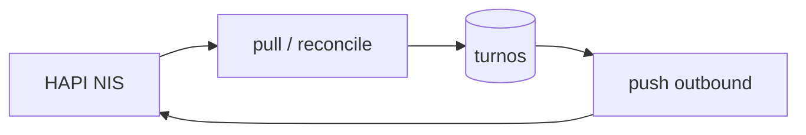

# Overview — Agendamiento FHIR entrante

## Objetivo

Bioenlace **consume** agendas y citas desde un servidor HAPI FHIR externo (NIS MSAL), materializa un **espejo** en `turnos` y **sincroniza estados** en ambos sentidos (`Appointment.status` ↔ `turnos.estado`). No publica grilla propia (`Slot` / `Schedule`) por ahora.

## Ancla operativa

**PES** (`profesional_efector_servicio`) = profesional + efector + servicio. Es el vínculo operativo entre un `Schedule` HAPI y la agenda Bioenlace.

## Identificación sin `urn:bioenlace:pes`

HAPI no incluirá identificador Bioenlace. Perfil nacional mínimo acordado:

| Recurso FHIR | Identificador Bioenlace |
|--------------|-------------------------|
| `Location` / `Organization` | `Efector.codigo_sisa` |
| `Practitioner` | `Persona.cuil` (preferido) o DNI RENAPER + desambiguación |
| `HealthcareService` | Catálogo `integration_fhir_service_code` → `id_servicio` |
| `Schedule` | Catálogo `integration_schedule_link` → `id_profesional_efector_servicio` (verificado) |

## Flujos

- **Entrante:** job `pull` + onboarding Schedule → PES.
- **Saliente:** hooks al cambiar `estado` + job `push-outbound` de reintento.

## Fuera de alcance (fase inicial)

- Publicar `Slot` / `Schedule` propios.
- Materializar grilla local completa.
- Paciente obligatorio en turno entrante (`id_persona` opcional en espejo).

## Estado de entregables

| Fase | Tema | Estado |
|------|------|--------|
| 1 | CUIL, catálogo servicio FHIR, tabla schedule link | Hecho |
| 2 | Resolver fail-closed + onboarding verificado | Hecho |
| 3 | Pull Appointment, push estados, consola | Hecho |
| — | Golden tests con Bundle real NIS | Pendiente (sin datos en servidor) |
| — | Cron + `enabled` en producción | Pendiente operativo |
