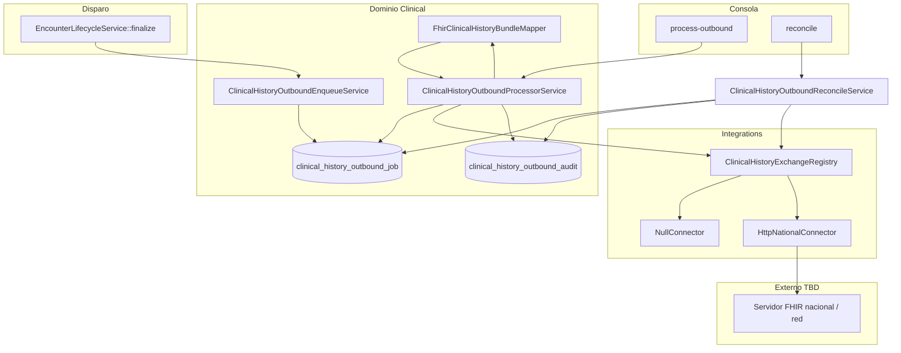

# Design — Interoperabilidad historia clínica

## Principios (alineados a capas Bioenlace)

| Regla | Implementación |
|-------|----------------|
| Sin hardcode de pantalla | Disparo en `EncounterLifecycleService::finalize` + params `clinicalHistoryExchange` |
| Conector intercambiable | `ClinicalHistoryExchangeConnector` + registry (como receta RDI) |
| Dominio vs integración | Mapper y cola en dominio; HTTP/OAuth en `Integrations/ClinicalHistory/` |
| Idempotencia | Un job activo por `(encounter_id, exchange_profile)` |
| Secretos fuera del repo | `baseUrl`, OAuth en `params-local.php` |

## Arquitectura

## Capas y responsabilidades

| Capa | Componente | Responsabilidad |
|------|------------|-----------------|
| Entrypoint | `EncounterLifecycleService` | Tras persistir `finished`, llama enqueue (no lógica FHIR) |
| Dominio | `ClinicalHistoryOutboundEnqueueService` | Crear/actualizar job si `enabled` y clase de encounter permitida |
| Dominio | `FhirClinicalHistoryBundleMapper` | Armar `Bundle` documental desde `Encounter` + hijos |
| Dominio | `ClinicalHistoryOutboundProcessorService` | Tomar jobs vencidos, mapear, invocar conector, actualizar estado |
| Integración | `ClinicalHistoryExchangeConnector` | `submitEncounterBundle(job, bundleJson)` |
| Integración | `HttpNationalClinicalHistoryConnector` | OAuth + POST + polling acuse (`statusPath`) |
| Dominio | `ClinicalHistoryOutboundReconcileService` | Jobs `ENVIADO` sin acuse → consulta estado |
| Dominio | `ClinicalHistoryOutboundRetryPolicy` | Backoff entre reintentos |
| Persistencia | `ClinicalHistoryOutboundJob` | Cola, payload snapshot, `external_id`, reintentos |

## Perfil de intercambio (v1 interno)

Nombre de config: `exchange_profile = encounter-document-v1`.

Recursos previstos en el Bundle (Fase 2 completa el mapper):

| Recurso FHIR | Origen Bioenlace |
|--------------|------------------|
| `Patient` | `personas` |
| `Encounter` | `encounter` |
| `Composition` | Nota clínica + metadatos del encuentro |
| `Condition` | `clinical_condition` del encounter |
| `AllergyIntolerance` | activas del paciente (subset) |
| `MedicationRequest` | órdenes del encounter |
| `ServiceRequest` | pedidos |
| `DiagnosticReport` | refs a `diagnostic_report` vinculados |
| `DocumentReference` | recetas emitidas (`electronic_prescription` status `issued`) |

El perfil **nacional exacto** (StructureDefinition argentino) se fija en Fase 0 cuando MSAL / jurisdicción publique la guía.

## Estados del job

| Estado | Significado |
|--------|-------------|
| `PENDIENTE` | En cola, `run_at` no alcanzado o listo para procesar |
| `PROCESANDO` | Worker tomó el job |
| `ENVIADO` | Conector devolvió éxito + `external_id` |
| `OMITIDO` | Conector `null` o reglas de negocio (efector excluido) |
| `FALLIDO` | Error transitorio; reintento si quedan intentos |
| `MUERTO` | Agotados reintentos; requiere intervención |

Evento de auditoría adicional: `reconciliado` (actualización de `external_id` vía cron reconcile).

## Política de reintentos

Config en `params[clinicalHistoryExchange][retry]`:

| Parámetro | Default | Descripción |
|-----------|---------|-------------|
| `max_attempts` | `5` | Intentos de envío HTTP |
| `backoff_seconds` | `[60, 300, 900, 3600, 14400]` | Espera antes del siguiente intento (índice = intento) |
| `batch_limit` | `20` | Jobs por ejecución de cron |
| `delay_after_finalize_seconds` | `120` | T+2 min tras finalizar (nota clínica estable) |

**Errores no reintentables** (marcar `MUERTO` de inmediato): 4xx de validación FHIR (excepto 429), Bundle vacío, encounter borrado.

**Errores reintentables**: timeout, 5xx, 429, red.

## Idempotencia y duplicados

- Índice único lógico: `(encounter_id, exchange_profile)` donde estado ∉ (`MUERTO`).
- Re-finalizar encounter no crea segundo job si ya existe `ENVIADO` (opcional: job `actualizacion` en Fase 4).
- `bundle_hash` (SHA-256 del JSON) en job para detectar cambios.

## Seguridad y auditoría

- Cada transición escribe en `clinical_history_outbound_audit` (`event_type`, `meta_json` sin PHI redundante).
- Log Yii categoría `clinical-history-exchange`.
- No loguear Bundle completo en producción (`log_bundle_snapshot` solo en dev).

## Params (`clinicalHistoryExchange`)

Ver `common/config/params.php`. Campos clave:

- `enabled` — master switch
- `default` — clave de conector (`null` | `nacional-fhir`)
- `encounter_classes` — ej. `['AMB','EMER','IMP']`
- `connectors` — definición Yii de clases
- `retry` — ver tabla arriba

## Cron / jobs

| Comando | Frecuencia sugerida | Acción |
|---------|-------------------|--------|
| `php yii clinical-history-exchange/process-outbound` | cada 5 min | Procesa cola saliente |
| `php yii clinical-history-exchange/reconcile` | diario | Actualiza `external_id` en jobs `ENVIADO` sin acuse (`statusPath`) |

Registrar en el mismo scheduler que `legal-record-export/run` y `encounter-patient-summary/process`.

## Separación de programas

Este plan **no modifica** [fhir-clinical.md](../../decisions/fhir-clinical.md): el modelo interno ya es FHIR-native; aquí se agrega **export interoperable** como subdominio `Integrations/ClinicalHistory` + cola, análogo a receta RDI.
