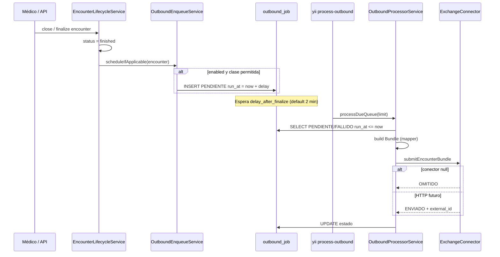

# Fase 1 — Estructura, cola y cron

## Estado

| Ítem | Estado |
|------|--------|
| Tabla `clinical_history_outbound_job` | Implementado |
| Tabla `clinical_history_outbound_audit` | Implementado |
| `ClinicalHistoryOutboundEnqueueService` | Implementado |
| Hook en `EncounterLifecycleService::finalize` | Implementado |
| `ClinicalHistoryOutboundProcessorService` | Implementado |
| Conector `null` | Implementado |
| Conector HTTP nacional | OAuth + POST implementado; `submitPath` configurable (contrato TBD) |
| Mapper FHIR | Esqueleto v1 con Patient, Encounter, Composition, Condition, pedidos, alergias, lab |
| Cron consola | Implementado |

## Flujo temporal (cuándo se envía)



## Cuándo **no** se encola

- `clinicalHistoryExchange.enabled = false`
- `encounter_class` no está en `encounter_classes`
- `efector_id` en lista de exclusión (`excluded_efector_ids`)
- Encounter sin `subject_persona_id`
- Ya existe job `ENVIADO` para el mismo `(encounter_id, profile)`

## Cron

```bash
# Procesar cola (producción: cada 5 min en crontab)
php yii clinical-history-exchange/process-outbound

# Opcional: límite
php yii clinical-history-exchange/process-outbound 50

# Un job por id (soporte)
php yii clinical-history-exchange/process-one 123
```

## Checklist Fase 1

- [x] Migración + modelos
- [x] Servicios enqueue / processor
- [x] Registry + conectores null / http stub
- [x] Params `clinicalHistoryExchange`
- [x] Hook finalize encounter
- [x] Mapper Bundle v1 (recursos clínicos del encounter)
- [x] API staff listar/ver estado jobs
- [ ] Tests unitarios enqueue + retry backoff (parcial)
- [x] RBAC lectura estado jobs
