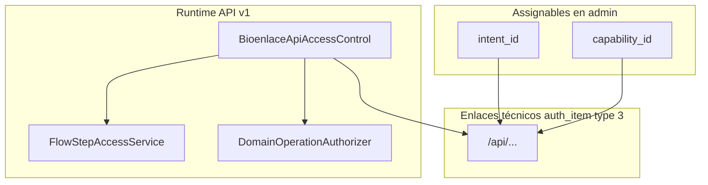

# Design — RBAC capabilities para UI nativa

## Decisión central

Extender el catálogo assignable con **capabilities** (`type` permission en `auth_item`, clave = `capability_id`) para operaciones de UI nativa y APIs sin intent conversacional.

Los **intents** del asistente se mantienen; cuando un intent abre UI nativa, puede **referenciar** la misma capability que el cliente directo (DRY en rutas API).

## Modelo de permisos



### Convención de nombres

| Tipo | Patrón | Ejemplo |
|------|--------|---------|
| Intent (asistente) | `dominio.accion` o familia NL | `urgencias.triage-paciente-guardia` |
| Capability (UI nativa) | `dominio.subdominio.operacion` | `guardia.ingreso`, `encounter.capturar` |
| Ruta API | `/api/...` sin `v1` | `/api/clinical/emergency-guardia/ingresar` |

Capabilities **no** llevan prefijo `capability.` en la clave RBAC (igual que intents sin prefijo `intent.`) — el `type` en catálogo distingue origen.

## Metadata de capabilities

Nuevo manifiesto (propuesto):

```
web/common/metadata/bioenlace/permission/capabilities/
  guardia.yaml
  encounter.yaml
  panel.yaml
```

Esquema por entrada:

```yaml
capability_id: guardia.ingreso
description: "Admisión de paciente a guardia (UI nativa web/móvil)"
assignable: true
routes:
  - /api/clinical/emergency-guardia/ingresar
  - /api/clinical/emergency-guardia/ingresar-formulario
  - /api/clinical/emergency-guardia/buscar-persona-ingreso
  - /api/clinical/emergency-guardia/vincular-identidad
  # ghost vía migración:
  - /api/registro/preview-renaper-como-staff
  - /api/registro/crear-sesion-didit-como-staff
default_roles:
  - Administrativo
  - AdminEfector
related_intents: []   # opcional: urgencias.* si se unifica más adelante
domain_operations:   # informativo; gates hard siguen en PHP
  - GuardiaEpisode.view_board
ui_surfaces:
  - home.emergency_board.ingreso
  - mobile.emergency_ingreso_screen
```

Reglas ([metadata-yaml-uso.mdc](../../../.cursor/rules/metadata-yaml-uso.mdc)):

- YAML = composición, rutas, roles default, superficies UI.
- Integridad clínica y «¿puede sobre este episodio?» = dominio PHP.

## Catálogo capabilities MVP

### Guardia (`guardia.*`)

| capability_id | Operación | Rutas API principales | Roles default |
|---------------|-----------|------------------------|---------------|
| `guardia.view_board` | Ver tablero / cola | `/api/home/panel` (sección `emergency_board`), `/api/clinical/emergency-guardia/ver`, KPIs | Administrativo, AdminEfector, enfermeria, Medico |
| `guardia.ingreso` | Admisión + identidad | `ingresar`, `ingresar-formulario`, `buscar-persona-ingreso`, `vincular-identidad`, RENAPER/Didit | Administrativo, AdminEfector |
| `guardia.triage` | Triage / re-triage | `registrar-triage`, `registrar-triage-formulario`, `elegir-paciente-triage` | enfermeria, Administrativo, AdminEfector, Medico |
| `guardia.atender` | Tomar caso / iniciar atención | `iniciar-atencion`, `asignar` (tomar) | Medico |
| `guardia.operaciones_staff` | Derivación, pedidos, SLA, CSV | `derivar`, `finalizar` (clínico), `crear-pedido`, … | Medico + coordinación (revisar lista fina) |
| `guardia.retiro_administrativo` | Paciente se retiró | `egreso-formulario` (modo administrativo) | Administrativo, AdminEfector |
| `guardia.egreso_clinico` | Egreso estructurado médico | `egreso-formulario` (modo clínico), intent `urgencias.egreso-estructurado-flow` | Medico |

### Encounter (`encounter.*`)

| capability_id | Operación | Rutas API | Roles default |
|---------------|-----------|-----------|---------------|
| `encounter.ver_como_staff` | Ver consulta documentada | `ver-consulta-como-staff`, ghost staff-summary, alterno `historia-clinica` lectura acotada | Medico, enfermeria, Administrativo (solo lectura) |
| `encounter.capturar` | Pipeline captura completo | `captura-*`, `analizar`, `guardar` | Medico |
| `encounter.documentar_nota` | Nota sin tomar caso (enfermería) | Subconjunto captura (sin diagnóstico/receta) — definir en servicio | enfermeria |

### Panel (`panel.*`)

| capability_id | Operación | Notas |
|---------------|-----------|-------|
| `panel.staff_clinical` | Cargar panel con secciones clínicas | Reemplazar auth-only blanket en `/api/home/panel` cuando `encounter_class` ∈ {EMER, AMB, IMP, VR} |

## Relación intent ↔ capability

| Intent existente | Capability recomendada | Acción |
|------------------|------------------------|--------|
| `urgencias.ver-tablero-guardia` | `guardia.view_board` | Intent sigue para NL; comparte rutas |
| `urgencias.triage-paciente-guardia` | `guardia.triage` | Idem |
| `urgencias.egreso-estructurado-flow` | `guardia.egreso_clinico` + `guardia.retiro_administrativo` | Split por modo en dominio; RBAC distinto |
| `listado_pacientes` | `encounter.capturar` + varias guardia | Descomponer grants; Medico mantiene bundle vía múltiples capabilities |
| `analisis` | `encounter.capturar` | Migrar enlace rutas; deprecar nombre `analisis` en admin |
| `front_ver_historial_paciente` | `encounter.ver_como_staff` | Fase 6 |

## Sync e integridad

Extender `CatalogPermissionSyncService` (o servicio hermano `CapabilityPermissionSyncService`):

1. Lee YAML `permission/capabilities/*.yaml`.
2. Registra `capability_id` en `auth_item` (type 2).
3. Enlaza `capability_id` → rutas en `auth_item_child`.
4. Opcional: aplica `default_roles` en staging vía migración, no en sync automático de prod.

CLI propuesto:

```bash
php yii catalog-permission/sync-capabilities   # nuevo
php yii catalog-permission/sync                # intents (existente)
php yii catalog-integrity/check                # ampliar reglas
```

Reglas CI nuevas:

- Toda ruta en `EmergencyGuardiaController` / `EncounterController` (acciones staff) tiene padre intent **o** capability.
- Toda capability assignable tiene ≥1 ruta.
- Ninguna ruta guardia admin cuelga solo de `listado_pacientes`.

## `/api/home/panel`

Estado actual: `$authenticatedOnlyRoutes` en `BioenlaceApiAccessControl`.

Propuesta:

1. Quitar `/api/home/panel` de auth-only.
2. Exigir `panel.staff_clinical` cuando la respuesta incluye secciones clínicas (EMER/AMB/IMP/VR).
3. `EmergencyBoardSectionProvider` sigue usando `GuardiaEpisode.view_board` en dominio; RBAC de borde alinea con `guardia.view_board`.

## Clientes nativos

| Cliente | Cambio |
|---------|--------|
| Web `pacientes-listado.js` | Usar `puede_*` del panel; no inferir permisos por rol en JS |
| Flutter `personalsalud` | Idem; eliminar checks duplicados salvo UX offline |
| Llamadas API | Opcional `X-Capability-Id` para trazabilidad; no obligatorio si RBAC por ruta está bien |
| Asistente | Mantener `X-Flow-Intent-Id`; FlowStep sigue para pasos dentro de flow |

## `home_panel_manifest.yaml`

Evolución (Fase 5):

```yaml
capabilities:
  triage: guardia.triage
  ingreso: guardia.ingreso
  atender: guardia.atender
  documentar: encounter.documentar_nota
atender_exclude_roles: [Administrativo, AdminEfector]  # sigue en manifiesto (UX)
```

`GuardiaBoardCapabilityService` resuelve: rol del usuario ∩ `default_roles` de capability (desde índice en memoria) ∩ exclude del manifiesto.

Alternativa mínima (fase 2 parche): mantener listas de roles en manifiesto hasta Fase 5; **solo** arreglar RBAC HTTP.

## Migración desde dump actual (`u257309594_bioenlace.sql`)

Acciones concretas Fase 2:

1. Crear capabilities guardia e insertar `auth_item_child` desde roles con `urgencias.*` / `GuardiaEpisode.*` hacia rutas que hoy solo cuelgan de `listado_pacientes`.
2. Grant `guardia.retiro_administrativo` → Administrativo, AdminEfector.
3. Re-ejecutar lógica de `m260618_100000_api_home_panel_rbac` (propagación panel → guardia) verificando resultado en `auth_item_child`.
4. No quitar a Medico `listado_pacientes` hasta Fase 3/6 (compatibilidad).

## Referencias de código

| Componente | Archivo |
|------------|---------|
| API access | `web/frontend/modules/api/v1/components/BioenlaceApiAccessControl.php` |
| Flow steps | `web/common/components/Platform/Core/Permission/FlowStepAccessService.php` |
| Capabilities UI | `web/common/components/Domain/Clinical/Emergency/Service/GuardiaBoardCapabilityService.php` |
| Manifiesto panel | `web/common/metadata/bioenlace/ui/home_panel_manifest.yaml` |
| Ghost inheritance | `web/common/components/Platform/Core/Permission/RbacRouteGhostInheritanceService.php` |

## ADR al cierre

Crear `web/docs/decisions/autorizacion-capabilities-ui-nativa.md`:

- Complementa [autorizacion-solo-por-intents.md](../../decisions/autorizacion-solo-por-intents.md) (no lo anula).
- Assignables = intents **+** capabilities.
- Rutas `/api/...` siguen siendo enlaces técnicos.
