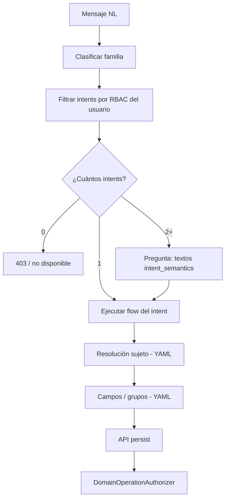

# Design — RBAC unificado por intents

## Principio rector

Mismo patrón que **create**: el permiso es el **intent**; el YAML del intent declara qué se puede ver, listar o editar; el **dominio** valida el recurso al ejecutar.

```text
┌─────────────────────────────────────────────────────────────┐
│  Admin: rol → intents (auth_item / auth_item_child)         │
└──────────────────────────────┬──────────────────────────────┘
                               ▼
┌─────────────────────────────────────────────────────────────┐
│  API: BioenlaceApiAccessControl — ruta ↔ intent_id          │
│  Flow steps: FlowStepAccessService — herencia intent padre    │
└──────────────────────────────┬──────────────────────────────┘
                               ▼
┌─────────────────────────────────────────────────────────────┐
│  Asistente: SubIntentEngine — YAML del intent (pasos, UI)     │
│  Descubrimiento: familias NL si hay varios intents candidatos │
└──────────────────────────────┬──────────────────────────────┘
                               ▼
┌─────────────────────────────────────────────────────────────┐
│  Dominio: DomainOperationAuthorizer + servicios de recurso    │
│  (pes_own, pes_efector, turno titular/representante, …)       │
└─────────────────────────────────────────────────────────────┘
```

## Tres capas (no mezclar)

| Capa | Pregunta | Dónde vive |
|------|----------|------------|
| **RBAC (intent)** | ¿Puede intentar esta operación en este contexto? | `auth_item`, `BioenlaceApiAccessControl`, catálogo intents |
| **Metadata (intent YAML)** | ¿Qué pasos, campos y agrupaciones UI tiene la operación? | `schemas/intents/{create,update,read}/`, UI JSON, manifests asociados |
| **Dominio** | ¿Este `id_pes` / turno / persona es válido ahora? | `domain-operation-policies.yaml`, servicios `*/Authorization/` |

No hay cuarta capa «scope en rol» ni «permiso por atributo en auth_item».

## Convenciones de intents

### Variantes de contexto (manual, explícito)

| Sufijo / patrón | Significado | Ejemplo |
|-----------------|-------------|---------|
| `…-como-paciente` / `…-propio` | Sujeto = usuario de sesión (o representación vía dominio) | `turnos.crear-como-paciente` |
| `…-para-…-flow` / `…-staff` | Staff sobre terceros en ámbito institucional | `turnos.crear-para-paciente-flow` |
| `…-efector` | Listado/info agregado en efector de sesión | `profesionales.listar-efector` (nombre ilustrativo) |

Regla: **no** un intent genérico con branch por scope de rol; **sí** un intent por variante que el admin asigna al rol que corresponda.

### Variantes de campos (roles clínicos distintos)

Si enfermero y administrativo editan conjuntos distintos de campos:

- **Dos intents** con YAML distinto (recomendado), o
- Un intent y manifests de campos distintos referenciados por `intent_id` distinto

**No** grants `Entidad.atributo.edit` en catálogo.

### Operaciones read / list / edit / create

| Tipo | Ubicación YAML | `rbac_route` |
|------|----------------|--------------|
| create | `intents/create/` | POST del submit del flow |
| update (flows complejos) | `intents/update/` | Ruta del submit o pantalla principal |
| read / list / edit disperso | `intents/read/` o `intents/update/` según convención del dominio | Ruta API dedicada (dejar de usar `/api/editar` genérico a medio plazo) |

Cada intent declara su `rbac_route`; `catalog-permission/sync` registra intent → ruta en `auth_item`.

### Familias para NL (asistente)

Metadata declarativa (sin enumerar en PHP):

- `intent_family` o entrada en `intent-aliases.yaml` / `intent-classification-rules.yaml`
- Agrupa variantes: `condicion-laboral.edit` → `condicion-laboral.editar-propio`, `condicion-laboral.editar-staff`
- Si tras filtrar por RBAC queda **un** candidato → entrar directo
- Si quedan **varios** → paso de elección; textos desde `intent_semantics.goal` / `action_name` de cada YAML

## Contenido del YAML de intent (read/list/edit)

Además de los campos actuales (`intent_id`, `keywords`, `subintents`, `flow_submit`, …), los intents del canal que reemplaza DataAccess deberían declarar de forma explícita:

| Bloque | Propósito |
|--------|-----------|
| `operation` | `read` \| `list` \| `edit` \| `info` (agregado) — documentación e integridad |
| `intent_family` | Agrupación NL |
| `domain_operation` | Clave en `domain-operation-policies.yaml` para el submit (si aplica) |
| `subject_resolution` | Handler o `open_ui` / endpoint para elegir sujeto (listar PES, elegir persona, …) |
| `field_groups` | Solo presentación: label, orden, campos referenciados |
| `fields` | Lista de atributos editables o visibles; keywords NL por campo |
| `ui_json` / `open_ui` | Pantalla embebible cuando no es escalar |

Los **grupos** son UX; no son permisos. Si el usuario tiene el intent, ve los campos del YAML (filtrados por NL si especifica atributo en el mensaje).

Comportamiento asistente (igual al diseño acordado en conversación):

1. Resolver familia / intent candidatos por NL + RBAC
2. Si varios contextos → preguntar (semántica YAML)
3. Paso resolución de sujeto (endpoint del YAML)
4. Si el mensaje no nombra campo → mostrar `field_groups`
5. Si nombra campo → ir directo al campo si existe en YAML; si no → mensaje «no disponible en esta operación»

## Admin

### Catálogo simplificado

| Pantalla | Comportamiento |
|----------|----------------|
| Índice permisos | Solo filas **intent** (como hoy para create) |
| Editar roles de un intent | Sin cambio conceptual |
| Editar intents de un rol | `RbacRoleController` / vista rol |
| Detalle intent (nuevo o ampliado) | Árbol **solo lectura**: field_groups, fields, rutas, pasos — parseados del YAML |
| Integridad | Sin chequeo «atributo en auth_item sin YAML»; sí intent ↔ ruta ↔ domain_operation |

### Eliminar del admin

- Asignación de permisos por atributo (`edit-attribute-roles`, grants `Entidad.atributo.*`)
- Filas de catálogo `kind: attribute`
- Menús que apunten a «permisos por atributo» como entidad assignable

### CLI

| Comando | Cambio |
|---------|--------|
| `catalog-permission/sync` | Solo intents; no crear ítems `Entidad.atributo.read\|info\|edit` |
| `catalog-integrity/check` | Reglas nuevas; deprecar reglas de atributos assignables |

## API y seguridad

### Puerta (RBAC)

- `BioenlaceApiAccessControl` + `ApiRoutePermissionResolver`: sin cambio de mecanismo
- `FlowStepAccessService`: pasos `open_ui` hijos del intent activo (`X-Flow-Intent-Id`)

### Persistencia (dominio)

Todo POST/PUT debe:

1. Comprobar que la ruta exige el intent que el cliente declara (flow header o convención)
2. Ejecutar `DomainOperationAuthorizer` con la clave declarada en el intent
3. Aplicar whitelist de campos según contrato del intent / UI JSON (servicio de dominio, no RBAC)

**No confiar** en que el YAML oculte un campo: un cliente puede enviar campos extra; el servicio los ignora o rechaza.

### Sesión operativa

Sin cambio de reglas (`api-v1-autenticacion-y-sesion`): intents staff que requieren efector deben validar presencia de `id_efector` en sesión o en body y responder 400 si falta.

## Relación con `data-access-config`

| Enfoque | Acción |
|---------|--------|
| Corto plazo | Convivencia: intents nuevos por dominio; `data-access-config` alimenta solo lectura admin y migración |
| Medio plazo | Mover definición de campos/grupos al YAML del intent; `data-access-config` se reduce o se elimina por entidad migrada |
| Motor métricas `info_list` | Encapsular detrás de intents concretos (`profesionales.conteo-efector`) o reutilizar executor con autorización solo por intent |

## Relación con `domain-operation-policies.yaml`

Se **mantiene** para validación de recurso. Cambios esperados:

- Reducir duplicación `*_staff` / `*_own` donde ya sean intents distintos con `domain_operation` distinto en cada YAML
- `domain_only_operations` siguen existiendo para chequeos sin permiso assignable intermedio si el intent ya acotó el contexto
- Revisar entradas `DataAccess.edit|list|info` cuando se retire el canal genérico

## Componentes a retirar (fase 6)

| Componente | Notas |
|------------|-------|
| `AttributePermissionEvaluator` | Eliminar usos en API/asistente |
| `AttributePermissionKeyMapper` | Eliminar o dejar solo tests legacy hasta borrar |
| `PermissionCatalogService::listAttributes` como grants | Sustituir por lectura YAML informativa |
| Intents `data-access.info`, `data-access.listar`, `data-access.editar` | Deprecar tras migración |
| `EditSurfaceAuthorizationService` basado en grants write | Sustituir por «tiene intent X» |
| `QueryAuthorizationService` + `required_groups` RBAC | Sustituir por intent por métrica o bundle |
| Filas `auth_item` tipo `Entidad.atributo.*` | Migración datos + sync |

## Migración de datos RBAC

Estrategia recomendada (detallar en implementación):

1. Inventario: cada grant atributo → intent(s) destino según tabla de mapeo por dominio
2. Script idempotente: asignar intents a roles que tenían grants de atributo equivalentes
3. Ventana de convivencia opcional: warnings en integridad si quedan grants atributo huérfanos
4. Migración Yii para limpiar `auth_item` atributo tras validación en staging

## Piloto: condición laboral

| Intent (ilustrativo) | Rol típico | Dominio |
|----------------------|------------|---------|
| `condicion-laboral.editar-propio` | Profesional | `ProfesionalEfectorServicio.condicion_laboral_own` |
| `condicion-laboral.editar-staff` | Enfermero / admin efector | `ProfesionalEfectorServicio.condicion_laboral_staff` |
| `condicion-laboral.editar-staff-enfermero` | Enfermero (si campos ⊂ admin) | Misma política staff; YAML con menos `fields` |

Flujo: alinear con `licencia.cargar-*-flow` y endpoints `crear-condicion-laboral` / `editar-condicion-laboral` existentes; extraer campos a YAML del intent; quitar dependencia de grants si existiera.

## Integridad (nuevas reglas)

El checker debería validar:

- Cada `intent_id` en disco tiene `rbac_route` resoluble
- Cada `rbac_route` de intent tiene política de dominio si el endpoint persiste
- `domain_operation` del YAML existe en `domain-operation-policies.yaml`
- `fields` referencian atributos del modelo AR o keys UI JSON válidas
- No existen permisos `Entidad.atributo.*` en `auth_item` salvo flag de migración
- Familias NL: todo `intent_family` tiene ≥1 intent miembro

## Alineación con reglas de arquitectura

- **0 hardcode**: familias y pasos en YAML; motores genéricos (`SubIntentEngine`, `CatalogIntegrityService`)
- **Capas**: controllers API delgados; autorización recurso en servicios de dominio
- **Admin**: solo asignación; no duplicar listas de campos editables en BD (`data_access_attribute_field` revisar si pasa a derivarse del YAML)

## Diagrama: elección de contexto sin «scope en rol»


