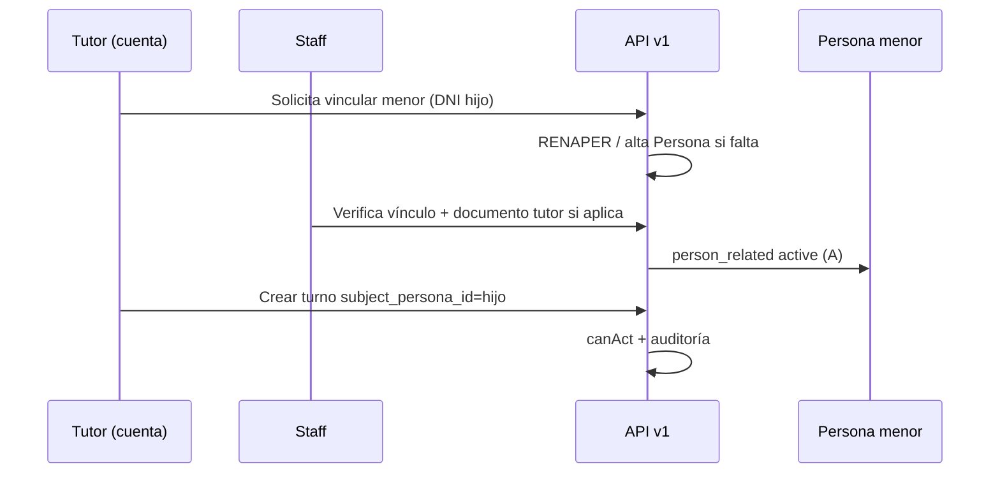
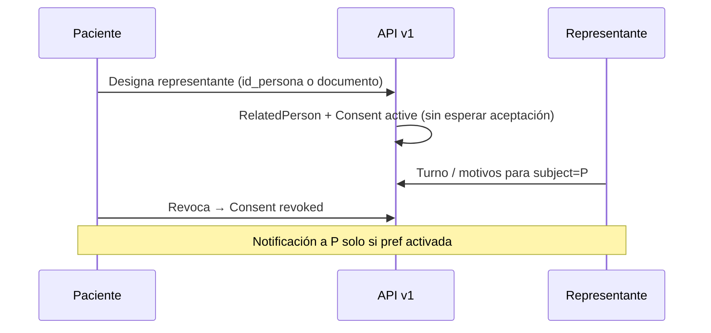

# Design — Representación paciente (FHIR)

## Principio

**Antecedente clínico familiar** ≠ **representación operativa**. Este plan solo cubre lo segundo: quién puede actuar en nombre de qué `Persona` y con qué permisos.

Alineación FHIR (persistencia interna puede ser tablas Yii; exposición API opcional FHIR después):

| Recurso | Uso en Bioenlace |
|---------|------------------|
| `Patient` | `personas` |
| `RelatedPerson` | Vínculo actor ↔ sujeto + `relationship` codificado |
| `Consent` | Régimen B: delegación activa/revocada; bloqueos legales |

## Modelo de datos (borrador)

### `relationship_type` (catálogo BD)

Códigos estables, etiqueta UI, código HL7/SNOMED opcional, `regime_allowed` (`A`|`B`|`both`), `requires_legal_document` (tutor).

Semilla desde parentescos ya usados en diabetes, acotada a:

- **Régimen A:** padre, madre, tutor_legal
- **Régimen B:** cualquier código del catálogo + `otro` si staff valida en el futuro

### `person_related` (≈ RelatedPerson)

| Campo | Descripción |
|-------|-------------|
| `id` | PK |
| `subject_persona_id` | Sujeto de atención (menor o paciente delegante) |
| `actor_persona_id` | Quien actúa (tiene `id_user`) |
| `relationship_type_id` | FK catálogo |
| `regime` | `verified_guardianship` (A) \| `patient_delegation` (B) |
| `status` | `pending` \| `active` \| `revoked` \| `blocked` |
| `verified_by` | `none` \| `staff` \| `renaper` \| `document` |
| `verified_at` | |
| `blocked_reason` | `court_order` \| `custody_dispute` \| `other` (nullable) |
| `blocked_at` / `blocked_by_user_id` | Staff |
| `permissions_json` | Snapshot permisos v1 (o FK a plantilla metadata) |
| `evidence_json` | Acta, nota staff, refs documentos |
| `created_at` / `updated_at` | |

Índices: `(subject_persona_id, status)`, `(actor_persona_id, status)`, unicidad lógica `(subject, actor, regime)` activo.

### `person_delegation_consent` (≈ Consent, régimen B)

| Campo | Descripción |
|-------|-------------|
| `person_related_id` | FK |
| `status` | `active` \| `revoked` |
| `granted_at` | Momento designación paciente |
| `revoked_at` | Revocación paciente o staff |
| `provision_json` | Alcance (turnos, motivos, …) |

Régimen A no requiere fila Consent si la política institucional lo cubre; la verificación staff queda en `person_related`.

### Auditoría

`person_related_audit_log`: actor, subject, acción (`turno_created`, `motivos_sent`, `link_blocked`, …), `id_user` sesión, timestamp, payload mínimo.

## Autorización

Servicio único (sin `if` en controllers):

```text
PersonRepresentationAccessService::canAct(
  actorPersonaId,
  subjectPersonaId,
  permission: 'scheduling.turno.crear' | 'clinical.motivos' | ...
): bool
```

Reglas:

1. Existe `person_related` `active`, régimen correcto, sin `blocked`
2. Régimen B: `Consent` `active`
3. Permiso incluido en `permissions_json` o plantilla metadata YAML (`representation_permissions_v1.yaml`)

**JWT** sigue siendo del actor. El sujeto va en body/query (`subject_persona_id`) o en **contexto operativo paciente** (análogo a `set-session` staff), fijado al elegir “a cargo de” en móvil.

### Impacto en código existente

| Componente | Cambio |
|------------|--------|
| `EncounterAccessService` | Permitir actor con representación activa para permisos acotados |
| `CarePackAssistanceService::assertPatientAccess` | Actor delegado |
| `TurnosController` crear/listar como paciente | `subject_persona_id` + `canAct` |
| `PermitirParaSiMismoScopeChecker` | Variante o checker paralelo para “por otro con delegación” |
| Motivos, recetas, HC paciente | Misma capa |

## Régimen A — flujo



- Dos padres: **dos filas** `person_related` activas (misma decisión producto).
- Mayoría de edad: vínculo **permanece** hasta revocación staff o hijo (cuando tenga cuenta).

## Régimen B — flujo



- Varios representantes: varias filas `active` con mismo `provision`.
- Representante: **cualquier** cuenta; no se exige parentesco.

## Permisos v1 (cerrados)

| Código | Producto |
|--------|----------|
| `scheduling.turno` | Sacar turno / pedir atención |
| `clinical.motivos` | Cargar motivos de consulta |
| `clinical.care_pack_assistance` | Pre-consulta cohorte |
| `clinical.care_plan` | Ver tratamientos / recetas delegadas |
| `clinical.historia_resumen` | Ver historia clínica (alcance paciente) |

Plantilla en metadata; no enumerar en orquestadores.

## Identidad externa

| Fuente | Uso |
|--------|-----|
| RENAPER / MPI | Validar DNI al crear `Persona` menor o validar actor |
| Didit | Registro adultos (sin cambio) |
| Gobierno parentesco | **No** disponible; no bloquea el plan |

## Configuración paciente (notificaciones)

`persona_preference` o extensión en prefs existentes:

- `notify_on_representative_action` (default false) — decisión **9c**

## Ubicación código (objetivo)

| Capa | Ruta |
|------|------|
| Dominio | `common/components/Person/Representation/` |
| Modelos | `common/models/Person/PersonRelated.php`, … |
| API | `frontend/modules/api/v1/controllers/PersonRepresentationController.php` |
| Metadata permisos | `common/components/Person/Representation/metadata/representation_permissions_v1.yaml` |
| Migración | `common/migrations/m*_person_related_fhir.php` |

## Reglas de arquitectura proyecto

- Orquestadores / asistente: sin `if (regime === 'A')`; permisos y rutas en YAML + RBAC.
- API v1 única fuente de negocio; móvil consume JSON genérico.
- Staff revoca: endpoint explícito `revocar-para-staff`, no lógica en timeline web.
