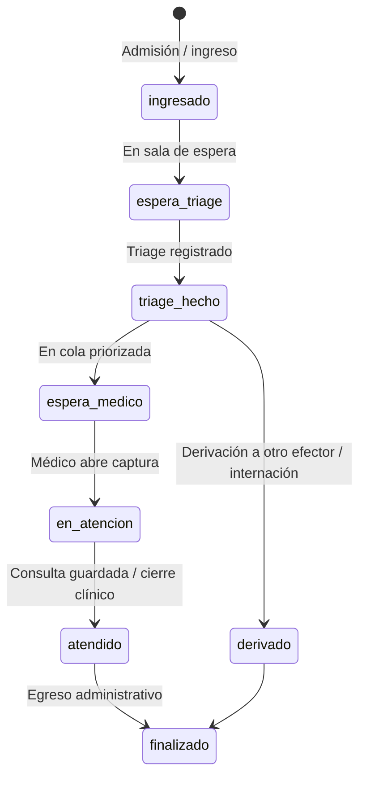

# Design — Urgencias: triage + tablero operativo

## Decisiones

| Tema | Decisión |
|------|----------|
| Fuente de verdad | API v1 + servicios en `common/components/`; web Yii y Flutter solo consumen JSON |
| Episodio | Se mantiene `guardia` como episodio; triage y cola como **extensión** (tablas hijas + eventos), no reemplazar `Guardia` |
| Estados legacy | `pendiente` / `atendida` / `finalizada` se **mapean** a estados de circuito nuevos; migración gradual sin romper libro de guardia |
| Escala de triage | Configurable por efector (`manchester` por defecto); niveles 1–5 con etiqueta y color en metadata |
| Orden de cola | Prioridad triage + timestamp de ingreso; desempate estable por `id` |
| Timestamps | Tabla de eventos `guardia_circuito_event` (o nombre equivalente) para auditoría y KPIs |
| Auth | Staff: `id_efector` de sesión o body explícito; no revalidar identidad; autorización por efector + PES cuando aplique |
| Médico móvil-first | Fase 3 prioriza `mobile/medico`; web conserva ingreso administrativo y tablero grande |
| Asistente | Sin `if` por pantalla; acciones vía catálogo UI / intents YAML cuando se agreguen (Fase 4 opcional) |
| Captura clínica | Reutilizar `PatientHistoriaUrl` + `Consulta::PARENT_GUARDIA`; no duplicar formulario de consulta en guardia |

## Modelo de circuito (propuesto)



**Campo canónico:** `circuito_estado` (enum/string) en `guardia` o vista materializada desde eventos.

**Compatibilidad:** mientras exista solo `estado` legacy, un adaptador en servicio expone ambos hasta deprecar vistas antiguas.

## Entidades (Fase 1)

| Tabla / entidad | Rol |
|-----------------|-----|
| `guardia` (existente) | Episodio; ingreso, cobertura, derivación, PES asignado |
| `guardia_triage` | 1:1 activo por guardia: escala, nivel, motivo (código + texto), vitales JSON, `triaged_at`, `id_profesional_efector_servicio` triager |
| `guardia_circuito_event` | Eventos append-only: `tipo`, `at`, `id_profesional_efector_servicio`, payload JSON |
| `efector_emergency_config` (opcional Fase 1) | Escala default, SLA objetivo por nivel, motivos habilitados |

## Servicios (ubicación)

```
web/common/components/Emergency/
  GuardiaCircuitoService.php      # transiciones de estado, validación
  GuardiaTriageService.php        # alta/actualización triage
  GuardiaQueueService.php         # listado tablero, orden, filtros
  GuardiaTimingService.php        # cálculo tiempos para tablero/KPI
```

Controllers API delgados en `frontend/modules/api/v1/controllers/` (prefijo sugerido: `EmergencyGuardiaController` o `clinical/GuardiaController` según convención del módulo).

## API (borrador Fase 1–2)

| Método | Ruta | Actor | Descripción |
|--------|------|-------|-------------|
| POST | `/api/v1/emergency/guardia/ingresar` | Staff | Ingreso (evolución de lógica actual web) |
| POST | `/api/v1/emergency/guardia/<id>/triage` | Médico / enfermería | Registrar o actualizar triage |
| GET | `/api/v1/emergency/guardia/tablero` | Staff / médico | Cola del efector (query: filtros, paginación) |
| GET | `/api/v1/emergency/guardia/<id>` | Staff / médico | Detalle episodio + triage + tiempos |
| POST | `/api/v1/emergency/guardia/<id>/asignar` | Staff / médico | Asignar PES |
| POST | `/api/v1/emergency/guardia/<id>/iniciar-atencion` | Médico | Marca en atención; devuelve URL captura o ids consulta |
| POST | `/api/v1/emergency/guardia/<id>/finalizar` | Staff / médico | Egreso (extiende egreso actual) |
| POST | `/api/v1/emergency/guardia/<id>/derivar` | Médico / staff | Derivación + notificación internación si aplica |

Rutas y permisos ApiGhost: nombres explícitos (`triage-para-guardia`, `tablero-guardia-efector`, …) alineados a reglas API v1 del repo (`.cursor/rules/api-v1-acciones-permisos-y-rutas.mdc`).

## Clientes

| Cliente | Fases | Notas |
|---------|-------|-------|
| Web `GuardiaController` | 2 | Tablero principal; ingreso puede migrar a API + vista delgada |
| `mobile/medico` | 3 | Home EMER → cola priorizada → triage compacto → atender |
| Web listado pacientes EMER | 2 | Reemplazar/ampliar datos de `PacientesController` vía mismo endpoint tablero |
| Push | 4 | Opcional: `EMERGENCY_PATIENT_READY`, asignación al médico |

## PRs sugeridos

1. **PR1** — Migración + servicios triage + API triage/detalle + RBAC.
2. **PR2** — Tablero API + web tablero (polling o SSE simple).
3. **PR3** — Flutter médico: cola, triage, atender.
4. **PR4** — Integración captura + derivación + eventos finales.
5. **PR5** — Indicadores + export básico.

## Riesgos y mitigaciones

| Riesgo | Mitigación |
|--------|------------|
| Romper flujos web actuales de ingreso | Mantener escenarios Yii; API en paralelo; feature flag por efector |
| Dos listas (PacientesController vs tablero) | Unificar payload en `GuardiaQueueService`; deprecar campos sueltos |
| Triage sin conectividad | UI móvil offline-lite fuera de MVP; mensaje claro |
| Sobrecarga de campos en formulario web | Triage en paso separado; móvil formulario corto |
