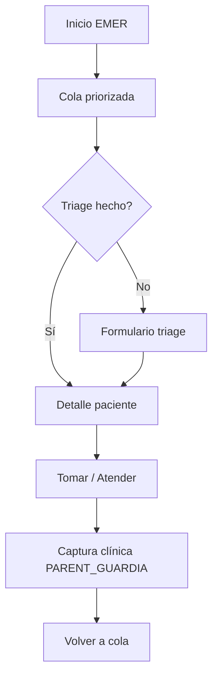

# Fase 3 — Flujo médico móvil-first

## Objetivo

Que el **médico de guardia** pueda operar el turno completo desde el teléfono: cola priorizada → triage rápido → atender → captura EMER existente.

## Checklist implementación

- [x] `EmergencyGuardiaApi` en `mobile/medico/lib/services/emergency_guardia_api.dart`
- [x] Tablero en **Inicio** (`home_screen`) cuando `encounterClass == EMER`
- [x] Orden por API (prioridad + ingreso); badge nivel con color Manchester
- [x] Pantalla **Triage** (`emergency_triage_screen.dart`): nivel, motivo, TA/FC → `registrar-triage`
- [ ] **Tomar caso** → `POST asignar` (API lista; UI explícita opcional)
- [x] **Atender** → `iniciar-atencion` + `PatientTimelineScreen` (`GUARDIA`)
- [x] Pull-to-refresh + repoll ~30 s
- [ ] Offline explícito
- [x] Cambio de encounter en Configuración recrea Inicio (`MainScreen` refresh key)

## Flujo UX móvil

## Pantallas (Flutter `mobile/medico`)

| Pantalla | Archivo sugerido |
|----------|------------------|
| Cola | `screens/emergency/emergency_queue_screen.dart` |
| Triage | `screens/emergency/emergency_triage_screen.dart` |
| Detalle | `screens/emergency/emergency_patient_detail_screen.dart` |

- Reutilizar estilos `BioSpacing`, cards de `home_screen`.
- Botones táctiles grandes (médico con guantes / uso rápido).

## Captura clínica

- No reimplementar formulario de consulta en Flutter si hoy la captura EMER es web SPA: **WebView** con URL de `PatientHistoriaUrl` o deep link documentado en Fase 4.
- Si ya hay captura nativa para AMB, evaluar extensión EMER en mismo módulo (spike Fase 4).

## Criterio de aceptación

- Médico en guardia completa triage + atención sin abrir desktop.
- Paciente nivel 1 aparece arriba de nivel 4 siempre.
- Tras atender, estado en cola pasa a “en atención” / “atendido” coherente con web.

## Próximo paso

Fase 4: cerrar ciclo egreso, derivación, push, asistente opcional.
