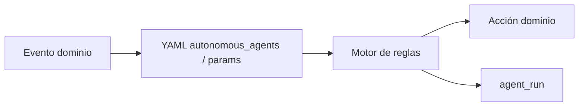

# Agentes autónomos

Procesos **proactivos** en los que el sistema toma un **paso de decisión** (compromiso, matices o volumen de datos del HIS) bajo política auditable. Se distinguen **agente** (reglas + datos) y **agente IA** (el paso decisorio usa modelo).

Definición y backlog histórico: [ideas-a-futuro/agentes-autonomos-backlog.md](./ideas-a-futuro/agentes-autonomos-backlog.md).  
Plan de implementación: [planes/agentes-autonomos-implementacion.md](./planes/agentes-autonomos-implementacion.md).

---

## Patrón técnico

| Pieza | Ubicación |
|-------|-----------|
| Política declarativa | `common/metadata/bioenlace/autonomous_agents/` |
| Motor genérico | `AutonomousAgentRuleEngine` |
| Auditoría | tabla `agent_run`, `AgentRunRecorder` |
| Acciones | Servicios de dominio (push, turnos, lab, cohortes) |

---

## Agentes implementados

### D03 — Codificación automática CIE-10 / SNOMED (agente IA D2)

| Campo | Valor |
|-------|--------|
| **Tipo** | Agente IA |
| **Trigger** | `EncounterDocumentationService::guardar` |
| **Contexto IA** | `encounter-codificacion-automatica` |
| **Servicio** | `EncounterAutomaticCodingService` |
| **Efecto** | `clinical_condition` con CIE-10 y/o SNOMED (`verification_status` PROVISIONAL) |
| **Flag** | `encounter_auto_codificacion_habilitada` |

Ver [captura-clinica.md](./captura-clinica.md) y [catalogo-usos-ia.md](./catalogo-usos-ia.md).

### B01 — Rama tras respuesta de touchpoint (agente D2)

| Campo | Valor |
|-------|--------|
| **Tipo** | Agente (reglas) |
| **Trigger** | Paciente envía formulario de seguimiento (`CarePackFollowupService::submitResponses`) |
| **Política** | `autonomous_agents/care-followup-branching.yaml` |
| **Decisiones** | Empeoramiento o intensidad alta → alerta staff; adherencia baja → mensaje educativo al paciente |
| **Efecto** | Push `CARE_FOLLOWUP_STAFF_ALERT` al PES del encounter; push educativo al paciente si aplica |
| **Auditoría** | `agent_run` (`agent_id`: `care-followup-branching`) |

Requiere `care_cohort.enabled`. Ver [asistencia-cohortes.md](./asistencia-cohortes.md).

### B03 — Post-lab: clasificar y notificar (agente D2)

| Campo | Valor |
|-------|--------|
| **Tipo** | Agente (reglas LOINC) |
| **Trigger** | Ingesta nueva de `DiagnosticReport` (`LaboratoryIngestService`) |
| **Política** | `autonomous_agents/post-lab-classification.yaml` |
| **Decisiones** | normal / control / critical por analito |
| **Efecto** | Push paciente; push staff si crítico y encounter con PES |
| **Auditoría** | `agent_run` (`agent_id`: `post-lab-classification`) |

Ver [laboratorio.md](./laboratorio.md).

### A03 — Lista de espera / relleno de huecos (agente D2–D3, v1 FIFO)

| Campo | Valor |
|-------|--------|
| **Tipo** | Agente (reglas) |
| **Trigger** | Cancelación de turno con hueco liberado (`TurnoLifecycleService::cancelar`) |
| **Política** | `autonomous_agents/turno-waitlist-fill.yaml` (FIFO, TTL 15 min, no ofertar banda A) |
| **Decisiones** | Primer inscripto en cola; si no acepta en TTL → siguiente |
| **Efecto** | Push `TURNO_WAITLIST_OFFER`; al aceptar, crea turno en el slot liberado |
| **API paciente** | `lista-espera-inscribir/cancelar/estado/aceptar-oferta-como-paciente` |
| **Cron** | `yii turno-waitlist/expire-offers` (cada 1–5 min junto a notificaciones) |
| **Auditoría** | `agent_run` (`agent_id`: `turno-waitlist-fill`) |
| **Flag** | `autonomous_agent_waitlist_enabled` |

Ver [turnos.md](./turnos.md).

---

## En implementación / backlog

| ID | Nombre | Fase plan |
|----|--------|-----------|
| A02 | Negociación multicanal | 1 |
| A01, H01, A04, A06, E01, E02, C03, D02, F02 | Ver plan | 2–4 |

---

## Documentos relacionados

- [Turnos](./turnos.md) · [Laboratorio](./laboratorio.md) · [Asistencia cohortes](./asistencia-cohortes.md)
- [Catálogo usos IA](./catalogo-usos-ia.md) · [Costos API](../costos/costos-api.md)
