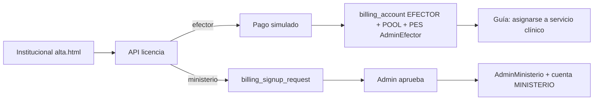

# Alta de cuenta y licencia

## De qué se trata

Desde el sitio institucional se puede **crear una clínica/efector** (privado o público) o un **consultorio profesional privado** (mismo modelo AdminEfector + licencia, con defaults distintos) con **pago simulado**, o **solicitar** una cuenta de ministerio (activación asistida). Un efector público declara ministerio (afiliación) y puede pagar por su cuenta o pedir cobertura del pool ministerial. El perfil **consultorio** no admite sector público: quien trabaja en un centro público debe ser sumado por AdminEfector.

## Actores

| Actor | Cómo entra |
|-------|------------|
| AdminEfector (clínica / centro) | Self-service en institucional → perfil `CLINICA` |
| AdminEfector (consultorio unipersonal) | Self-service → perfil `CONSULTORIO` **solo PRIVADO**; deep-link `?perfil=consultorio` |
| AdminMinisterio | Solicitud → verificación → aprobación en admin plataforma |
| Ops Bioenlace | Aprueba solicitudes y movimientos de pool |

## Cómo funciona

1. **Privado:** cuenta propia, cobro simulado, entitlements según plan.
2. **Público (solo clínica/centro):** elige ministerio (AFILIADO). Por defecto paga en cuenta propia; si marca cobertura ministerial, queda pendiente hasta que ops mueva el POOL.
3. **Consultorio:** mismos pasos que clínica privada; **sin** opción público; plan por defecto 1 profesional ambulatorio; tipología de consultorio; tras el alta, `next_steps` indica asignarse a un servicio clínico (no se crea PES clínico automáticamente).
4. **Desvincular pago ministerio / asociar:** AdminEfector autenticado vía API `desvincular-pago-ministerio` / `asociar-pago-ministerio` (esta última genera solicitud).

## Relación con el resto

- Modelo de pool: [matriz-argentina-modulos-precios.md](../modelo-de-negocio/business-plan/matriz-argentina-modulos-precios.md)
- Decisión: [onboarding-comercial-self-service.md](../decisions/onboarding-comercial-self-service.md)
- Admin: Licencias / Contratos + Solicitudes alta licencia
