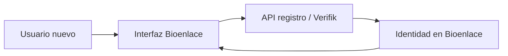

# Experiencia paciente y médico

## De qué se trata

**Una misma plataforma Bioenlace** con la misma API: el **paciente** gestiona turnos, resultados, resúmenes y conversación; el **médico** trabaja agenda, captura clínica y operación en el efector.

## Registro e identidad

- Alta con validación de documento y, para profesionales, referencias externas cuando corresponde.
- Tras login, **token** y **sesión operativa** (efector, servicio, rol) fijan qué puede hacer cada pantalla.

## Capacidades transversales

| Capacidad | Idea |
|-----------|------|
| Conversación y acciones guiadas | [asistente-y-chat.md](./asistente-y-chat.md) |
| Notificaciones push | Turnos, resumen de atención listo, etc. |
| Medios | Intercambio de audio, imagen o video según flujo clínico o soporte |
| Videollamada | Cuando el producto habilita teleconsulta |

## Paciente en el día a día

- Inicio: próximos turnos, tratamientos activos, mis atenciones.
- Resolver turnos en conflicto o pedir acciones desde la conversación o desde accesos directos en inicio.
- Configuración: alertas, recordatorios de planes de tratamiento.

## Médico en el día a día

- Sesión con **efector y servicio**; agenda del día; pacientes en consulta.
- Captura clínica y prescripción según [captura-clinica.md](./captura-clinica.md) y [receta-electronica.md](./receta-electronica.md).

## Relación con otros documentos

- [turnos.md](./turnos.md), [laboratorio.md](./laboratorio.md), [resumen-atencion-paciente.md](./resumen-atencion-paciente.md)
