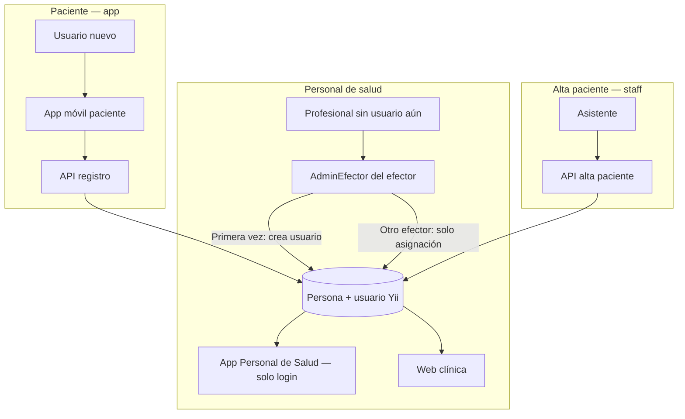

# Experiencia paciente y personal de salud

## De qué se trata

**Una misma plataforma Bioenlace** con la misma API: el **paciente** gestiona turnos, resultados, resúmenes y conversación desde la **app móvil**; el **personal de salud** trabaja agenda, captura clínica y operación en el efector (web clínica y **app móvil Personal de Salud**).

## Registro e identidad

Detalle de alta de **pacientes** y de **usuarios del personal**: **[registro-paciente.md](./registro-paciente.md)** y gestión AdminEfector en [admin_efector/gestion-efector.md](../qa/admin_efector/gestion-efector.md).

- **Paciente:** autoregistro en app; contexto provincial/sector y domicilio en segundo plano (sin detalle técnico en la UI). **Sesión:** huella local en el día a día; Didit al reingresar tras cerrar sesión — [sesion-paciente-app.md](./sesion-paciente-app.md).
- **Personal de salud:** **no hay registro en la app móvil**. Un **AdminEfector** crea el usuario Yii la **primera vez** que asigna a esa persona a cualquier efector. Si cambia de centro, el AdminEfector del nuevo efector la **asigna al efector** reutilizando el **mismo usuario**.
- **App Personal de Salud:** solo **login** + wizard de sesión operativa (efector, servicio, área); `appClient` `personalsalud-flutter`.
- **Alta de pacientes** (no de staff): la hace el personal desde web/asistente cuando corresponde — ver [registro-paciente.md](./registro-paciente.md).
- Tras login, **token** y **sesión operativa** del staff (efector, servicio, rol) definen su contexto; el paciente en un flujo clínico se pasa **explícitamente** (asistente, API, captura).

## Capacidades transversales

| Capacidad | Idea |
|-----------|------|
| Conversación y acciones guiadas | [asistente-y-chat.md](./asistente-y-chat.md) |
| Notificaciones push | Turnos, guardia, resumen de atención listo, etc. |
| Medios | Intercambio de audio, imagen o video según flujo clínico o soporte |
| Videollamada | Cuando el producto habilita teleconsulta |

## Paciente en el día a día

- Inicio: próximos turnos, tratamientos activos, mis atenciones.
- **Representación:** chip «A cargo de» en inicio (yo u otro paciente con tutela o delegación activa); gestión en Configuración → Representación. Detalle: [representacion-paciente.md](./representacion-paciente.md).
- Resolver turnos en conflicto o pedir acciones desde la conversación o desde accesos directos en inicio.
- Configuración: alertas, recordatorios de planes de tratamiento, preferencia de aviso cuando un representante actúa (N9).

## Personal de salud en el día a día

- **Primer acceso:** si no tenés usuario, el administrador del efector debe crearte uno; la app no ofrece alta.
- Sesión con **efector y servicio**; la **página de inicio muta** según `encounter_class` y rol (tablero EMER, mapa IMP, agenda AMB, etc.) — ver [superficies-ui.md](./superficies-ui.md). Misma lógica en **web** y **app Personal de Salud** (`GET /home/panel`).
- **Captura clínica** unificada: timeline del paciente + formulario encounter (texto/audio → API `clinical/encounter/*`); muta por encounter, rol y especialidad — [captura-clinica.md](./captura-clinica.md). En ambulatorio, el timeline muestra **motivos pre-turno** (intake, resumen del chat, cohorte) antes del dictado — [recorrido-pre-post-consulta.md](./recorrido-pre-post-consulta.md).
- Operaciones puntuales (alta internación, triage, etc.) vía **flows del asistente** cuando aplica — [asistente-y-chat.md](./asistente-y-chat.md).
- Con **encounterClass = EMER** (guardia): tablero operativo, triage, atender, derivar y egreso — [urgencias-guardia.md](./urgencias-guardia.md).
- **Internación (IMP):** mapa de camas en inicio; atención en piso vía timeline con `parent=INTERNACION` — [internacion.md](./internacion.md).

## Relación con otros documentos

- [registro-paciente.md](./registro-paciente.md) — alta paciente, MPI reducido, contexto y domicilio RENAPER
- [sesion-paciente-app.md](./sesion-paciente-app.md) — sesión, bloqueo local y reingreso Didit
- [representacion-paciente.md](./representacion-paciente.md) — tutela de menor y delegación
- [consultas-seguimiento.md](./consultas-seguimiento.md) — consulta clínica por mensaje y seguimiento de tratamiento (app)
- [superficies-ui.md](./superficies-ui.md) — inicio vs captura vs flows (web = app Personal de Salud)
- [urgencias-guardia.md](./urgencias-guardia.md), [internacion.md](./internacion.md)
- [app-personalsalud/README.md](../qa/app-personalsalud/README.md) — QA humo app móvil
- [STORE_LISTING.md](../../../mobile/personalsalud/STORE_LISTING.md) — borrador Play Store
