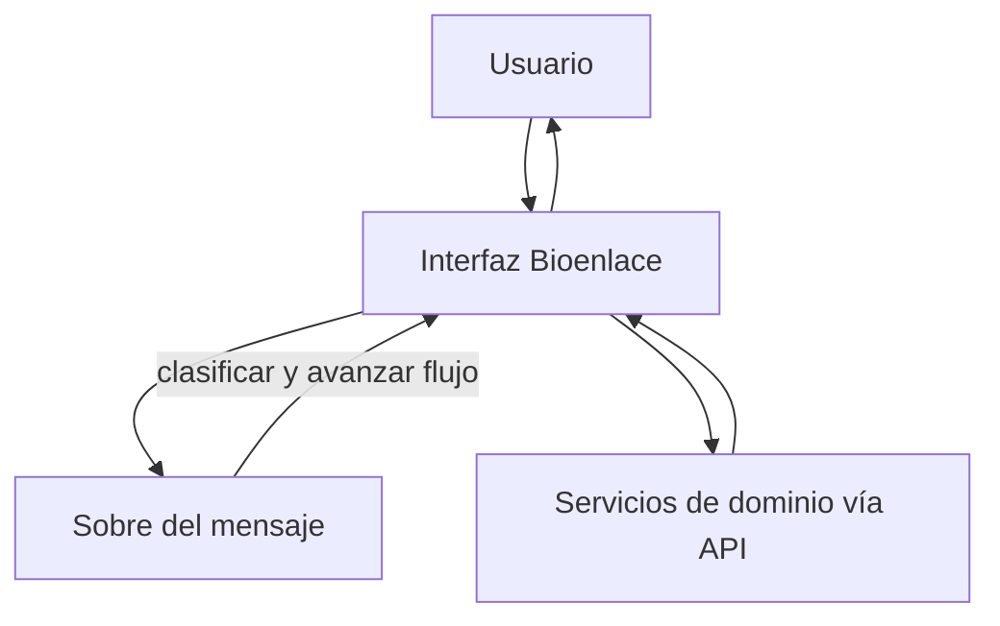

# Conversación y acciones en Bioenlace

## De qué se trata

Pacientes y staff **hacen cosas en lenguaje natural** dentro de Bioenlace: pedir un turno, ver laboratorio, abrir un formulario, seguir un asistente paso a paso sin memorizar menús. Es la misma plataforma que las pantallas de inicio, listas y formularios: no es un producto aparte.

Por detrás hay dos motores (clasificar intención y guiar pasos); la explicación con diagramas está en [arquitectura/asistente-motores.md](../arquitectura/asistente-motores.md).

## Qué ve el usuario

- Mensajes claros del sistema conversacional.
- Pantallas embebidas (listas, formularios, confirmaciones) en el mismo hilo o en la pantalla que corresponda.
- Atajos de acciones frecuentes según rol (categorías “turnos”, “laboratorio”, “mis atenciones”…).

## Cómo funciona de punta a punta

1. El usuario escribe o elige una acción sugerida.
2. El sistema decide **qué intent** corresponde y si tiene **permiso**.
3. Si el flujo es conversacional, avanza por **pasos** (YAML): elegir ítem, confirmar, enviar formulario.
4. Cada paso que necesita datos llama a la **API de negocio** (turnos, clínica, laboratorio); la capa conversacional no guarda la verdad clínica, solo el **borrador** del wizard.

## Otros usos del mismo stack

- Conversación operativa general.
- Motivos de consulta antes del turno.
- Captura clínica (texto o audio del encuentro) con entrypoint dedicado.

Comparten ideas de borrador y permisos; no siempre pasan por el mismo clasificador de intents.

## Modelo de superficies

Web staff y app Personal de Salud comparten API; tres tipos de UI: **inicio** (tableros), **captura encounter** (timeline + formulario), **flows** (asistente). Detalle: [superficies-ui.md](./superficies-ui.md).

WhatsApp es otra superficie del **mismo** asistente paciente (Meta Cloud API): paridad de intents con la **app móvil paciente**. **Alcance:** solo respuestas a mensajes **iniciados por el paciente** (ventana service de Meta). **No** se usan plantillas utility/marketing para avisos proactivos (recordatorios, resolución, etc. siguen en push). La presentación se adapta al canal (texto, botones o listas); si un paso necesita una pantalla rica, se invita a abrir Bioenlace. Antes de operar, se vincula el número a la cuenta paciente (confirmación explícita).

**Costos:** Meta del alcance actual ≈ **$0**; la IA es la del §1 (igual que app). Detalle: [costos-api §7](../costos/costos-api.md#7-whatsapp-cloud-api-paciente).

Checklist manual de smoke: [qa/paciente/asistente-whatsapp.md](../qa/paciente/asistente-whatsapp.md).

## Intents de dominio (referencia mayo 2026)

Ejemplos de flujos conversacionales con UI JSON (YAML en `SubIntentEngine/schemas/intents/`):

| Dominio | Intent | Uso |
|---------|--------|-----|
| Atención (paciente) | `atencion.necesito-atencion` | Triage + turno ambulatorio (primer atajo en chat) |
| Urgencias | `urgencias.ver-tablero-guardia` | Navegar al tablero EMER |
| Urgencias | `urgencias.triage-paciente-guardia` | Lista sin triage → formulario Manchester |
| Internación | `internacion.mapa-camas-flow` | Mapa de camas del efector |
| Internación | `internacion.alta-estructurada-flow` | Alta con epicrisis y plantilla |
| Internación | `internacion.cambio-cama-flow` | Traslado de cama en internación activa |
| Agenda | `turnos.indicadores-agenda-flow` | KPIs no-show y lead time (staff) |
| Planes | `tratamiento.adherencia-resumen-staff` | Dashboard adherencia por efector |
| Personas | `personas.vincular-menor-flow` | Tutela verificada (hub nativo / solicitud menor) |
| Personas | `personas.designar-representante-flow` | Delegación paciente → representante |

Catálogo API: `PersonRepresentationUiActionCatalog` (acción hub `person-representation.hub` → pantalla nativa `person_representation_hub` en móvil).

Detalle operativo por área: [urgencias-guardia.md](./urgencias-guardia.md), [internacion.md](./internacion.md), [turnos.md](./turnos.md), [planes-de-tratamiento.md](./planes-de-tratamiento.md), [representacion-paciente.md](./representacion-paciente.md).

## Costos

- Asistente (app o WhatsApp reactivo): [costos-api §1](../costos/costos-api.md#1-conversación-con-el-paciente) + [§7](../costos/costos-api.md#7-whatsapp-cloud-api-paciente) (Meta ≈ $0; utility no habilitada).
- Índice: [costos/](../costos/README.md).
