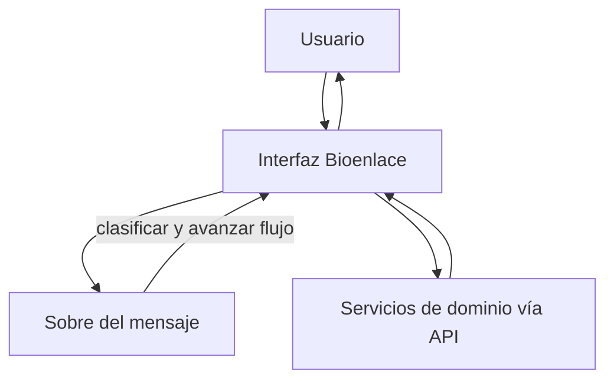
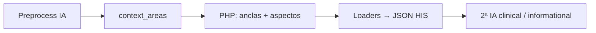
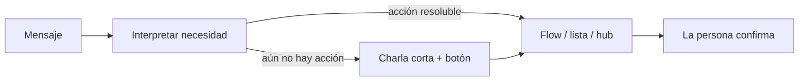

# Conversación y acciones en Bioenlace

## De qué se trata

Pacientes y personal **hacen cosas en lenguaje natural**: pedir un turno, ver laboratorio, abrir un formulario, seguir un asistente paso a paso. Es la misma plataforma que las pantallas de inicio y las listas: no es un producto aparte.

Por detrás hay dos motores (clasificar intención y guiar pasos). Diagramas: [arquitectura/asistente-motores.md](../arquitectura/asistente-motores.md).

## Qué ve el usuario

- Mensajes claros.
- Pantallas embebidas (listas, formularios, confirmaciones) en el hilo o en la pantalla que corresponda.
- Atajos de acciones frecuentes según rol (turnos, laboratorio, mis atenciones…).

## Cómo funciona

```mermaid
flowchart TB
  U[Usuario]
  IF[Interfaz Bioenlace]
  ENV[Sobre del mensaje]
  DOM[Servicios de dominio vía API]
  U --> IF
  IF --> ENV
  ENV -->|clasificar y avanzar flujo| IF
  IF --> DOM
  DOM --> IF
  IF --> U
```

1. El usuario escribe o elige un atajo.
2. El sistema elige el **intent** y comprueba **permiso**.
3. Si hace falta, avanza por **pasos** declarados (elegir ítem, confirmar, formulario).
4. Cada paso que necesita datos llama a la **API de negocio**. El chat no es la fuente de verdad clínica: solo guarda el **borrador** del wizard.

Los YAML de flujo viven en `common/metadata/bioenlace/assistant/intents/`.

Clasificación de acción: keywords del intent + desambiguación si hay empate (sin IA eligiendo `intent_id`).

**Canales** (preprocess IA → `user_goal`):

| Canal | Rol | Botones |
|-------|-----|---------|
| **clinical** | Malestar o preocupación por **su** salud sin trámite explícito | Solicitar Atención si hay síntoma en el hilo (o certeza) |
| **informational** | Cómo funciona el producto; **saludo solo** sin síntoma | Artículo + CTA a intent(s) del artículo |
| **ambiguous** | Dominio poco claro / desvío de hilo | Preguntas fijas para encauzar |
| **operational** | Trámite concreto | Flow del intent |

Hilos: no se mezcla historial clínico con ayuda de producto; un cambio de dominio puede pasar por ambiguous. Metadata de prompts: `assistant/prompts/`; booking: `assistant/routing/booking-offer.yaml`.

Contenido editorial: [contenido-informativo.md](./contenido-informativo.md).

## Contexto HIS en la 2ª IA

Cuando el paciente pregunta algo que **necesita datos del sistema** (próximo turno, reglas del centro, llegar tarde) pero no hay un artículo editorial, Bioenlace **no** pega la historia clínica completa al prompt. Usa un volcado acotado del HIS con vocabulario operativo.

```mermaid
flowchart LR
  P[Preprocess IA]
  A[context_areas]
  R[PHP: anclas + aspectos]
  L[Loaders → JSON HIS]
  I[2ª IA clinical / informational]
  P --> A --> R --> L --> I
```

| Concepto | Quién lo ve | Qué es |
|----------|-------------|--------|
| **Área HIS** | Preprocess (`context_areas`) | Tema top-level: `appointments`, `product`, … |
| **Aspecto** | 2ª IA (clave JSON en volcado) | Unidad de carga: `appointment.current`, `site.appointment.policies`, … |
| **Entidad** | Solo PHP (loaders) | `Turno`, `EfectorTurnosConfig`, … — **no** aparece en prompts |

Reglas de producto:

- Saludo solo o meta sin datos → `context_areas: []` → **sin loaders**.
- El preprocess **no** elige aspectos ni SQL; PHP resuelve anclas y aspectos tras el preprocess.
- El bloque en prompt es `--- context:his ---` con JSON de aspectos (valores reales o `null` si el loader no tiene el dato). Reglas transversales en el prompt; sin listas globales de “limitaciones”.
- Canal **informational** sin artículo pero con áreas HIS: respuesta con IA + volcado (no mensaje genérico `no_article`).

Detalle técnico: [arquitectura/asistente-motores.md](../arquitectura/asistente-motores.md) · ADR: [decisions/asistente-contexto-his-areas-aspectos.md](../decisions/asistente-contexto-his-areas-aspectos.md).

## Qué interpreta y qué no resuelve el modelo

Bioenlace **entiende la necesidad** y **abre el camino que ya existe** (flow, lista, hub) para que la persona lo complete. Eso escala: el dato vive en la API (turnos, oferta del centro, PES, acto); no se pega al prompt la historia clínica completa, ni el catálogo del efector, ni la provincia.

```mermaid
flowchart LR
  M[Mensaje]
  I[Interpretar necesidad]
  F[Flow / lista / hub]
  U[La persona confirma]
  C[Charla corta + botón]
  M --> I
  I -->|acción resoluble| F --> U
  I -->|aún no hay acción| C --> F
```

| Tipo de pedido | Qué hace Bioenlace | Qué no hace |
|----------------|--------------------|-------------|
| Síntoma o “qué hago” | Charla breve y oferta **Solicitar Atención** | Diagnosticar ni recetar en el chat |
| Turno / cancelar / ver lo mío | Intent operativo; hidrata el **draft** con lo que ya dijo | Completar la reserva sin que confirme |
| “Mi {oferta}” (*dentista*, *kinesiólogo*…) | Misma reserva; intenta cruzar la mención con la **oferta del centro** (no con una especialidad suelta) | Un intent por profesión |
| “Última vez en {oferta}” | Lectura de turnos pasados, filtrada si se puede cruzar la oferta | Preguntarle la fecha a Gemini con la HC |
| “Sacalo vos / elegí y confirmá” | Abre el flow; la persona elige y confirma | Agendar a ciegas en su nombre |

Si el flow tiene muchos pasos, la palanca es **hidratar el borrador** (servicio, centro, “el mío”), no alargar el prompt. El conversacional queda para lo que todavía no es una acción.

Anclas genéricas (odontología es solo un ejemplo de habla): [asistente-consultas.md](../qa/paciente/asistente-consultas.md). Servicio vs PES vs acto: [glosario-servicio-pes-acto.md](./glosario-servicio-pes-acto.md). Extracto de HC: [ia-datos-y-privacidad.md](./ia-datos-y-privacidad.md).

## Consultar un dato (lectura)

Cuando la persona **pregunta un dato que ya está en Bioenlace** (cuántos profesionales hay, mis turnos, última vez en un área del centro), el asistente no inventa ni pega la historia al modelo. Elige una **consulta autorizada** para ese usuario, rellena los filtros con lo que ya dijo (centro, oferta, fechas, límite) y muestra el resultado.

El permiso es el de **esa consulta**: solo ve lo que su rol puede. No hay un canal genérico “listame lo que quieras” en el chat: cada pregunta tiene una puerta con permiso propio. Por detrás, las consultas simples (conteo, listado, agregado) usan el mismo motor de query; las pantallas ricas (tablero de guardia, mapa de camas, indicadores de agenda) son flujos de producto, no esa query genérica.

Detalle técnico: [asistente-lectura-data-access.md](../arquitectura/asistente-lectura-data-access.md).

## Superficies

Tres tipos de UI: **inicio**, **captura del encounter**, **flows** (asistente). Detalle: [superficies-ui.md](./superficies-ui.md).

**WhatsApp** es el mismo asistente paciente, solo ante mensajes **iniciados por el paciente**. Los avisos proactivos (recordatorios, reubicación) siguen en **push**. Si un paso necesita pantalla rica, se invita a abrir Bioenlace. Hay que vincular el número a la cuenta (confirmación explícita).

Smoke WhatsApp: [qa/paciente/asistente-whatsapp.md](../qa/paciente/asistente-whatsapp.md).  
Qué puede preguntar un paciente: [qa/paciente/asistente-consultas.md](../qa/paciente/asistente-consultas.md) (incluye “mi dentista”, última vez en una oferta y pedidos de que el asistente lo haga solo).

## Puertas frecuentes (paciente)

| Qué pide | Intent |
|----------|--------|
| Malestar, estudio, control o urgencia | `atencion.necesito-atencion` — [solicitar-atencion.md](./solicitar-atencion.md) |
| Solo sacar turno (sin motivo clínico) | `turnos.crear-como-paciente` — [turnos.md](./turnos.md) |
| Última vez en una oferta del centro | `turnos.ver-ultimo-en-oferta-como-paciente` |
| Tutela / delegación | `personas.vincular-menor-flow`, `personas.designar-representante-flow` — [representacion-paciente.md](./representacion-paciente.md) |

El personal usa otros intents (tablero de guardia, mapa de camas, KPIs de agenda, adherencia). Ver el área correspondiente.

Otros usos del mismo stack (no siempre el mismo clasificador): motivos pre-consulta, captura clínica con audio/texto.

## Datos de salud en el chat

El hilo reciente sirve para seguir la charla (*«empezó ayer…»*). El extracto de HC en conversacional es **estrecho**: no responde “cuándo fui a X” ni reemplaza un intent de lectura. Sirve para no contradecir una alergia o condición **si** el texto se va hacia consejo. Ejemplo y candado: [ia-datos-y-privacidad.md](./ia-datos-y-privacidad.md).

## Costos

Conversación (app o WhatsApp reactivo): [costos-api §1](../costos/costos-api.md#1-conversación-con-el-paciente) y [§7](../costos/costos-api.md#7-whatsapp-cloud-api-paciente). Índice: [costos/](../costos/README.md).
