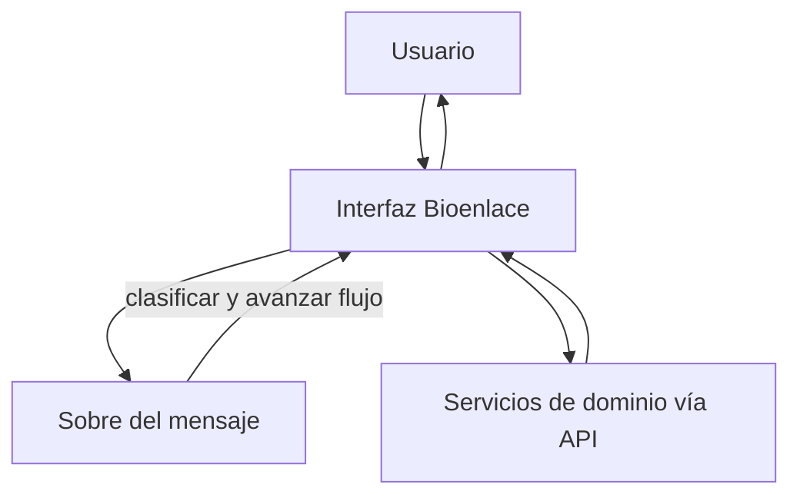

# Conversación y acciones en Bioenlace

## De qué se trata

Pacientes y personal **hacen cosas en lenguaje natural**: pedir un turno, ver laboratorio, abrir un formulario, seguir un asistente paso a paso. Es la misma plataforma que las pantallas de inicio y las listas: no es un producto aparte.

Por detrás hay dos motores (clasificar intención y guiar pasos). Diagramas: [arquitectura/asistente-motores.md](../arquitectura/asistente-motores.md).

## Qué ve el usuario

- Mensajes claros.
- Pantallas embebidas (listas, formularios, confirmaciones) en el hilo o en la pantalla que corresponda.
- Atajos de acciones frecuentes según rol (turnos, laboratorio, mis atenciones…).

## Cómo funciona

```mermaid
flowchart TB
  U[Usuario]
  IF[Interfaz Bioenlace]
  ENV[Sobre del mensaje]
  DOM[Servicios de dominio vía API]
  U --> IF
  IF --> ENV
  ENV -->|clasificar y avanzar flujo| IF
  IF --> DOM
  DOM --> IF
  IF --> U
```

1. El usuario escribe o elige un atajo.
2. El sistema elige el **intent** y comprueba **permiso**.
3. Si hace falta, avanza por **pasos** declarados (elegir ítem, confirmar, formulario).
4. Cada paso que necesita datos llama a la **API de negocio**. El chat no es la fuente de verdad clínica: solo guarda el **borrador** del wizard.

Los YAML de flujo viven en `common/metadata/bioenlace/assistant/intents/`.

## Superficies

Tres tipos de UI: **inicio**, **captura del encounter**, **flows** (asistente). Detalle: [superficies-ui.md](./superficies-ui.md).

**WhatsApp** es el mismo asistente paciente, solo ante mensajes **iniciados por el paciente**. Los avisos proactivos (recordatorios, reubicación) siguen en **push**. Si un paso necesita pantalla rica, se invita a abrir Bioenlace. Hay que vincular el número a la cuenta (confirmación explícita).

Smoke WhatsApp: [qa/paciente/asistente-whatsapp.md](../qa/paciente/asistente-whatsapp.md).  
Qué puede preguntar un paciente: [qa/paciente/asistente-consultas.md](../qa/paciente/asistente-consultas.md).

## Puertas frecuentes (paciente)

| Qué pide | Intent |
|----------|--------|
| Malestar, estudio, control o urgencia | `atencion.necesito-atencion` — [solicitar-atencion.md](./solicitar-atencion.md) |
| Solo sacar turno (sin motivo clínico) | `turnos.crear-como-paciente` — [turnos.md](./turnos.md) |
| Tutela / delegación | `personas.vincular-menor-flow`, `personas.designar-representante-flow` — [representacion-paciente.md](./representacion-paciente.md) |

El personal usa otros intents (tablero de guardia, mapa de camas, KPIs de agenda, adherencia). Ver el área correspondiente.

Otros usos del mismo stack (no siempre el mismo clasificador): motivos pre-consulta, captura clínica con audio/texto.

## Costos

Conversación (app o WhatsApp reactivo): [costos-api §1](../costos/costos-api.md#1-conversación-con-el-paciente) y [§7](../costos/costos-api.md#7-whatsapp-cloud-api-paciente). Índice: [costos/](../costos/README.md).
