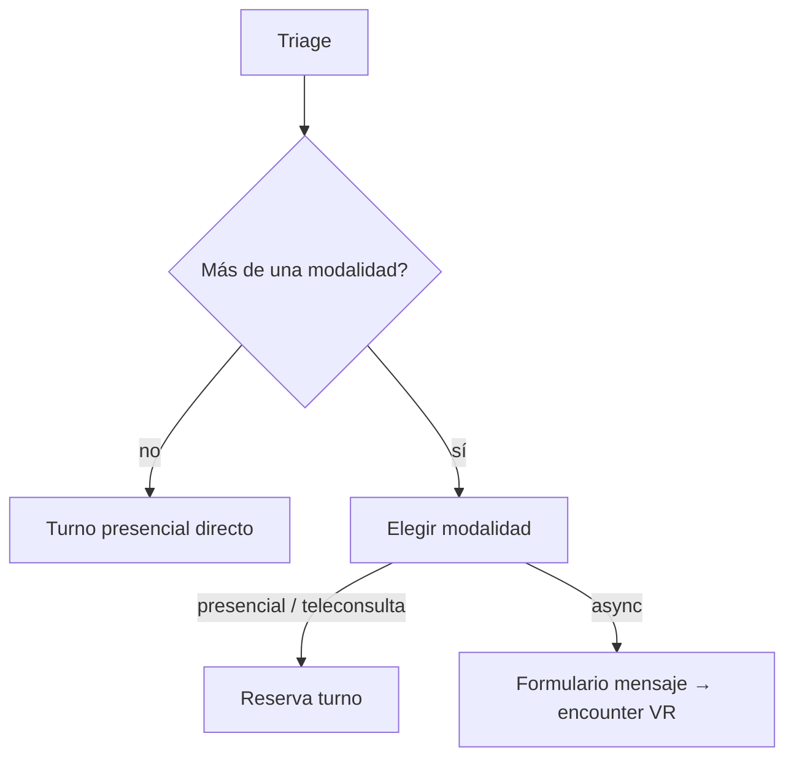

# Atención remota y consulta clínica por mensaje

## Denominación

| Término | Uso |
|---------|-----|
| **Consulta clínica por mensaje** | Nombre de producto: atención asincrónica por chat, sin turno ni videollamada; responde un profesional real. |
| **Consulta async** | Nombre técnico (`SOLICITUD_ASYNC`, encounter VR, bandeja staff). |
| **Videollamada** | Atención remota **con** turno reservado (no es consulta clínica por mensaje). |

Detalle del flujo paciente de renovación / dudas / seguimiento: [consultas-seguimiento.md](./consultas-seguimiento.md).

## De qué se trata

Bioenlace puede atender algunos motivos de consulta **sin que el paciente concurra presencialmente**: por **videollamada** (con turno reservado) o por **consulta clínica por mensaje** (consulta async, sin turno ni video). La adopción es gradual: el personal médico sigue operando en presencial mientras el sistema educa y, más adelante, ofrece modalidades remotas al paciente y opt-in en la agenda del profesional.

## Actores

- **Paciente** — reserva o solicita atención vía asistente (**Solicitar Atención** / `atencion.necesito-atencion`). Malestar y urgencia: triage + modalidad. Consulta por mensaje y seguimiento: motivo **Control/Seguimiento** — ver [solicitar-atencion.md](./solicitar-atencion.md) y [consultas-seguimiento.md](./consultas-seguimiento.md).
- **Profesional (PES)** — atiende turnos del día; puede habilitar remoto en su agenda (`acepta_consultas_online`).
- **Admin efector** — política de teleconsulta por servicio y métricas agregadas del efector.

## Cómo funciona (etapa 0 — observación staff)

Cuando un turno es **presencial** pero el triage persistido tiene elegibilidad **sugerida** o **permitida** para remoto, el listado **Pacientes del día** muestra un aviso informativo (videollamada y/o mensaje). Textos en `staff_modalidad_insight.yaml`; reglas clínicas vía `TeleconsultaElegibilidadService`.

## Cómo funciona (etapa 1 — oferta al paciente)

Tras el triage, el paciente puede ver el paso **Modalidad** con hasta tres opciones (catálogo `reserva_modalidad_atencion.yaml`):

- **Presencial** — siempre que el caso no sea de urgencia bloqueada.
- **Videollamada con turno** — si `TeleconsultaElegibilidadService` y la política del servicio lo permiten; slots vía hub teleconsulta sin elegir profesional.
- **Consulta clínica por mensaje** — si la elegibilidad clínica es `sugerido` o `permitido`; crea un encounter virtual planificado (`SOLICITUD_ASYNC`) sin turno.

Si solo aplica presencial, el asistente **omite** el paso modalidad y fija `tipo_atencion=presencial`. Si no hay cupos de videollamada en el hub, la UI de días muestra un mensaje orientando a mensaje o presencial.

## Etapas previstas

| Etapa | Foco |
|-------|------|
| 0 | Insight educativo en listado staff |
| 1 | Oferta modalidad al paciente + solicitud async mínima |
| 2 | Opt-in profesional: copy en agenda, KPI y link desde insight |
| 3 | Bandeja staff para async + chat operativo |
| 4 | Política y métricas por efector/servicio (AdminEfector) |

## Cómo funciona (etapa 2 — opt-in profesional)

Al **configurar agenda**, el profesional ve un texto que distingue videollamada (switch opcional) y consulta clínica por mensaje (no requiere el switch). El campo pasó a llamarse «Acepto videollamada en esta agenda».

En el listado del día, si la agenda no tiene remoto habilitado, el insight incluye enlace a **Configurar mi agenda** (asistente).

En los KPI de agenda (30 días), si hubo turnos presenciales con triage `sugerido`, aparece el indicador **Presencial (remoto posible)**.

## Cómo funciona (etapa 3 — bandeja de consultas clínicas por mensaje)

Las solicitudes generan un encounter VR en estado **planificado**, sin turno. El equipo del **servicio** asignado en el efector de sesión las ve en **Consultas clínicas por mensaje**, encima del listado de turnos del día.

- **Tomar y responder** — asigna el PES de sesión, pasa a `in-progress` y abre el chat.
- **Chat** — API `consulta-chat` existente; el primer mensaje del paciente se guarda al crear la solicitud.
- **SLA** — plazo objetivo según banda de urgencia del triage (`consulta_async_bandeja.yaml`); badge si venció sin respuesta del staff.
- **Priorización (agente H01)** — orden sugerido por score (banda triage, SLA vencido, antigüedad, mensaje paciente sin respuesta). Badge «Prioridad 1–3» en tarjetas. Escalamiento push staff en bandas A/B con SLA vencido (una vez por solicitud).
- **Paciente** — en inicio ve sus consultas async activas con acceso al mismo chat.

## Cómo funciona (etapa 4 — política por servicio)

**AdminEfector** ve en el panel operativo KPIs agregados del efector: turnos presenciales con potencial remoto (30 días) y cuántos servicios tienen videollamada habilitada en reserva.

Desde el asistente (**Política de teleconsulta por servicio**), configura por cada servicio del efector:

- **Sin videollamada** (`NINGUNA`) — default; solo presencial en reserva (la consulta clínica por mensaje sigue por triage).
- **Todas las elegibles** (`TODAS`) — video si el triage y la agenda del profesional lo permiten.
- **Algunos motivos** (`ALGUNAS`) — allowlist en `servicio_teleconsulta_caso`.

## Relación con el resto

- [triage-reserva-turno.md](./triage-reserva-turno.md) — motivo y alarmas al reservar.
- [consultas-seguimiento.md](./consultas-seguimiento.md) — flujo paciente de consulta clínica por mensaje y seguimiento (sin triage de malestar nuevo).
- [teleconsulta-elegibilidad.md](./teleconsulta-elegibilidad.md) — reglas de modalidad en reserva.
- [turnos.md](./turnos.md) — agenda y listado del día.
