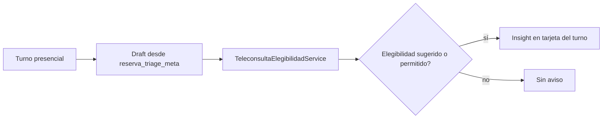

# Atención remota y consulta async

## De qué se trata

Bioenlace puede atender algunos motivos de consulta **sin que el paciente concurra presencialmente**: por **videollamada** (con turno reservado) o por **mensaje** (consulta async, sin turno ni video). La adopción es gradual: el personal médico sigue operando en presencial mientras el sistema educa y, más adelante, ofrece modalidades remotas al paciente y opt-in en la agenda del profesional.

## Actores

- **Paciente** — reserva o solicita atención vía asistente (`atencion.necesito-atencion`) con triage previo.
- **Profesional (PES)** — atiende turnos del día; puede habilitar remoto en su agenda (`acepta_consultas_online`).
- **Admin efector** — política de teleconsulta por servicio y métricas agregadas (etapas futuras).

## Cómo funciona (etapa 0 — observación)

Cuando un turno es **presencial** pero el **motivo de reserva** (triage persistido en el turno) tiene elegibilidad clínica **sugerida** o **permitida** para remoto, el listado **Pacientes del día** del staff muestra un aviso informativo:

- Resume que el caso suele poder resolverse sin presencial.
- Enumera modalidades posibles (videollamada con turno, consulta por mensaje).
- Si la agenda del profesional aún no acepta consultas online, un pie opcional indica cómo habilitarlas — **sin obligar**.

Las reglas clínicas no se duplican: se reutilizan `TeleconsultaElegibilidadService` y el catálogo `reserva_triage_teleconsulta_elegibilidad`. Los textos de UI viven en `staff_modalidad_insight.yaml`.

## Etapas previstas

| Etapa | Foco |
|-------|------|
| 0 | Insight educativo en listado (actual) |
| 1 | Oferta remota al paciente en reserva cuando el servicio lo permite |
| 2 | Opt-in profesional en agenda; priorizar async |
| 3 | Bandeja async sin turno |
| 4 | Política y métricas por efector/servicio |

Plan de implementación activo: `web/docs/plans/atencion-remota-async/plan.md` (temporal).

## Relación con el resto

- [triage-reserva-turno.md](./triage-reserva-turno.md) — motivo y alarmas al reservar.
- [teleconsulta-elegibilidad.md](./teleconsulta-elegibilidad.md) — reglas de modalidad en reserva.
- [turnos.md](./turnos.md) — agenda y listado del día.
