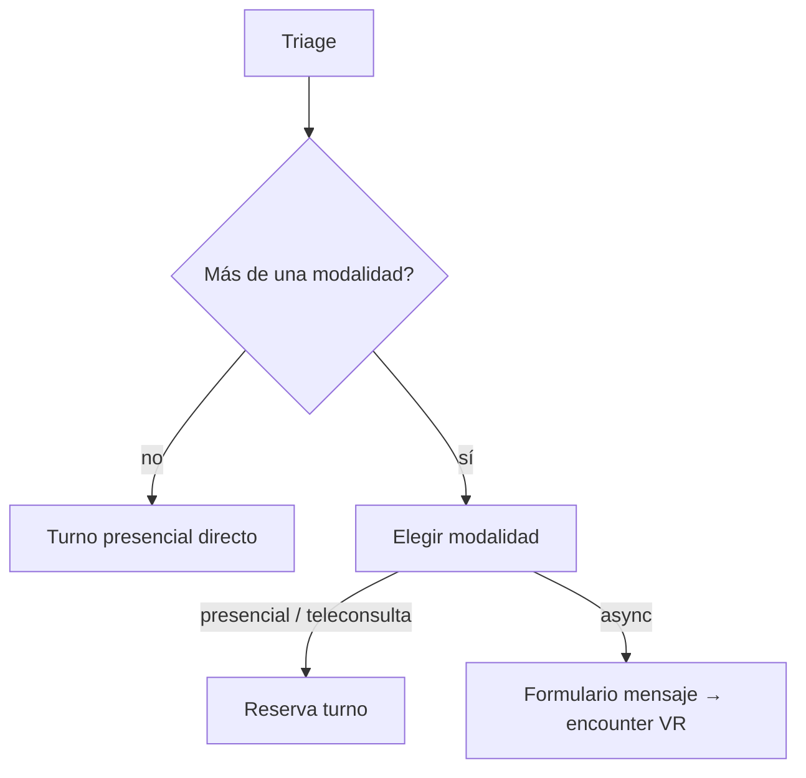

# Atención remota y consulta clínica por mensaje

## De qué se trata

Algunos motivos se atienden **sin concurrir presencialmente**:

| Canal | Qué es |
|-------|--------|
| **Videollamada** | Atención remota **con** turno reservado |
| **Consulta clínica por mensaje** | Chat asincrónico, sin turno ni video; responde un profesional real (`SOLICITUD_ASYNC`) |

No es consulta inmediata. La adopción es gradual: el equipo puede seguir en presencial mientras se ofrece remoto al paciente y opt-in en la agenda.

Renovación, ajuste y evolución (paciente): [consultas-seguimiento.md](./consultas-seguimiento.md). Puerta: [solicitar-atencion.md](./solicitar-atencion.md). Reglas de modalidad: [teleconsulta-elegibilidad.md](./teleconsulta-elegibilidad.md).

## Actores

- **Paciente** — Solicitar Atención: malestar/urgencia (triage + modalidad) o Control/Seguimiento (mensaje).
- **Profesional** — turnos del día; puede aceptar videollamada en su agenda.
- **Admin efector** — política de teleconsulta por servicio.

## Cómo funciona (etapa 0 — observación staff)

Cuando un turno es **presencial** pero el triage persistido tiene elegibilidad **sugerida** o **permitida** para remoto, el listado **Pacientes del día** muestra un aviso informativo (videollamada y/o mensaje). Textos en `staff_modalidad_insight.yaml`; reglas clínicas vía `TeleconsultaElegibilidadService`.

## Cómo funciona (etapa 1 — oferta al paciente)

Tras el triage, el paciente puede ver el paso **Modalidad** con hasta tres opciones (catálogo `reserva_modalidad_atencion.yaml`):

- **Presencial** — siempre que el caso no sea de urgencia bloqueada.
- **Videollamada con turno** — si `TeleconsultaElegibilidadService` y la política del servicio lo permiten; slots vía hub teleconsulta sin elegir profesional.
- **Consulta clínica por mensaje** — si la elegibilidad clínica es `sugerido` o `permitido`; crea un encounter virtual planificado (`SOLICITUD_ASYNC`) sin turno.

Si solo aplica presencial, el asistente **omite** el paso modalidad y fija `tipo_atencion=presencial`. Si no hay cupos de videollamada en el hub, la UI de días muestra un mensaje orientando a mensaje o presencial.

```mermaid
flowchart TD
  T[Triage] --> M{Más de una modalidad?}
  M -->|no| P[Turno presencial directo]
  M -->|sí| E[Elegir modalidad]
  E -->|presencial / teleconsulta| R[Reserva turno]
  E -->|async| S[Formulario mensaje → encounter VR]
```

## Etapas previstas

| Etapa | Foco |
|-------|------|
| 0 | Insight educativo en listado staff |
| 1 | Oferta modalidad al paciente + solicitud async mínima |
| 2 | Opt-in profesional: copy en agenda, KPI y link desde insight |
| 3 | Bandeja staff para async + chat operativo |
| 4 | Política y métricas por efector/servicio (AdminEfector) |

## Cómo funciona (etapa 2 — opt-in profesional)

Al **configurar agenda**, el profesional ve un texto que distingue videollamada (switch opcional) y consulta clínica por mensaje (no requiere el switch). El campo pasó a llamarse «Acepto videollamada en esta agenda».

En el listado del día, si la agenda no tiene remoto habilitado, el insight incluye enlace a **Configurar mis horarios** (asistente).

En los KPI de agenda (30 días), si hubo turnos presenciales con triage `sugerido`, aparece el indicador **Presencial (remoto posible)**.

## Cómo funciona (etapa 3 — bandeja de consultas clínicas por mensaje)

Las solicitudes generan un encounter VR en estado **planificado**, sin turno. El personal las atiende en sesión operativa **Virtual** (`encounter_class = VR`): el inicio muestra la bandeja **Consultas clínicas por mensaje** (no en Ambulatorio).

- **Las mías** — solicitudes ya tomadas por el profesional de la sesión (`in-progress` / en espera asignadas a su PES).
- **Por tomar** — solicitudes `planned` del servicio/efector aún sin asignar; cualquier profesional con PES en ese servicio puede tomarlas.
- Las tomadas por **otro** profesional **no** aparecen en la bandeja de quien no las tomó.
- **Tomar y responder** — asigna el PES de sesión, pasa a `in-progress` y abre el chat.
- **Chat** — API `consulta-chat` existente; el primer mensaje del paciente se guarda al crear la solicitud.
- **SLA** — plazo objetivo según banda de urgencia del triage (`consulta_async_bandeja.yaml`); badge si venció sin respuesta del staff.
- **Priorización (agente H01)** — orden sugerido por score (banda triage, SLA vencido, antigüedad, mensaje paciente sin respuesta). Badge de nivel (alta/media/baja) en las primeras posiciones. Escalamiento push staff en bandas A/B con SLA vencido (una vez por solicitud).
- **Paciente** — en inicio ve condiciones activas, tratamientos y consultas async (generales o anidadas bajo ancla) con acceso al mismo chat.

## Cómo funciona (etapa 4 — política por servicio)

**AdminEfector** ve en el panel operativo KPIs agregados del efector: turnos presenciales con potencial remoto (30 días) y cuántos servicios tienen videollamada habilitada en reserva.

Desde el asistente (**Política de teleconsulta por servicio**), configura por cada servicio del efector:

- **Sin videollamada** (`NINGUNA`) — default; solo presencial en reserva (la consulta clínica por mensaje sigue por triage).
- **Todas las elegibles** (`TODAS`) — video si el triage y la agenda del profesional lo permiten.
- **Algunos motivos** (`ALGUNAS`) — allowlist en `servicio_teleconsulta_caso`.

## Relación con el resto

- [triage-reserva-turno.md](./triage-reserva-turno.md) — alarmas al reservar
- [consultas-seguimiento.md](./consultas-seguimiento.md) — hub Control/Seguimiento
- [turnos.md](./turnos.md) — agenda y listado del día
