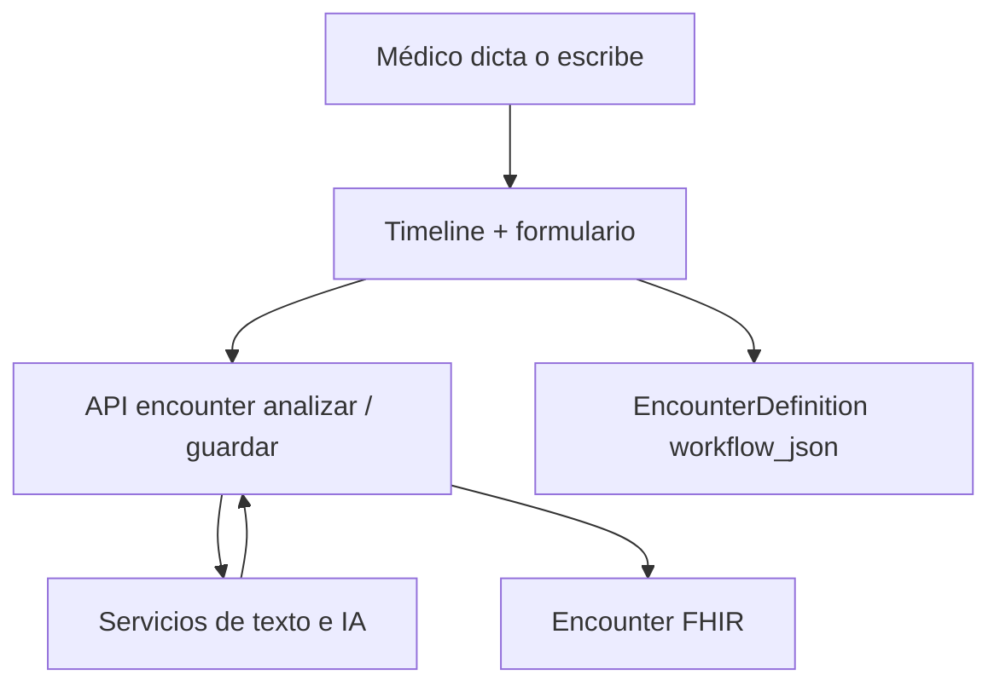

# Captura clínica

## De qué se trata

Durante la atención, el profesional registra la evolución por **texto** o **audio**. El sistema interpreta, corrige y enriquece con IA, y persiste el encuentro clínico (encounter FHIR).

La captura es **una sola superficie** para ambulatorio, guardia, internación y demás contextos: el formulario muta según encounter, rol y especialidad — igual en web y móvil. Ver [superficies-ui.md](./superficies-ui.md).

## Superficie web (shell)

| Pieza | Rol |
|-------|-----|
| `paciente/historia` (timeline) | Estado del paciente, historial, **motivos pre-turno** (intake, chat, cohorte) |
| `_formulario_consulta.php` | Entrada texto/audio + análisis + confirmación |
| `PacienteController::actionFormularioConsulta` | Resuelve `id_configuracion` vía `EncounterDefinition` |

**Contexto del formulario** (hidden / query):

- `id_persona`
- `parent` + `parent_id` — turno, internación, guardia, etc. (`Encounter::PARENT_*`)
- `id_consulta` — id del encounter en curso (alias legacy; semántica = `encounter_id`)
- `id_configuracion` — fila de `encounter_definition` (servicio + `encounter_class` + workflow por especialidad)

Entrada desde listados: `PatientHistoriaUrl::captura($idPersona, $parent, $parentId)`.

## Motivos y pre-consulta (antes del dictado)

En ambulatorio con turno, el timeline carga `GET /api/v1/personas/{id}/historia-clinica?turno_id=` y muestra, en orden:

1. **Preguntas previas al chat** (`motivos_consulta_paciente.motivos_intake`) — formulario declarativo del paciente, sin IA.
2. **Resumen de motivos** (`reason_text` / chat) y orientación preliminar (insights IA).
3. **Asistencia pre-consulta por cohorte** (`care_pack_cohorte`) — si care packs están habilitados.

Misma API y orden en la **app Personal de Salud** (`patient_timeline_screen`). Detalle de ventanas, journey y notificaciones: [recorrido-pre-post-consulta.md](./recorrido-pre-post-consulta.md).

La apertura al médico respeta `historia_clinica_apertura_medico_minutos` (params): sin turno vinculado (guardia, etc.) los motivos son visibles de inmediato.

## Cómo funciona

1. **Entrada:** audio transcrito o texto libre.
2. **Configuración:** `EncounterCaptureContextService::validarPermisoAtencion(parent, parent_id)` + lookup de `EncounterDefinition` → categorías/pasos del workflow.
3. **Análisis:** extracción de conceptos a campos del workflow (el médico revisa el HTML antes de guardar).
4. **Guardado:** `EncounterDocumentationService` persiste FHIR; **codificación CIE-10/SNOMED** vía `encounter-codificacion-automatica` (IA elige códigos y los guarda en `clinical_condition`).

## Mutación por contexto

| Dimensión | Efecto |
|-----------|--------|
| `encounter_class` (AMB, EMER, IMP, …) | Clase FHIR y definición de workflow |
| Rol (médico, enfermería, …) | Permisos y visibilidad en timeline |
| Especialidad / servicio | `EncounterDefinition` y registries (oftalmología, odontología, …) |

## Niveles de carga

- Carga mínima: solo lo esencial para cerrar la atención.
- Carga ampliada: más campos estructurados cuando el servicio lo exige en el workflow.

## Relación con el paciente

El paciente **no** ve el dictado crudo ni el expediente legal completo; ve el **resumen en lenguaje claro** descrito en [resumen-atencion-paciente.md](./resumen-atencion-paciente.md).

## Conversación clínica

La captura puede iniciarse desde la conversación integrada o desde el timeline; arquitectura en [arquitectura/asistente-motores.md](../arquitectura/asistente-motores.md).

## Lo que no es captura clínica

- Tableros de inicio (guardia, mapa de camas, agenda).
- Flows operativos (alta de internación, cambio de cama).
- Vistas MVC legacy por pestaña (`internacion-diagnostico/*`, etc.) — retiradas en migración legacy.
