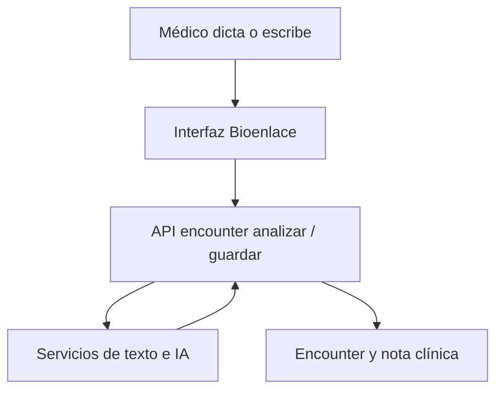

# Captura clínica

## De qué se trata

Durante la atención, el profesional registra la evolución por **texto** o **audio**. El sistema interpreta, corrige y enriquece con IA, y persiste el encuentro clínico (modelo unificado de consulta / encounter).

## Cómo funciona

1. **Entrada:** audio transcrito o texto libre en la pantalla de consulta.
2. **Análisis:** se extraen conceptos y campos; lo no mapeado puede quedar en datos auxiliares para revisión.
3. **Corrección:** reglas y IA mejoran redacción sin reemplazar la responsabilidad del profesional.
4. **Guardado:** al finalizar el encuentro ambulatorio, la nota queda en el registro; dispara publicación del **resumen al paciente** (minutos después) si aplica.

## Niveles de carga

- Carga mínima: solo lo esencial para cerrar la atención.
- Carga ampliada: más campos estructurados cuando el servicio lo exige.

## Relación con el paciente

El paciente **no** ve el dictado crudo ni el expediente legal completo; ve el **resumen en lenguaje claro** descrito en [resumen-atencion-paciente.md](./resumen-atencion-paciente.md).

## Conversación clínica

La captura puede iniciarse desde la conversación integrada o desde la pantalla de consulta; arquitectura en [arquitectura/asistente-motores.md](../arquitectura/asistente-motores.md).
