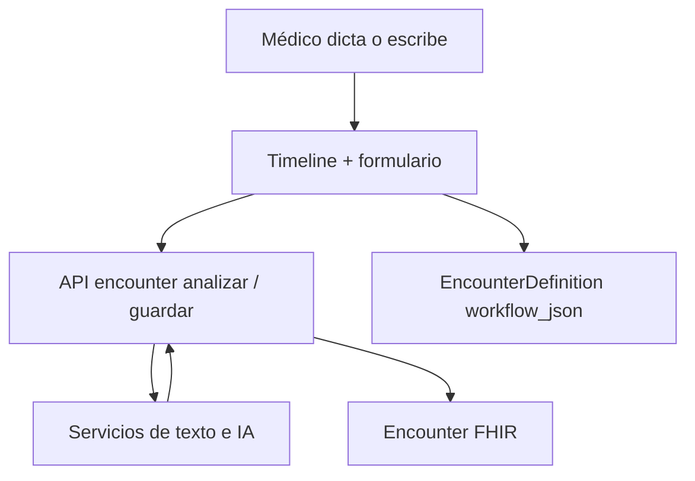

# Captura clínica

## De qué se trata

Durante la atención, el profesional registra la evolución por **texto** o **audio**. El sistema interpreta, corrige y enriquece con IA, y persiste el encuentro clínico (encounter FHIR).

La captura es **una sola superficie** para ambulatorio, guardia, internación y demás contextos: el formulario muta según encounter, rol y **servicio institucional del encounter** (`EncounterDefinition` por `service_id` + clase) — igual en web y móvil. Ver [superficies-ui.md](./superficies-ui.md). “Servicio” aquí es la oferta del centro, no la especialidad del título ni un acto SNOMED — [glosario-servicio-pes-acto.md](./glosario-servicio-pes-acto.md).

## Superficie web (shell)

| Pieza | Rol |
|-------|-----|
| `paciente/historia` (timeline) | Estado del paciente, historial, **motivos pre-turno** (intake, chat, cohorte) |
| `_formulario_consulta.php` | Entrada texto/audio + análisis + confirmación |
| `PacienteController::actionFormularioConsulta` | Resuelve `id_configuracion` (`encounter_definition.id`) |

**Contexto del formulario** (hidden / query):

- `id_persona`
- `parent` + `parent_id` — turno, internación, guardia, etc. (`Encounter::PARENT_*`)
- `id_consulta` — id del encounter en curso (alias legacy; semántica = `encounter_id`)
- `id_configuracion` — id de `encounter_definition` (**servicio del centro** + `encounter_class` + workflow)

Entrada desde listados: `PatientHistoriaUrl::captura($idPersona, $parent, $parentId)`.

## Motivos y pre-consulta (antes del dictado)

En ambulatorio con turno, el timeline carga `GET /api/v1/personas/{id}/historia-clinica?turno_id=` y muestra, en orden:

1. **Preguntas previas al chat** (`motivos_consulta_paciente.motivos_intake`) — formulario declarativo del paciente, sin IA.
2. **Resumen de motivos** (`reason_text` / chat) y orientación preliminar (insights IA).
3. **Asistencia pre-consulta por cohorte** (`care_pack_cohorte`) — si care packs están habilitados.

Misma API y orden en la **app Personal de Salud** (`patient_timeline_screen`). Detalle de ventanas, journey y notificaciones: [recorrido-pre-post-consulta.md](./recorrido-pre-post-consulta.md).

La apertura al médico respeta `historia_clinica_apertura_medico_minutos` (params): sin turno vinculado (guardia, etc.) los motivos son visibles de inmediato.

## Cómo funciona

```mermaid
flowchart TB
  M[Médico dicta o escribe]
  UI[Timeline + formulario]
  API[API encounter analizar / guardar]
  DEF[EncounterDefinition workflow_json]
  IA[Servicios de texto e IA]
  ENC[Encounter FHIR]
  M --> UI
  UI --> DEF
  UI --> API
  API --> IA
  IA --> API
  API --> ENC
```

1. **Entrada:** audio transcrito o texto libre.
2. **Configuración:** `EncounterCaptureContextService::validarPermisoAtencion(parent, parent_id)` + lookup de `EncounterDefinition` (`service_id` + clase). Las categorías del prompt/completitud las resuelve `EncounterCaptureCategoryResolver`: workflow de la oferta + overlay del **actor** (PES `servicios.item_name` de sesión) + actividades del **CarePlan inpatient** (sugerido, no gate).
3. **Análisis:** extracción de conceptos a campos del workflow (el médico revisa el HTML antes de guardar).
4. **Guardado:** `EncounterDocumentationService` persiste FHIR; **codificación CIE-10/SNOMED** vía `encounter-codificacion-automatica` (IA elige códigos y los guarda en `clinical_condition`).

## Contratos vs metadata

La integridad de cada ítem (p. ej. plazo solo en controles programados) vive en modelos de entrada Yii, no en listas planas del YAML. El YAML aporta composición del workflow, prompts y knobs; si faltan datos, el profesional resuelve opciones sugeridas sin preselección.

Detalle: [metadata-yaml-uso.md](../arquitectura/metadata-yaml-uso.md) y [captura-clinica-contratos-yii-vs-yaml.md](../decisions/captura-clinica-contratos-yii-vs-yaml.md).

Al cerrar la atención, el review puede listar **problemas y tratamientos abiertos** del paciente para que el profesional confirme estado (resuelto, en pausa, etc.) sin preselección. Ver [planes-de-tratamiento.md](./planes-de-tratamiento.md).

En **internación / guardia**, cada evolución es un encounter nuevo (salvo editar un `encounter_id` o continuar un pase `in-progress`). Una nota casi idéntica a una evolución previa **bloquea** el guardado; los ítems ya activos en el episodio no se tildan ni se reinsertan. Completar el care plan “Internación” no es el alta del episodio.

## Mutación por contexto

| Dimensión | Efecto |
|-----------|--------|
| `encounter_class` (AMB, EMER, IMP, …) | Clase FHIR y definición de workflow |
| Actor (PES `item_name`: médico, enfermería, …) | Overlay de categorías (p. ej. SV en IMP para enfermería); permisos y timeline |
| Oferta del centro (`service_id`) | Fila `encounter_definition` y registries (oftalmología, odontología, …) |
| `parent` GUARDIA / INTERNACION | Banner de episodio (`contexto_episodio`); sin motivos AMB. Ver [hcd-episodio-emergencia-internacion.md](./hcd-episodio-emergencia-internacion.md) |

## Guardia (EMER)

En guardia el workflow (`emer_standard` en `EncounterDefinition`) incluye motivos, diagnóstico, medicación, prácticas, indicaciones, **signos vitales** y **derivaciones**. Las cards de SV del timeline son **solo lectura**.

**Conducta (alta, internación, derivación a otra área/institución)** se documenta en esa captura. Tras guardar, el dominio puede marcar pedido de cama si la captura indica pase a internación (`GuardiaEncounterOutcomeService`); el staff **ingresa la cama** en el tablero. El médico no tiene CTA “Solicitar cama”.

**Paciente se retiró** no se ofrece en la HC: solo en el tablero (menú ⋮ / CTA web).

Las secciones `requerido` de cada `EncounterDefinition` (por servicio + clase) más el overlay de actor/CarePlan definen qué se pide en el prompt; la integridad al confirmar sigue en los `*Input` Yii. La plantilla EMER se elige por `encounter_class = EMER` (o `emer_nursing` si el servicio de la definición tiene `item_name=enfermeria`).

En internación el enfermero documenta la **misma nota** de encounter. El médico indica el plan (actividades del CarePlan `inpatient`); la captura de enfermería marca esas secciones como **sugeridas** y agrega signos vitales al menú si la definición de la oferta clínica no los traía.

Textos listos para pegar o dictar (alta, lab, derivación, incompletos, SCA, etc.): [textos-ejemplo-captura-emer.md](../qa/escenarios/urgencia/textos-ejemplo-captura-emer.md). Internación (evolución, régimen, balance, alta clínica): [textos-ejemplo-captura-imp.md](../qa/escenarios/internacion/textos-ejemplo-captura-imp.md).

El **egreso** es el cierre final del episodio: destino, diagnóstico operativo y epicrisis, sin dejar pedidos o derivaciones que retengan al paciente en guardia. Ver [urgencias-guardia.md](./urgencias-guardia.md).

## Niveles de carga

- Carga mínima: solo lo esencial para cerrar la atención.
- Carga ampliada: más campos estructurados cuando el servicio lo exige en el workflow.

## Relación con el paciente

El paciente **no** ve el dictado crudo ni el expediente legal completo; ve el **resumen en lenguaje claro** descrito en [resumen-atencion-paciente.md](./resumen-atencion-paciente.md).

## Conversación clínica

La captura puede iniciarse desde la conversación integrada o desde el timeline; arquitectura en [arquitectura/asistente-motores.md](../arquitectura/asistente-motores.md).

## Lo que no es captura clínica

- Tableros de inicio (guardia, mapa de camas, agenda).
- Flows operativos (alta de internación, cambio de cama).
- Vistas MVC legacy por pestaña (`internacion-diagnostico/*`, etc.) — retiradas en migración legacy.
