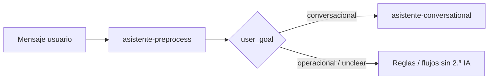

# Catálogo de usos de IA en Bioenlace

Referencia rápida: **qué hace cada llamada a modelos**, con el **contexto** que usa `IAManager` (segundo argumento de `consultarIA` / `consultar`) para logs, caché y telemetría (`AICostTracker::por_contexto`).

Modelo por defecto en producción: **`gemini-2.5-flash-lite`** (`vertex_ai_model` en `params.php`). Costos por flujo: [costos-api.md § Capacidades](../costos/costos-api.md#capacidades-que-consumen-api).

---

## Resumen por tipo de capacidad

| Tipo | Proveedor típico | ¿Genera texto clínico? |
|------|------------------|-------------------------|
| **IA generativa (Gemini)** | Vertex / Generative Language API | Sí |
| **STT (voz → texto)** | Dispositivo, luego HF o Groq en servidor | No (solo transcripción) |
| **Visión (imagen)** | Google Vision API (verificación facial) | No |

Este documento cubre sobre todo la **IA generativa** y enlaza STT donde comparte el flujo.

---

## Tabla de contextos (`IAManager`)

| Contexto | Quién | Para qué | Frecuencia típica | Código principal |
|----------|-------|----------|-------------------|------------------|
| `asistente-preprocess` | Paciente o staff en chat | Normalizar mensaje, fijar `user_goal`, extracciones ligeras | **Cada mensaje raíz** del asistente | `ChatPreprocessService` |
| `asistente-conversational` | Paciente (chat) | Respuesta en lenguaje natural (síntomas, orientación, empatía) | Cuando `user_goal` = conversacional | `ConversationalChannel` |
| `intent-engine-classification` | Paciente o staff | Elegir intent del catálogo cuando las reglas no alcanzan confianza | Ocasional (fallback del motor de intents) | `IntentClassifier` → `IntentEngine` |
| `motivos-consulta-batch` | Sistema (cron/lote) | Resumir el hilo de motivos en `encounter.reason_text` | **1× por consulta** al cerrar ventana de motivos | `AppointmentReasonBatchService` |
| `motivos-consulta-insights` | Sistema (tras el lote) | Sugerencias orientativas: hipótesis diagnósticas y prácticas (máx. 5 c/u) | **1× por consulta** si hay resumen de motivos | `AppointmentReasonClinicalInsightsService` |
| `care-pack-assistance-batch` | Sistema (cola sync) | Pack JSON de preguntas pre-consulta por cohorte | **1× por cohort_key** cuando falta pack vigente | `CarePackGenerationService` |
| `care-pack-followup-batch` | Sistema (cola sync) | Calendario touchpoints + formularios post-consulta | **1× por cohort_key** | `CarePackGenerationService` |
| `care-pack-education-batch` | Sistema (cola sync) | Módulos educativos reutilizables | **1× por cohort_key** | `CarePackGenerationService` |
| `care-pack-vertex-batch` | Sistema (Vertex batch) | Misma generación que arriba, vía `batchPredictionJobs` | **1 inferencia / job** en lote GCS | `CarePackVertexBatchPoller` + `AICostTracker` |
| `analisis-consulta` | Médico (captura) | Extraer JSON estructurado del dictado según categorías del servicio | **1× por análisis** de encounter | `ConsultaProcesamientoService` |
| `encounter-codificacion-automatica` | Sistema (al guardar) | Elegir códigos CIE-10 y/o SNOMED desde texto clínico y persistir `Condition` | **1× por guardado** de encounter con texto suficiente | `EncounterAutomaticCodingService` |
| `terminos-contextuales` | — | Reservado en `IAManager`; sin llamadas activas en el repo | — | `IAManager::obtenerTerminosContextuales` |

**Nota:** el canal **operativo** del asistente (turnos, formularios, flujos YAML) usa **reglas PHP** sobre `normalized_text`; no dispara `intent-engine-classification` en el camino habitual (`OperationalChannel` → `classifyAmongItems`).

---

## Por flujo de producto

### 1. Conversación y asistente

| Paso | Contexto IA | ¿Siempre IA? |
|------|-------------|--------------|
| Entender el mensaje | `asistente-preprocess` | Sí (mensaje con texto nuevo) |
| Charla clínica / síntomas | `asistente-conversational` | Solo si es conversacional |
| Reservar turno, menú, wizard | — | No (reglas + `SubIntentEngine`) |
| Clasificar intent (motor global) | `intent-engine-classification` | Solo si reglas + IA del classifier |

Detalle de producto: [asistente-y-chat.md](./asistente-y-chat.md) · Motor: [arquitectura/asistente-motores.md](../arquitectura/asistente-motores.md).

**Onboarding y día a día:** en costos se modela como volumen aparte ([costos-api §3](../costos/costos-api.md#3-agente-de-ia-para-onboarding-y-tareas-del-día-a-día)); en código **no hay un contexto dedicado** — las preguntas libres reutilizan el mismo stack del asistente (`asistente-preprocess` y, si aplica, conversacional).

---

### 2. Motivos de consulta (antes del turno)

| Paso | Tecnología | Contexto / notas |
|------|------------|------------------|
| Mensajes del paciente (texto) | Sin IA por mensaje | El chat de motivos no resume en cada nota |
| Audio en el hilo | STT en servidor (lote) o **futuro** STT en dispositivo | `SpeechToTextManager` en batch; ver [stt.md](../costos/estrategias-reduccion/stt.md) |
| Cierre de ventana → resumen | IA | `motivos-consulta-batch` + `PatientAiContextBuilder` (perfil `motivos`) |
| Sugerencias para el médico | IA | `motivos-consulta-insights` (diagnósticos/prácticas preliminares) |

---

### 3. Captura clínica (durante la atención)

| Paso | Tecnología | Contexto / notas |
|------|------------|------------------|
| Dictado / audio | STT dispositivo o servidor | Política `captura_clinica`; contexto telemetría STT, no Gemini |
| Preparación de texto | **CPU** (SymSpell, abreviaturas) | `ProcesadorTextoMedico` — no es llamada a Gemini |
| Análisis → campos del formulario | IA | `analisis-consulta` + contexto clínico (`PatientAiContextBuilder`, perfil `encounter`) |
| Guardado → codificación diagnóstica | IA | `encounter-codificacion-automatica` — decide CIE-10/SNOMED y persiste (sin UI de sugerencias) |

Detalle: [captura-clinica.md](./captura-clinica.md) · API: `clinical/encounter/analizar|guardar`.

---

### 4. Packs de cohorte (asistencia / seguimiento / educación)

| Paso | Modo | Contexto telemetría |
|------|------|------------------------|
| Generación sync (cron) | `IAManager` | `care-pack-*-batch` según `pack_type` |
| Generación Vertex batch | GCS + `batchPredictionJobs` | `care-pack-vertex-batch` |
| Runtime paciente (formularios) | Sin IA | Lee JSON del pack ya generado |

Operación y cron: [asistencia-cohortes.md](./asistencia-cohortes.md).

---

### 5. Transcripción (STT) — no es Gemini

| Uso | Dónde | Camino feliz |
|-----|-------|--------------|
| Dictado médico §4 | `ClinicalSpeechInputResolver` | **Edge-Cloud Routing** STT: texto en dispositivo; fallback `SpeechToTextManager` / Groq — ver [stt.md § Edge-Cloud](../costos/estrategias-reduccion/stt.md#edge-cloud-routing-stt) |
| Notas de voz en motivos | `AppointmentReasonBatchService` | Hoy STT en servidor al procesar lote |
| Transcribir audio suelto | `POST /api/v1/audio/transcribir` | Igual política dispositivo → servidor |

---

### 6. Otros (fuera de `IAManager`)

| Uso | Tecnología | Notas |
|-----|------------|-------|
| Verificación identidad (registro / biométrico) | Didit (KYC + liveness) | `DiditClient`; SDK en móvil; no es LLM |
| Medios clínicos analizados en nube | Vision (COGS §5 hoy en $0) | Modelo de producto: costo al enviar a analizar |

---

## Qué no usa IA generativa

- Pasos de **flujos guiados** del asistente (`SubIntentEngine`) salvo preprocess al reingresar texto.
- **Match operativo** de intents por keywords (`classifyAmongItems`).
- Validaciones de negocio, RBAC, persistencia FHIR.
- Gran parte de **corrección ortográfica** previa al análisis de consulta (diccionario local).

---

## Relación con documentación de costos

| Bloque costos-api | Flujos de este catálogo |
|-------------------|-------------------------|
| §1 Conversación | `asistente-preprocess`, `asistente-conversational`, `intent-engine-classification` (anexo) |
| §2 Motivos | `motivos-consulta-batch`, `motivos-consulta-insights`, STT motivos |
| §3 Onboarding | `asistente-onboarding` (metadata; código: preprocess/conversacional) |
| §4 Captura | `analisis-consulta`, `encounter-codificacion-automatica`, STT captura |
| Anexo care packs | `care-pack-*-batch`, `care-pack-vertex-batch` |

Tokens y volúmenes: [costos-api § Contextos](../costos/costos-api.md#contextos-iamanager-y-tokens-de-referencia) · `ai-cost-reference.yaml`.

Matriz ahorro / caché: [matriz-casos-uso.md](../costos/estrategias-reduccion/matriz-casos-uso.md).

---

## Relación con otros documentos

- [apps-paciente-personalsalud.md](./apps-paciente-personalsalud.md) — experiencia global
- [asistente-y-chat.md](./asistente-y-chat.md) — conversación
- [captura-clinica.md](./captura-clinica.md) — dictado médico
- [costos-api.md § COGS](../costos/costos-api.md#cogs-abreviatura) — definición de costo variable
- Palancas por contexto (modelo, caché, STT): [proveedor-modelo-tokens.md](../costos/estrategias-reduccion/proveedor-modelo-tokens.md) y [estrategias-reduccion/README.md](../costos/estrategias-reduccion/README.md)
