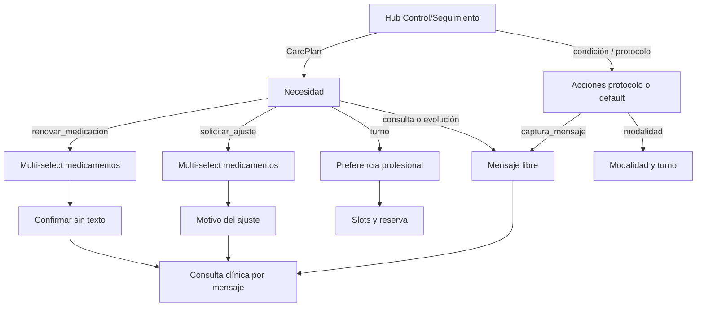

# Consultas y seguimiento (paciente)

> **Entrada de producto:** absorbida en **[Solicitar Atención](./solicitar-atencion.md)** → motivo **Control/Seguimiento**.  
> Este documento describe el **canal async** y las acciones sobre tratamiento que siguen existiendo detrás del hub.

## Denominación

| Término | Uso |
|---------|-----|
| **Consulta clínica por mensaje** | Nombre de producto: solicitud no urgente que un profesional **real** revisa y responde de forma asincrónica (sin turno ni videollamada). |
| **Consulta async** | Sinónimo técnico (`SOLICITUD_ASYNC`, encounter VR planificado, bandeja staff). |
| **Control/Seguimiento** | Motivo de Solicitar Atención que abre el hub (tratamientos, condiciones, controles recomendados). |

No confundir con «consulta rápida»: no promete respuesta inmediata. La IA puede clasificar y priorizar; la confirmación clínica la hace una persona.

## De qué se trata

Capacidades del paciente **sin mezclarlas** con malestar nuevo o urgencia:

- **Seguimiento de un plan de tratamiento activo** — renovar medicación, solicitar ajuste, consulta/evolución o pedir turno.
- **Condición / control recomendado** — acciones del protocolo o defaults (mensaje / turno vinculados al ancla).
- **Controles recomendados por perfil** — p. ej. orientación de vacunas (edad/sexo).

Sin plan activo u on-hold, esa ancla no aparece; el hub solo lista condiciones y controles recomendados aplicables (sin consulta suelta, atención previa ni turno genérico).

**Canal:** solo la **app móvil paciente**. El personal opera la bandeja de consultas clínicas por mensaje y los turnos en web o app Personal de Salud.

## Separación de flujos

| Situación | Flujo |
|-----------|--------|
| Malestar nuevo, síntoma agudo, urgencia | [Solicitar Atención](./solicitar-atencion.md) → Malestar / Urgencia |
| Renovar o ajustar medicación, duda/evolución, control, consulta por mensaje | Solicitar Atención → **Control/Seguimiento** |
| Solo reservar o cancelar turno sin motivo clínico de seguimiento | Intents de turnos |

## Cómo funciona (tras el hub)

1. **Hub** — ancla (tratamiento, condición o control recomendado).
2. **CarePlan** — si hay varios, elige uno (entrada desde el detalle del plan ya trae `care_plan_id`).
3. **Necesidad / acción** — renovar, ajustar, consulta/evolución, turno, u outcomes del protocolo.
4. **Medicación** — multi-selección de `MedicationRequest` del plan.
5. **Consulta async** — encounter VR planificado; el staff ve operación y medicamentos en bandeja/chat.

Metadata intake: `Scheduling/metadata/consultas_seguimiento_intake.yaml`. Hub: `control_seguimiento_hub.yaml`. API: `consultas-seguimiento/hub`, `condicion-acciones`, `paso`.

## Accesos en la app

- Atajo **Solicitar Atención** → **Control/Seguimiento**.
- **Inicio** — card **Tus condiciones** (todas las ACTIVE deduplicadas) y card de tratamiento; las consultas por mensaje con ancla van anidadas bajo la condición o el plan (sin historial en el card; el historial queda para un intent futuro).
- **Detalle del plan de tratamiento** — acciones con plan (y a menudo necesidad) ya cargados → mismo intent `atencion.necesito-atencion`.
- **Detalle de condición** — acciones de protocolo o defaults del hub con ancla `diag:…` → mismo intent.
- Frases NL de renovación / seguimiento / consulta por mensaje → mismo intent.

## Relación con otros documentos

- [solicitar-atencion.md](./solicitar-atencion.md) — puerta y hub
- [planes-de-tratamiento.md](./planes-de-tratamiento.md)
- [atencion-remota-async.md](./atencion-remota-async.md)
- [triage-reserva-turno.md](./triage-reserva-turno.md)
- QA: [../qa/escenarios/seguimiento/README.md](../qa/escenarios/seguimiento/README.md)
