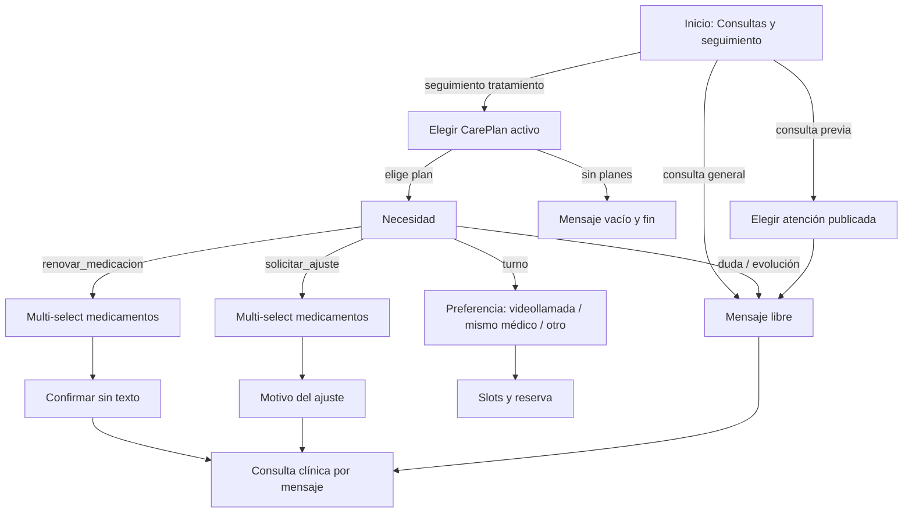

# Consultas y seguimiento (paciente)

## Denominación

| Término | Uso |
|---------|-----|
| **Consulta clínica por mensaje** | Nombre de producto: solicitud no urgente que un profesional **real** revisa y responde de forma asincrónica (sin turno ni videollamada). |
| **Consulta async** | Sinónimo técnico (`SOLICITUD_ASYNC`, encounter VR planificado, bandeja staff). |
| **Consultas y seguimiento** | Nombre del flujo / atajo del asistente (`atencion.consultas-seguimiento-flow`) que agrupa consulta general, seguimiento de tratamiento y seguimiento de consulta previa. |

No confundir con «consulta rápida»: no promete respuesta inmediata. La IA puede clasificar y priorizar; la confirmación clínica la hace una persona.

## De qué se trata

Flujo dedicado para que el **paciente** consulte al equipo de salud **sin mezclarlo** con malestar nuevo o urgencia (`atencion.necesito-atencion`). Cubre:

- **Consulta general** — mensaje libre resuelto por **consulta clínica por mensaje**.
- **Seguimiento** de un **plan de tratamiento activo** — renovar medicación (multi-medicamento, sin texto libre), solicitar ajuste (medicamentos + motivo), dudas, contar evolución o pedir turno.
- **Seguimiento de una consulta previa** — mensaje vinculado a una atención ya publicada.

Sin plan activo u on-hold, el camino «Seguimiento de tratamiento» muestra un mensaje vacío y **no continúa**.

**Canal:** solo la **app móvil paciente**. El personal opera la bandeja de consultas clínicas por mensaje y los turnos en web o app Personal de Salud; el paciente no usa la web clínica.

## Separación de flujos

| Situación | Flujo |
|-----------|--------|
| Malestar nuevo, síntoma agudo, «necesito atención», urgencia | `atencion.necesito-atencion` (motivo: **Malestar nuevo** o **Urgencia** — sin opción Seguimiento) |
| Renovar o ajustar medicación, duda de tratamiento, evolución, consulta clínica por mensaje | `atencion.consultas-seguimiento-flow` |
| Solo reservar o cancelar turno sin motivo clínico de seguimiento | Intents de turnos |

La clasificación en lenguaje natural prioriza este flujo cuando el mensaje habla de tratamiento, receta, seguimiento o consulta clínica por mensaje, y **no** describe un cuadro agudo nuevo.

## Cómo funciona

1. **Tipo** — consulta general, seguimiento de tratamiento activo o seguimiento de consulta previa.
2. **CarePlan** — si hay varios planes activos/on-hold, elige uno; sin planes, mensaje y fin. Entrada desde el detalle del plan ya trae `care_plan_id`.
3. **Necesidad** — renovar medicación, solicitar ajuste, duda, contar evolución o solicitar turno.
4. **Medicación (renovar / ajustar)** — multi-selección de `MedicationRequest` del plan; renovación confirma sin composer; ajuste pide motivo corto.
5. **Mensaje** — texto libre para duda, evolución, consulta general o consulta previa.
6. **Consulta async** — encounter VR planificado; el staff ve operación y medicamentos en el contexto de bandeja/chat.

## Accesos en la app

- Categoría **Atención** en atajos del asistente: «Consultas y seguimiento».
- **Inicio** — acceso al mismo intent desde acciones rápidas.
- **Detalle del plan de tratamiento** — botones por necesidad (`seguimientoAcciones`), con plan y necesidad ya cargados.

## Relación con otros documentos

- [planes-de-tratamiento.md](./planes-de-tratamiento.md) — definición del plan y recordatorios.
- [atencion-remota-async.md](./atencion-remota-async.md) — consulta clínica por mensaje y bandeja staff.
- [triage-reserva-turno.md](./triage-reserva-turno.md) — triage del flujo «necesito atención» (no aplica a consulta general de este flujo).
- [apps-paciente-personalsalud.md](./apps-paciente-personalsalud.md) — canal paciente vs staff.
- QA por escenario: [../qa/escenarios/seguimiento/README.md](../qa/escenarios/seguimiento/README.md)
