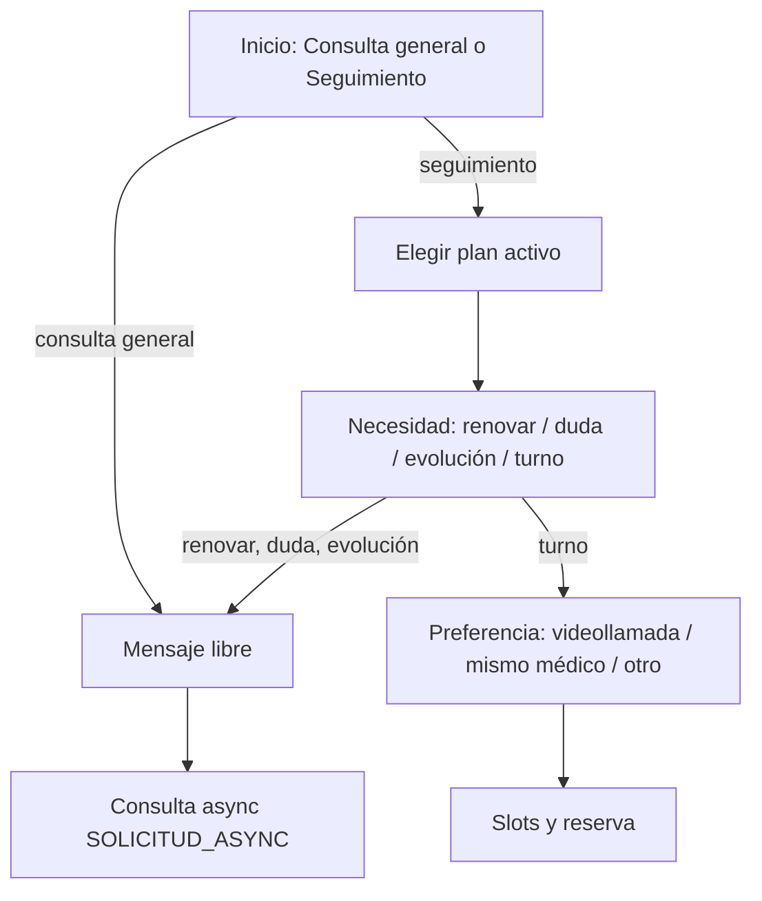

# Consultas y seguimiento (paciente)

## De qué se trata

Flujo dedicado para que el **paciente** consulte al equipo de salud **sin mezclarlo** con malestar nuevo o urgencia (`atencion.necesito-atencion`). Cubre:

- **Consulta general** — mensaje libre resuelto por **consulta async** (sin turno).
- **Seguimiento** de un **plan de tratamiento activo** — renovar o ajustar medicación, dudas, contar evolución o pedir turno (videollamada, mismo médico u otro profesional).

**Canal:** solo la **app móvil paciente**. El personal opera la bandeja async y los turnos en web o app Personal de Salud; el paciente no usa la web clínica.

## Separación de flujos

| Situación | Flujo |
|-----------|--------|
| Malestar nuevo, síntoma agudo, «necesito atención», urgencia | `atencion.necesito-atencion` (triage + modalidad presencial / tele / async) |
| Renovar receta, duda de tratamiento, evolución, consulta general por mensaje | `atencion.consultas-seguimiento-flow` |
| Solo reservar o cancelar turno sin motivo clínico de seguimiento | Intents de turnos |

La clasificación en lenguaje natural prioriza este flujo cuando el mensaje habla de tratamiento, receta, seguimiento o consulta por mensaje, y **no** describe un cuadro agudo nuevo.

## Cómo funciona

1. **Tipo** — el paciente elige consulta general o seguimiento (atajo en inicio, chat o detalle del plan).
2. **Seguimiento** — si hay varios planes activos, elige uno; si entra desde el plan, el identificador ya viene prefijado.
3. **Necesidad** — renovar o ajustar medicación, duda, contar evolución o solicitar turno.
4. **Mensaje** — texto libre (y audio si el cliente lo ofrece) para async; en turno de seguimiento, ramas de teleconsulta o agenda según preferencia.
5. **Async** — crea encounter virtual planificado; el staff responde desde la bandeja «Consultas por mensaje» (ver [atencion-remota-async.md](./atencion-remota-async.md)).

## Accesos en la app

- Categoría **Atención** en atajos del asistente: «Consultas y seguimiento».
- **Inicio** — acceso al mismo intent desde acciones rápidas.
- **Detalle del plan de tratamiento** — botones por necesidad (`seguimientoAcciones` en el resumen del care plan), con plan y necesidad ya cargados.

## Relación con otros documentos

- [planes-de-tratamiento.md](./planes-de-tratamiento.md) — definición del plan y recordatorios.
- [atencion-remota-async.md](./atencion-remota-async.md) — consulta por mensaje y bandeja staff.
- [triage-reserva-turno.md](./triage-reserva-turno.md) — triage del flujo «necesito atención» (no aplica a consulta general de este flujo).
- [apps-paciente-personalsalud.md](./apps-paciente-personalsalud.md) — canal paciente vs staff.
