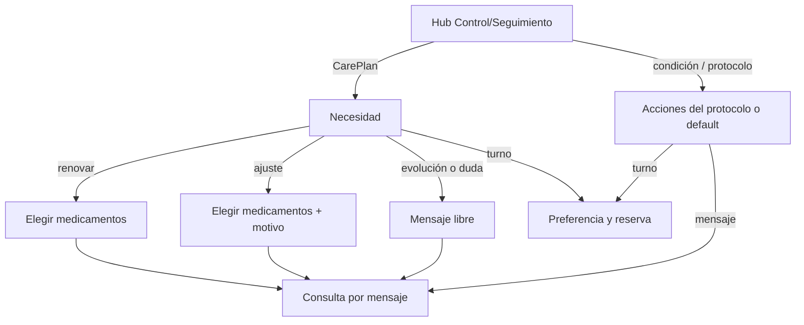

# Consultas y seguimiento (paciente)

La **entrada** es [Solicitar Atención](./solicitar-atencion.md) → **Control/Seguimiento**. Aquí está lo que ocurre **después del hub**: renovar o ajustar medicación, contar evolución y **consulta clínica por mensaje**.

Términos (mensaje vs videollamada vs async): [atencion-remota-async.md](./atencion-remota-async.md). Planes: [planes-de-tratamiento.md](./planes-de-tratamiento.md).

No es «consulta rápida»: un profesional **real** responde cuando puede. La IA puede ordenar la bandeja; no confirma clínica.

## Tras el hub

```mermaid
flowchart TD
  HUB[Hub Control/Seguimiento]
  HUB -->|CarePlan| NEC[Necesidad]
  HUB -->|condición / protocolo| ACC[Acciones del protocolo o default]
  NEC -->|renovar| MEDR[Elegir medicamentos]
  MEDR --> ASYNC[Consulta por mensaje]
  NEC -->|ajuste| MEDA[Elegir medicamentos + motivo]
  MEDA --> ASYNC
  NEC -->|evolución o duda| MSG[Mensaje libre]
  MSG --> ASYNC
  NEC -->|turno| SLOTS[Preferencia y reserva]
  ACC -->|turno| SLOTS
  ACC -->|mensaje| ASYNC
```

1. Elige ancla (tratamiento, condición o control recomendado).
2. Si hay varios planes, elige uno (desde el detalle del plan ya viene elegido).
3. Renovar o ajustar: elige medicamentos del plan. Evolución: texto libre. Turno: slots.
4. Lo async abre un encounter virtual planificado; el personal lo ve en la bandeja de sesión **Virtual**.

Sin plan activo u on-hold, esa ancla no aparece. El hub no es el lugar para «sacar turno» genérico ni para malestar nuevo.

## Dónde se entra

- Atajo **Solicitar Atención** → Control/Seguimiento.
- Inicio: cards de **condiciones** y **tratamiento** (consultas por mensaje anidadas bajo el ancla).
- Detalle del plan o de la condición: mismas acciones, a menudo con el ancla ya cargada.
- Frases del tipo *«renovar el enalapril»*, *«consulta por mensaje»* → el mismo intent `atencion.necesito-atencion`.

QA: [../qa/escenarios/seguimiento/README.md](../qa/escenarios/seguimiento/README.md).
