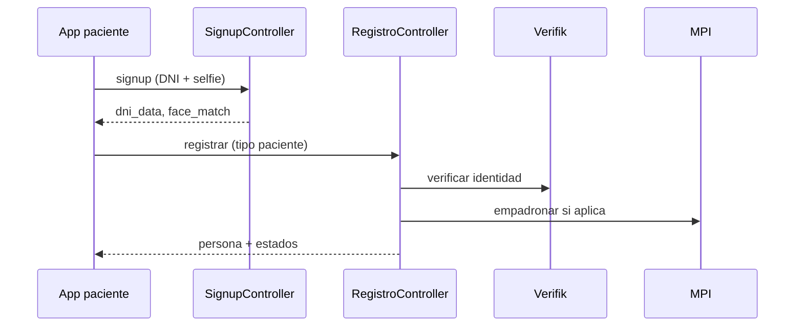

# Producto — Diseño

## Registro API vs alta manual web

### Decisión

El **registro self-service** (apps) pasa por `POST /api/v1/registro/registrar` y `RegistroService`: Verifik → persona → MPI → (si médico) REFEPS.

La **web administrativa** sigue usando formularios en `PersonaController` sin automatizar Verifik/MPI en el mismo flujo.

**Alternativa descartada:** obligar a todo alta por operador web — no escala para onboarding móvil.

**Alternativa descartada:** duplicar lógica Verifik en cada app — se centralizó en API.

Detalle: [flows/registro-paciente.md](./flows/registro-paciente.md).

## Capacidades transversales

Chat pre-consulta, onboarding con IA, medios y videollamada se documentan como **capacidades de producto** vinculadas al asistente y a proveedores externos; los costos se estiman en [costos/](../costos/README.md).

**Alternativa descartada:** implementar cada capacidad como pantalla Yii independiente sin pasar por API/asistente.

## Diagrama — registro app paciente (simplificado)

## Anclas

| Pieza | Nombre |
|-------|--------|
| Registro API | `RegistroController::actionRegistrar`, `RegistroService` |
| Signup móvil | `SignupController` |
| Alta manual | `PersonaController` (create/update) |
