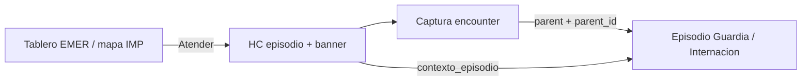

# HCD de episodio (guardia e internación)

## De qué se trata

En **EMER** e **IMP** la historia clínica deja de centrarse en un encounter ambulatorio y pasa a ser el **cockpit del episodio** (estadía): seguridad longitudinal del paciente + contexto operativo de la estadía + captura de hitos.

No reemplaza el **tablero** (cola) ni la **captura** (escritura de un encounter): las tres superficies conviven.

## Actores

- Médico de guardia / piso: abre HC desde “Atender” con `parent=GUARDIA|INTERNACION`.
- Enfermería / coordinación: mismo banner de contexto; roles de escritura según captura.
- Sistema: ensambla `contexto_episodio` en `GET /api/v1/personas/{id}/historia-clinica`.

## Cómo funciona

1. Staff abre captura con `PatientHistoriaUrl::captura(persona, parent, parent_id)`.
2. La HC pide `historia-clinica?parent=&parent_id=`.
3. El dominio arma el **banner** (triaje, estado de circuito, ubicación, médico, motivo, ingreso).
4. Debajo sigue el **estado actual del paciente** (alergias, crónicos) — capa longitudinal.
5. El **registro del episodio** (`timeline_episodio`) lista hitos recientes→antiguos: circuito, triage, evoluciones, enfermería, pedidos, lab, medicación, interconsultas.
6. Los **signos vitales del episodio** (`signos_vitales_episodio`) unen triage + enfermería de los encounters (curva en web, serie en móvil), distintos de los SV longitudinales del paciente.

## Banner (`contexto_episodio`)

| Campo | Guardia | Internación |
|-------|---------|-------------|
| tipo / episodio_id | GUARDIA | INTERNACION |
| triage (nivel, color, hora) | Sí (Manchester) | No |
| estado / circuito | `circuito_estado` | En curso (sin circuito EMER) |
| ubicacion | Reservado (box aún no modelado) | Cama / sala / piso |
| equipo.medico | PES asignado | PES del episodio |
| motivo | Motivo de triage o situación al ingresar | Situación al ingresar |
| ingreso_at | `ingreso_at` / fecha-hora | Fecha-hora de ingreso |

Compatibilidad: `contexto_internacion` se mantiene (cama + médico/motivo). Las evoluciones pasan al feed unificado.

## Registro cronológico (`timeline_episodio`)

Ítems tipados (más reciente primero), filtrables en UI:

| `type` | Fuente |
|--------|--------|
| `circuito` | Eventos de `guardia_circuito_event` (ingreso, asignación, egreso, …) |
| `triage` | `GuardiaTriage` (nivel, motivo, vitales) |
| `evolucion_medica` | Notes de encounters del episodio |
| `atencion_enfermeria` | `atenciones_enfermeria` por encounter |
| `pedido` / `interconsulta` | `ServiceRequest` |
| `resultado_lab` | `DiagnosticReport` |
| `medicacion` / `administracion` | `MedicationRequest` / `MedicationAdministration` |

Servicio: `EpisodioTimelineService`. Query de encounters acepta `parent_type` corto o FQCN.

## Signos vitales del episodio (`signos_vitales_episodio`)

Servicio: `EpisodioSignosVitalesService`.

| Fuente | Momento |
|--------|---------|
| Triage (`vitals_json`) | `triaged_at` |
| Enfermería (`atenciones_enfermeria.datos`) | encounters del episodio |

Métricas: TA sys/dia, FC, FR, SatO₂, temperatura, glucemia, Glasgow (si está en `datos`).

UI web: chips de últimos + gráfica Plotly. Móvil: chips + últimas mediciones por serie.

## Relación con el resto

- Circuito y tablero: [urgencias-guardia.md](./urgencias-guardia.md)
- Internación y alta/epicrisis: [internacion.md](./internacion.md)
- Captura de encounter: [captura-clinica.md](./captura-clinica.md)
- Superficies: [superficies-ui.md](./superficies-ui.md)

## Próximos cortes (backlog)

1. Ubicación física en guardia (box/puesto) y enfermero asignado.
2. Valores críticos de lab destacados en el feed.
3. Care-plan formal / B02 post-egreso domiciliario (hoy pautas de alarma en texto).

## Egreso estructurado (conducta)

API: `GET|POST /api/v1/clinical/emergency-guardia/{id}/egreso-formulario`.

Campos: destino (`ALTA_DOMICILIARIA`, `OBSERVACION`, `INTERNACION`, `QUIROFANO`, `DERIVACION`, `FUGA`, `DEFUNCION`), diagnóstico operativo, epicrisis (≥20), pautas de alarma (obligatorias en alta domiciliaria), checklist.

Efectos según destino: derivación setea efector; internación solicita cama; luego cierra circuito (`finalizar`). Intent asistente: `urgencias.egreso-estructurado-flow`.

CTA en banner HC (`acciones`) y en tablero (redirige a HC con `?egreso=1`).
