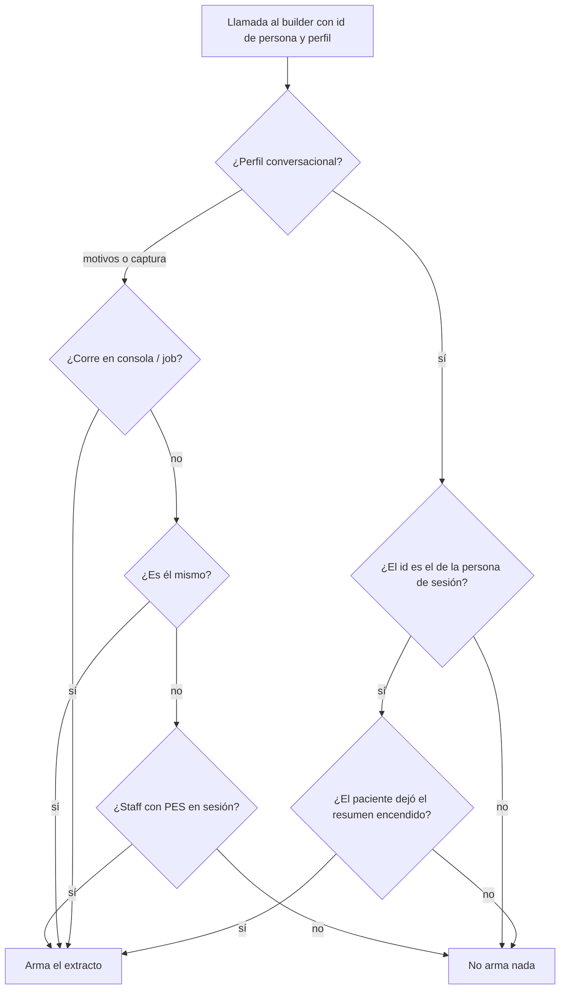

# IA, datos de salud y privacidad

Cómo Bioenlace usa **inteligencia artificial** con datos de pacientes, qué se envía a **Google Vertex / Gemini**, y qué puede apagar la persona en la app. No es un dictamen legal: el contrato firmado con Google y la normativa aplicable mandan.

## Dos cosas distintas

El chat del asistente mezcla, en la práctica, dos orígenes de texto:

| Origen | Qué es | Dónde se usa |
|--------|--------|----------------|
| **Historial del hilo** | Últimos mensajes de **esa** conversación con el asistente | Para no repetir y seguir el hilo (*«empezó ayer…»*) |
| **Extracto de historia clínica** | Edad, sexo, alergias, condiciones y medicación **acotados** (no la HC completa ni fechas de turnos ni resúmenes de atenciones previas) | Referencia mínima en **charla de síntomas**, para no contradecir lo ya registrado. No es el expediente para responder “cuándo fui a…” |

El historial del hilo es parte del servicio que la persona ya está usando. El extracto de HC es más sensible: sale del expediente hacia el modelo.

### Para qué sirve (y para qué no) en el chat

El canal conversacional pide empatía corta, no recetar y, si hay síntoma, el botón **Solicitar Atención**. El extracto **no cambia el desenlace** en la mayoría de esos mensajes: el flow de atención hace el trabajo.

Ejemplo donde sí aporta: *«Me duele la cabeza, ¿puedo tomar ibuprofeno?»* Si hay alergia a AINE en el extracto, la respuesta puede negarse a orientar con analgésicos y ofrecer atención. Sin extracto, el riesgo es un consejo de mostrador (que el propio prompt intenta prohibir).

**No** sirve para *«¿cuándo fue la última vez que fui al dentista?»*: esa fecha no está en el extracto. Eso es un **intent de lectura** sobre turnos / oferta del centro, no más texto en el prompt. Ver [asistente-y-chat.md](./asistente-y-chat.md).

Tres usos de ese extracto (mismos datos, distinta puerta):

| Uso | Quién lo dispara | ¿El paciente puede apagarlo? |
|-----|------------------|------------------------------|
| Chat canal guide del asistente | La persona (o el staff) escribiendo en el asistente | **Sí** — Configuración → *Resumen de historia en el asistente* (`PROFILE_GUIDE` / `PROFILE_CONVERSATIONAL`) |
| Motivos pre-consulta (resumen al cerrar la ventana) | Job del sistema, como parte de la atención | **No** — es el circuito clínico, no un chat opcional |
| Captura del encounter (análisis del dictado) | El profesional en la consulta | **No** — igual |

## Acuerdo de tratamiento con Google (Vertex)

Bioenlace llama a **Vertex AI / Gemini** (`gemini-2.5-flash-lite` en producción) para generar texto: respuesta conversacional, resúmenes de motivos, análisis de captura, packs de cohorte, etc. Catálogo: [catalogo-usos-ia.md](./catalogo-usos-ia.md).

Ahí hay **dos roles**:

- **Bioenlace y el efector** deciden para qué se usa el dato (responsable / co-responsable según el caso).
- **Google** ejecuta el modelo y **devuelve texto**. Es **encargado** del tratamiento: no debería usar ese dato para su propio negocio.

Eso **no** vive en `params.php`. Vive en el **contrato de Google Cloud** más el **Cloud Data Processing Addendum (CDPA)** y los *Service Specific Terms*. Hay que tenerlo firmado (Bioenlace y, si aplica, la provincia o el efector) y guardado con el resto de encargos.

Qué tiene que quedar asentado en ese paquete (y revisarse cuando Google actualice términos):

1. **Dato de salud.** El prompt puede incluir síntomas que escribió la persona y, si el extracto está activo, alergias / condiciones / medicación. Es categoría sensible.
2. **Finalidad.** Solo inferencia para las funciones del producto (responder, resumir, extraer campos). No publicidad.
3. **Sin reentrenamiento con datos del cliente.** En Vertex de pago, Google declara una **Training Restriction**: no usa datos del cliente para entrenar o ajustar modelos **salvo permiso o instrucción explícita**. No es automático por usar Gemini: hay que leer el anexo vigente. Referencia operativa: [Data governance de Vertex / Gemini](https://cloud.google.com/vertex-ai/generative-ai/docs/data-governance) y el [CDPA](https://cloud.google.com/terms/data-processing-addendum).
4. **Dónde corre.** La región por defecto del proyecto es **`us-central1`**. El dato puede procesarse **fuera de Argentina**. Si un contrato público exige residencia, hay que cambiar región o proveedor; no alcanza con un comentario en el código.
5. **Retención en Google.** Hay caché en memoria (latencia, TTL corto), posible registro de prompts por abuso según los ToS, y funciones (Grounding con Search, request-response logging, etc.) que **no** debemos activar si el objetivo es no dejar copias extra. Request-response logging de Vertex está **apagado** salvo que alguien lo encienda en el proyecto GCP.
6. **Incidentes y subencargados.** Plazos y canal, como en cualquier DPA.

«El contrato cubre dato de salud» = ese anexo firmado, no una línea en el repositorio. Este documento es la **lista de control operativa** para no perder el hilo.

Otros encargados del mismo tipo (transcripción, identidad, push) están en la [política de privacidad pública](../../../institucional/privacidad.html).

## Qué ve y qué puede elegir el paciente

En **Configuración** de la app paciente hay un interruptor **Resumen de historia en el asistente** (canal **guide**).

- **Encendido (predeterminado):** el chat conversacional puede incluir el extracto acotado en el prompt a Vertex. Es el comportamiento que ya tenía el producto.
- **Apagado:** el asistente sigue funcionando (historial del hilo, turnos, flujos). **No** manda alergias, condiciones ni medicación del expediente en esa charla.
- **No apaga** motivos pre-consulta ni la captura del profesional: esos caminos son atención, no un asistente opcional.

La política de privacidad pública debe decir que el chat puede usar un extracto de HC y que se puede desactivar ahí.

## Candado del extracto (`PatientAiContextBuilder`)

El builder es quien **arma el texto corto** a partir del id de persona. No es un segundo cerebro clínico: no inventa diagnósticos ni sustituye al médico.

Antes, el candado era demasiado holgado: si el usuario de sesión era **él mismo** *o* tenía un **PES** (profesional asignado a un servicio del centro), el builder dejaba armar el extracto para **cualquier** id de persona que le pasaran. El chat conversacional **hoy** solo le pasa el id de quien está logueado, así que no había un intent que metiera la HC de un tercero en esa charla. El riesgo era **a futuro**: un llamador nuevo (o un bug) que pasara otro id con un staff logueado.

Ahora:

- **Conversacional:** solo la persona de la sesión, y solo si no apagó el interruptor.
- **Motivos y captura en la API web:** uno mismo, o staff con PES (están en un acto clínico).
- **Jobs de consola** (cierre de motivos, packs): no hay sesión web; el builder **sí** arma el extracto de motivos/captura. Sin esto, el lote salía vacío o rompía: en consola el componente `user` no tiene `getIdPersona()`.

El interruptor **no** se consulta en motivos ni en captura.

## Relación con otros documentos

- [asistente-y-chat.md](./asistente-y-chat.md) — conversación
- [catalogo-usos-ia.md](./catalogo-usos-ia.md) — cada llamada a modelo
- [apps-paciente-personalsalud.md](./apps-paciente-personalsalud.md) — Configuración
- [costos-api.md § contexto clínico](../costos/costos-api.md#contexto-clínico-en-prompts-ia) — tokens del extracto
- QA del interruptor: [qa/paciente/asistente.md](../qa/paciente/asistente.md)
