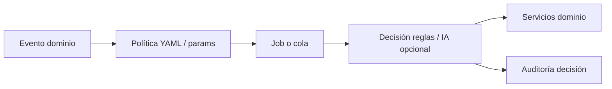

# Agentes autónomos — backlog de producto

> **Estado:** idea a futuro — no comprometido en roadmap. Flujos operativos del HIS en los que **el sistema toma al menos una decisión** que hoy haría una persona (staff, paciente o coordinación), dentro de políticas auditables.

## De qué se trata

Un **agente** (en este documento) es un flujo — disparado por evento, cron o cola — que incluye **al menos un paso donde el sistema elige** entre alternativas o fija un curso de acción **sin que una persona decida en ese momento**.

No importa si la decisión usa reglas de dominio, consultas a BD o IA: lo que define al agente es **quién decide en ese paso**. La implementación puede ser servicio de dominio + job + metadata; no requiere un motor de «agents» ni un LLM.

Ejemplos de **decisión del sistema** (sustituye criterio humano en ese paso):

| Tipo | Ejemplo | Sin agente (hoy suele hacerlo una persona) |
|------|---------|---------------------------------------------|
| **Selección** | Qué 2–3 slots ofrecer a un turno en resolución | El paciente recorre toda la agenda |
| **Clasificación** | Resultado de lab crítico vs normal | Staff revisa bandeja manualmente |
| **Enrutado** | Tras triage sin cupo, canal alternativo (tele/async) | Recepción orienta por teléfono |
| **Priorización** | Orden de la bandeja async | Coordinador ordena «a ojo» |
| **Emparejamiento** | Vincular lab al encounter más probable | Admisión arrastra el estudio |
| **Acción condicionada** | Respuesta roja en touchpoint → alerta enfermería | Alguien lee formularios uno por uno |

Ejemplos de **procesos que no son agentes** (aunque sean automáticos o proactivos):

- Push genérico «tu turno requiere reubicación» **sin** precalcular opciones (solo avisa; decide el paciente al abrir la app).
- Recordatorio de turno a hora fija (T−48 h) sin elegir acción según contexto.
- Secuencia fija de onboarding día 0 / día 3 (calendario, no decisión).
- Export FHIR en cola (ejecución determinística, sin ramas de criterio).
- Briefing que **solo muestra** datos ya existentes sin priorizar ni clasificar.

No es el asistente conversacional del chat: ese canal es **reactivo** (la persona escribe primero). Los agentes de este documento son **proactivos** y suelen ser event-driven; la diferencia clave respecto de un job cualquiera es la **decisión sustitutiva**.

## Cuándo conviene que el sistema decida

Criterios para priorizar un flujo como agente (automatizar la decisión):

| Criterio | Por qué conviene |
|----------|------------------|
| **Volumen y repetición** | Misma decisión cientos de veces al mes; el costo humano no escala (reoferta de turnos, post-lab, priorizar async). |
| **Ventana de tiempo corta** | Si nadie decide en minutos, se pierde valor (hueco de agenda, SLA guardia). |
| **Reglas explícitas y auditables** | La política del efector puede declararse (umbrales LOINC, mismo PES, banda triage); la decisión es defendible en auditoría. |
| **Reversibilidad o confirmación posterior** | Reprogramar turno, borrador de resumen, sugerencia CIE-10: el humano puede corregir después. |
| **Criterio acotado y verificable** | Disponibilidad de slots, match fecha+pedido, validación nomenclador: no requiere juicio clínico abierto. |
| **Reduce carga de rol no clínico** | Secretaría, admisión, coordinación: liberan tiempo para excepciones y trato humano. |

Cuándo **no** conviene (o solo con humano en el loop):

| Criterio | Por qué no |
|----------|------------|
| **Juicio clínico con responsabilidad legal** | Diagnóstico, prescripción, derivación a guardia por «sensación» de urgencia. |
| **Alta ambigüedad + baja reversibilidad** | Casos sociales complejos, conflictos de cobertura, comunicación sensible. |
| **Datos insuficientes en el sistema** | Decidir sin contexto empeora respecto de preguntar (ej. negociar obra social). |
| **La decisión es puramente preferencia personal** | Horario «el que más me guste» sin política: mejor que elija el paciente en UI completa. |
| **Solo formatear o entregar** | Resumen de KPIs, FAQ con cita de fuente: informar no es decidir. |

La **IA** entra solo cuando las reglas no alcanzan para un subpaso concreto (redacción en lenguaje simple, desempate blando entre slots equivalentes, borrador de texto). **Alarmas clínicas y elegibilidad** siguen siendo reglas verificables, no LLM.

## Grados de decisión (antes «niveles de autonomía»)

Cuánto decide el sistema y cuánto queda para la persona **después** del paso automático:

| Grado | Nombre | Decisión del sistema | La persona después |
|-------|--------|----------------------|-------------------|
| **D0** | Clasificar / rankear | Ordena o etiqueta alternativas | Solo consume (briefing, cohortes, KPIs narrados) — **borde**: si no hay elección sustitutiva, no es agente |
| **D1** | Acotar opciones | Elige qué mostrar (2–3 slots, canal sugerido, códigos CIE-10) | Elige entre lo propuesto |
| **D2** | Actuar con política | Ejecuta si reglas + opt-in o plazo (reprogramar al tocar, alerta por respuesta roja, reintento FHIR) | Puede deshacer o no intervino |
| **D3** | Orquestar ramas | Encadena decisiones (multicanal, lista de espera en cascada, dead-letter) | Supervisión por auditoría y política del efector |
| **D4** | ~~Clínico sin humano~~ | Diagnóstico, prescripción, derivación guardia sola | **Fuera de alcance** |

## Principios de diseño (alineado a arquitectura Bioenlace)

- **Trigger** → servicio de dominio o job; no `if` en `ChatOrchestrator`.
- **Política de la decisión** (umbrales, canales, plazos, elegibilidad) en **metadata** (`params`, YAML catálogo, futuro `autonomous_agents/*.yaml`).
- **Handler** registrable pequeño (`agent_id → callable`) si hace falta extensión de rubro.
- **Trazabilidad de la decisión**: qué alternativas había, qué regla aplicó, qué se ejecutó (`agent_run`, `agent_action` o equivalente de dominio).
- **Idempotencia** en acciones D2/D3.

## Relación con lo existente (parcial hoy)

| Proceso actual | ¿Agente? | Decisión que falta o es manual |
|----------------|----------|--------------------------------|
| Turno `en resolución` + push | Parcial | Push avisa; **no** elige slots ni rankea |
| Reubicar como paciente (flujo app) | No | Decide el paciente en UI |
| Opciones vecinas (antes/después) | Parcial | Agenda fija el par; paciente elige |
| Cierre ventana motivos / care-pack batch | No | Batch sin sustituir decisión operativa |
| Captura encounter + `analisis-consulta` | Parcial (D1) | IA sugiere; médico confirma todo |
| Pull LIS | No | Ingesta; sin clasificar ni notificar al paciente |
| Export FHIR HC | No | Cola determinística |

---

## Backlog resumido (prioridad sugerida)

Solo ítems con **decisión del sistema** relevante. Los marcados *proceso* son automaciones útiles pero **no agentes** bajo esta definición.

| ID | Flujo | Decisión del sistema | ¿Conviene? | Grado | Prioridad |
|----|-------|----------------------|------------|-------|-----------|
| A01 | Reoferta de turnos en resolución | Qué slots ofrecer y en qué orden | Sí — volumen, reglas PES/tele | D1→D2 | **P0** |
| A02 | Negociación multicanal (reprogramar) | Canal siguiente; recalcular oferta | Sí — tiempo y abandono | D2–D3 | **P0** |
| A03 | Relleno de huecos / lista de espera | A quién ofrecer el hueco y en qué orden | Sí — ventana minutos | D2–D3 | P1 |
| A04 | Anti no-show predictivo | Recordatorio extra vs liberar slot | Condicional — política efector | D1–D2 | P1 |
| A05 | Ruteo de demanda post-triage | Canal alternativo si no hay cupo | Sí — reduce abandono | D1 | P1 |
| A06 | Cierre de loop (sin respuesta) | Cancelar vs mantener vs escalar humano | Sí — evita turnos huérfanos | D2 | P1 |
| B01 | Touchpoints cohorte / plan | Respuesta → alerta / educación / solo log | Sí — reglas rojo/amarillo/verde | D2 | **P0** |
| B02 | Seguimiento post-alta | Igual que B01 por plantilla | Sí | D2 | P1 |
| B03 | Post-lab: clasificar y notificar | Crítico vs normal; notificar a quién | Sí — reglas LOINC | D1–D2 | **P0** |
| B04 | Adherencia / refill crónica | Recordar vs ofrecer async renovación | Moderado — bajo riesgo | D1 | P1 |
| C01 | Intake / completar MPI | Qué campo pedir según tipo de atención | Moderado — lógica de formulario | D1 | P1 |
| C03 | Clasificar puerta de entrada | Banda y flujo destino | Sí — reglas + IA fallback acotado | D1 | P1 |
| D01 | Huecos en nota + pedir completar | Qué falta según checklist servicio | Sí — determinista | D1 | P1 |
| D02 | Resumen paciente al cerrar encounter | Borrador de texto (no publicar) | Sí — humano publica | D1 | P1 |
| D03 | Sugerencia CIE-10 | Códigos candidatos | Sí — médico confirma cada uno | D1 | P2 |
| E01 | Asociar lab a encounter | Match encounter | Sí — reglas fecha/pedido | D2 | P1 |
| E02 | Reintentos integración (FHIR/RDI) | Requeue vs dead-letter vs refresh token | Sí — ops estándar | D3 | P1 |
| E03 | Validar receta pre-envío RDI | Bloquear envío o no | Sí — validación dura | D2 | P2 |
| F01 | Alerta SLA tablero guardia | Resaltar breach SLA | Débil — umbral fijo | D0–D1 | P1 |
| F02 | Sugerencia de cama | Ranking camas | Sí — humano confirma | D1 | P2 |
| F03 | Borrador epicrisis + checklist alta | Borrador + pendientes | Parcial — asistencia documental | D1 | P2 |
| H01 | Bandeja async priorizada | Orden de atención sugerido | Sí — SLA y triage | D1 | P2 |
| I02 | Guía «qué canal usar» | Un camino recomendado | Sí — árbol decisión | D1 | P1 |
| — | *B05 educación post-consulta* | Secuencia fija de contenido | *Proceso, no agente* | — | P2 |
| — | *C02 briefing pre-atención* | Solo agrega datos | *Proceso, no agente* | — | **P0** aparte |
| — | *G01/G02 analytics* | Query o narrativa KPI | *Proceso, no agente* | — | P2–P3 |
| — | *H02 FAQ staff* | Recuperación metadata | *Proceso, no agente* | — | P3 |
| — | *I01 onboarding* | Calendario fijo | *Proceso, no agente* | — | P2 |

---

## Familia A — Turnos y agenda

### A01 — Reoferta de turnos en resolución

| Campo | Valor |
|-------|--------|
| **Decisión del sistema** | Filtrar candidatos de slot y elegir cuáles mostrar (top 2–3) según política PES, `urgency_band`, tele |
| **Grado** | D1 (acota opciones) → D2 (reprograma si el paciente confirma en app/push) |
| **¿Por qué conviene?** | Alto volumen en licencias/cambios de agenda; hoy el paciente recorre toda la grilla; reglas auditables |
| **Trigger** | `Turno` pasa a `en resolución` (cambio agenda efector) |
| **Política** | Mismo PES si posible; respetar `urgency_band`; preferir tele si `teleconsulta_elegibilidad` |
| **Efecto** | Push/in-app con 2–3 slots rankeados; draft de reprogramación |
| **Métricas** | % reubicados &lt; 48 h, tiempo medio en resolución, abandono |
| **Base hoy** | [turnos.md](../turnos.md) paso 6 |

**Casos de uso**

1. **Agenda caída por licencia:** La Dra. García cancela el martes. Juan tenía control de HTA a las 10:00. El agente ofrece martes 15:30 con la Dra. García (reapertura parcial) o miércoles 9:00 con otro clínico del mismo servicio. Juan toca «Confirmar miércoles» y el turno se reprograma solo.
2. **Misma modalidad remota:** María tenía teleconsulta dermatología. El efector mueve el bloque virtual al jueves. El agente solo ofrece slots `teleconsulta` en la misma semana; si no hay, explica presencial como alternativa con enlace a elegir.
3. **Representante de menor:** El tutor de un paciente pediátrico recibe la reoferta en su app «A cargo de»; acepta un slot fuera de horario escolar porque el ranking priorizó franja 16–18 h.

---

### A02 — Negociación multicanal (reprogramar)

| Campo | Valor |
|-------|--------|
| **Grado** | D2–D3 |
| **Trigger** | Sin respuesta a push A01 tras N horas; o paciente responde «no puedo» |
| **Política** | Orden de canales: push → WhatsApp/SMS → email; tope de intentos; horario legal |
| **Efecto** | Hilo estructurado (no chat libre): CONFIRMAR / REAGENDAR / CANCELAR; IA solo redacta |
| **Métricas** | Tasa respuesta por canal, costo mensajería, conversión a slot confirmado |

**Casos de uso**

1. **Push ignorado:** Pedro no abre la app en 24 h. El agente envía WhatsApp con los mismos 3 slots y botones. Pedro responde «el jueves no». El agente recalcula y ofrece viernes/lunes sin intervención de secretaría.
2. **Idioma simple:** Adulto mayor con baja digitalidad. SMS corto con un solo link a página web mínima (sin login si token firmado) para confirmar el único slot viable.
3. **Conflicto de obra social:** El paciente indica «mi OS no atiende ese día». El agente no negocia cobertura; deriva a bandeja administrativa con resumen y mantiene slot tentativo 48 h.

---

### A03 — Relleno de huecos / lista de espera

| Campo | Valor |
|-------|--------|
| **Grado** | D2–D3 |
| **Trigger** | Cancelación &lt; 24 h antes; slot liberado |
| **Política** | Cola por score: banda triage, crónico, distancia lead time, fairness (no saltear urgencias) |
| **Efecto** | Oferta en cascada al primer «sí»; actualiza turno y notifica al que perdió la carrera |
| **Métricas** | % huecos rellenados, lead time reducido, quejas por «me cortaron» |

**Casos de uso**

1. **Cancelación de último momento:** Un paciente cancela a las 8:00 un turno de las 9:00. El agente ofrece el hueco a tres pacientes en lista de espera de cardiología; la primera que confirma en 15 minutos lo toma.
2. **Sobreturno ético:** Lista de espera solo para controles crónicos banda C; el agente no ofrece huecos de urgencia banda A a la lista (regla dura).
3. **Profesional con agenda hueca:** Viernes tarde con 2 slots vacíos; el agente agrupa ofertas a pacientes con `control_cronico` del servicio que llevan &gt; 90 días sin control.

---

### A04 — Anti no-show predictivo

| Campo | Valor |
|-------|--------|
| **Grado** | D1–D2 |
| **Trigger** | T−48 h, T−2 h (configurable); score de riesgo alto |
| **Política** | Modelo simple primero: historial no-show + distancia + primera vez; luego ML |
| **Efecto** | Recordatorio extra, pedido confirmación explícita, oferta reprogramar antes del día |
| **Métricas** | Tasa no-show vs baseline, `GET turnos/indicadores-agenda` |
| **Base hoy** | Indicadores KPI ya expuestos |

**Casos de uso**

1. **Paciente rezagado:** Historial de 2 ausencias en 6 meses. A las 48 h el agente pide «Confirmá con un toque»; si no confirma a las 24 h, libera slot a lista de espera (política estricta del efector).
2. **Primera consulta:** Sin historial, riesgo medio: solo recordatorio 2 h con mapa y documentación a llevar (IA redacta según servicio).
3. **Teleconsulta:** Riesgo alto: a las 2 h envía link de video + test de conectividad; si no abre el link, staff recibe alerta opcional.

---

### A05 — Ruteo de demanda post-triage

| Campo | Valor |
|-------|--------|
| **Grado** | D1 |
| **Trigger** | Fin de triage reserva sin banda A; sin cupo en servicio elegido |
| **Política** | `TeleconsultaElegibilidadService`, async `SOLICITUD_ASYNC`, primaria |
| **Efecto** | Mensaje: «No hay dermatólogo en 30 días; te ofrecemos…» + deep link al flujo correcto |
| **Métricas** | Conversión a canal alternativo, abandono, guardia evitable |

**Casos de uso**

1. **Renovación crónica:** Triage `control_cronico` + sin slots. El agente ofrece consulta async o tele con clínico del hub en 72 h en lugar de lista de 4 meses con especialista.
2. **Trámite administrativo:** `tramite_admin` → deriva a flujo sin médico (certificado, duplicado receta) si el efector lo habilita.
3. **Banda B sin especialista:** Ofrece turno clínica general con nota «derivación a especialista si corresponde» y pre-carga motivos para el médico.

---

### A06 — Cierre de loop (sin respuesta)

| Campo | Valor |
|-------|--------|
| **Grado** | D2 |
| **Trigger** | Timeout tras A01/A02 (ej. 72 h) |
| **Política** | Cancelar vs mantener en resolución; liberar cupo; notificar efector |
| **Efecto** | Estado terminal auditado; paciente informado |
| **Métricas** | Turnos huérfanos, reclamos |

**Casos de uso**

1. **Sin respuesta tras reoferta:** Tras 3 intentos multicanal, el turno se cancela, el cupo vuelve a disponible y el paciente recibe «Volvé a reservar cuando puedas» con link.
2. **Alta demanda:** El efector configura «no cancelar» sino mantener en cola prioritaria para próxima apertura de agenda.
3. **Crónico prioritario:** Excepción: paciente diabético sin control → escala a coordinación humana en lugar de cancelar automático.

---

## Familia B — Seguimiento y continuidad

### B01 — Touchpoints cohorte / plan de tratamiento

| Campo | Valor |
|-------|--------|
| **Grado** | D2 |
| **Trigger** | Calendario del care-pack / ítem del plan (día +3, +7…) |
| **Política** | Respuestas rojas → alerta staff; amarillas → mensaje educativo; verde → solo registro |
| **Efecto** | Push + formulario corto; persistir en HC |
| **Base hoy** | [asistencia-cohortes.md](../asistencia-cohortes.md), `care-pack-followup-batch` |

**Casos de uso**

1. **Post IAM:** Día 3 post infarto: «¿Dolor en pecho al caminar?» Responde sí → enfermería recibe alerta y llama.
2. **HTA:** Semana 2: «¿Tomaste la medicación todos los días?» Adherencia baja → mensaje educativo + oferta turno control (enlace A05).
3. **Embarazo de riesgo:** Touchpoint con peso y presión; valores fuera de rango → derivación a guardia obstétrica (regla, no IA).

---

### B02 — Seguimiento post-alta (internación)

| Campo | Valor |
|-------|--------|
| **Grado** | D2 |
| **Trigger** | `Encounter` IMP finalizado / alta estructurada |
| **Política** | Plantilla por motivo de internación; días 1, 7, 30 |
| **Efecto** | Preguntas + checklist medicación; escalamiento |
| **Base hoy** | [internacion.md](../internacion.md) |

**Casos de uso**

1. **Cirugía:** Día 1 en casa: «¿Fiebre &gt; 38? ¿Herida enrojecida?» Sí → instrucciones guardia + aviso cirujano de guardia.
2. **Neumonía:** Día 7: «¿Mejoró la tos? ¿Terminó antibiótico?» No terminó → recordatorio adherencia.
3. **Alta social compleja:** El agente detecta falta teléfono cuidador en MPI → pide completar antes de seguimiento (ver C01).

---

### B03 — Post-lab: clasificar y notificar

| Campo | Valor |
|-------|--------|
| **Grado** | D1–D2 |
| **Trigger** | Ingesta FHIR `DiagnosticReport` / analitos |
| **Política** | Reglas por LOINC + umbrales; IA solo redacta mensaje |
| **Efecto** | Push paciente; flag staff si crítico |
| **Base hoy** | [laboratorio.md](../laboratorio.md) |

**Casos de uso**

1. **HbA1c elevada:** Resultado ingesta de LIS; regla marca «control requerido». Paciente: «Tu estudio muestra glucosa elevada; el equipo te contactará» + oferta turno.
2. **Normal:** «Todo dentro de rangos esperados; tu médico lo verá en la próxima consulta» — reduce llamadas.
3. **Crítico:** Potasio crítico → no solo notifica paciente «acudí urgencias»; abre tarea en bandeja médico de cabecera con SLA.

---

### B04 — Adherencia y refill crónica

| Campo | Valor |
|-------|--------|
| **Grado** | D1–D2 |
| **Trigger** | Receta con duración conocida; T−7 días fin tratamiento |
| **Política** | Solo crónicos en plan; no sustitutos controlados sin médico |
| **Efecto** | Recordatorio + link async renovación o turno |
| **Base hoy** | [receta-electronica.md](../receta-electronica.md), planes |

**Casos de uso**

1. **Losartán 30 días:** Día 23: «Te quedan ~7 días; ¿necesitás renovar?» → flujo async si política del efector lo permite.
2. **Insulina:** No ofrece renovación automática; solo recordatorio de turno control endocrino.
3. **Farmacia sin stock:** Paciente responde «no conseguí» → agente registra barrera adherencia y notifica coordinación (no cambia dosis).

---

### B05 — Educación post-consulta diferida

> **Clasificación:** proceso automático, no agente — secuencia fija de contenido; no elige rama según contexto del paciente.

| Campo | Valor |
|-------|--------|
| **Grado** | D1 |
| **Trigger** | T+N según diagnóstico orientativo / servicio |
| **Política** | Contenido aprobado por protocolo; IA adapta redacción |
| **Efecto** | Secuencia educativa en app |
| **Ver** | [seguimiento-post-consulta-educacion.md](./seguimiento-post-consulta-educacion.md) |

**Casos de uso**

1. **Diabetes nuevo:** Día 3 post consulta: qué es HbA1c, señales hipoglucemia (sin cambiar tratamiento).
2. **Lumbalgia:** Día 1: ergonomía; día 14: cuándo volver si no mejoró.
3. **Pediatría fiebre:** Padre recibe «mitos y verdades» 12 h post consulta para reducir reconsulta ansiosa.

---

## Familia C — Demanda e intake

### C01 — Intake / completar MPI

| Campo | Valor |
|-------|--------|
| **Grado** | D1–D2 |
| **Trigger** | Registro incompleto; pre-turno; pre-video |
| **Política** | Campos obligatorios por tipo de atención |
| **Efecto** | Mensajes progresivos hasta completar |

**Casos de uso**

1. **Sin teléfono:** Antes de teleconsulta, bloquea link de video hasta validar móvil.
2. **Obra social faltante:** Autogestión turno especialista requiere OS; agente pide foto credencial (futuro OCR) o selección catálogo.
3. **Representante:** Menor sin tutor vinculado → flujo delegación antes de confirmar turno.

---

### C02 — Briefing pre-atención al staff

> **Clasificación:** proceso automático, no agente — agrega y resume datos; el médico interpreta y decide en la consulta.

| Campo | Valor |
|-------|--------|
| **Grado** | D0 |
| **Trigger** | T−15 min turno o al abrir «Pacientes del día» |
| **Política** | `PatientAiContextBuilder` perfiles `motivos` / `encounter` |
| **Efecto** | Panel: motivos resumidos, labs 90 días, meds, alergias, banda triage |
| **Base hoy** | `motivos-consulta-batch`, insights |

**Casos de uso**

1. **Clínica saturada:** El médico abre el turno de las 9:00 y ve 4 líneas: motivo IA, alergia penicilina, último LDL, «paciente ansioso por dolor torácico atípico» (del chat motivos).
2. **Primera vez:** Sin historial interno; briefing muestra datos Didit + «sin labs previos en sistema».
3. **Teleconsulta:** Incluye «elegibilidad remota: sugerida» y link directo a sala cuando corresponda.

---

### C03 — Clasificar puerta de entrada

| Campo | Valor |
|-------|--------|
| **Grado** | D1 |
| **Trigger** | Mensaje inicial asistente / WhatsApp futuro / IVR |
| **Política** | Árbol + IA fallback; banda A → guardia |
| **Efecto** | Deep link al flujo correcto |

**Casos de uso**

1. **«Me duele el pecho»:** Clasificador + reglas → banda A → «Dirigite a guardia» sin ofrecer turno ambulatorio.
2. **«Quiero repetir la receta»:** → async o turno crónico según política.
3. **«¿Cuánto cuesta la consulta?»:** → FAQ administrativo, sin consumir slot clínico.

---

## Familia D — Documentación clínica (asistida)

### D01 — Huecos en nota + pedir completar

| Campo | Valor |
|-------|--------|
| **Grado** | D1 |
| **Trigger** | Post `analisis-consulta`; checklist por `encounter_class` |
| **Política** | Campos obligatorios por servicio |
| **Efecto** | «Falta TA y peso» → prompt voz/texto antes de firmar |
| **Base hoy** | [captura-clinica.md](../captura-clinica.md) |

**Casos de uso**

1. **Control HTA:** Médico dicta evolución pero no tensiones; agente pide «decí TA ahora» antes de guardar.
2. **Pediatría:** Falta peso/talla percentil → bloqueo suave hasta completar.
3. **Guardia:** Campos triage ENARM incompletos → lista en sidebar.

---

### D02 — Resumen paciente al cerrar encounter

| Campo | Valor |
|-------|--------|
| **Grado** | D1 (borrador) → humano publica |
| **Trigger** | Encounter `finished` |
| **Política** | Lenguaje simple; sin jerga; extiende resumen actual |
| **Efecto** | Borrador en `resumen-atencion-paciente` |
| **Base hoy** | [resumen-atencion-paciente.md](../resumen-atencion-paciente.md) |

**Casos de uso**

1. **Consulta aguda:** «Tomá ibuprofeno 3 días; volvé si fiebre &gt; 38» + link receta PDF.
2. **Estudios pedidos:** Explica en criollo qué es la resonancia y ayuno requerido.
3. **Derivación:** «Te derivamos a cardiología; en 48 h te llegará turno» (si A01 ya programó).

---

### D03 — Sugerencia CIE-10 con confirmación

| Campo | Valor |
|-------|--------|
| **Grado** | D1 |
| **Trigger** | Cierre documentación; texto libre suficiente |
| **Política** | Médico confirma cada código; auto solo baja ambigüedad |
| **Efecto** | Lista sugerida con justificación |

**Casos de uso**

1. **IVAS + sinusitis:** Sugiere J01.9 con cita del párrafo evaluación; médico un clic confirma.
2. **Comorbilidades:** Sugiere secundarios para estadística hospitalaria; médico descarta.
3. **Guardia:** Prioriza código motivo consulta para tablero epidemiológico.

---

## Familia E — Integraciones e interoperabilidad

### E01 — Asociar lab a encounter

| Campo | Valor |
|-------|--------|
| **Grado** | D2 |
| **Trigger** | Lab ingestado sin `encounter_id` |
| **Política** | Match por fecha, pedido, profesional solicitante |
| **Efecto** | Vincula `DiagnosticReport` al encounter abierto más probable |

**Casos de uso**

1. **Pedido en consulta lunes:** Resultado miércoles → se adjunta al encounter del lunes automáticamente.
2. **Ambigüedad:** Dos encounters misma semana → D1: staff elige en bandeja «pendientes vincular».
3. **Sin encounter:** Guarda huérfano y B03 notifica igual al paciente.

---

### E02 — Reintentos integración (FHIR HC, RDI, LIS)

| Campo | Valor |
|-------|--------|
| **Grado** | D3 |
| **Trigger** | Job fallido; backoff exponencial |
| **Política** | `clinicalHistoryExchange.retry`, conectores |
| **Efecto** | Requeue, alerta ops, dead-letter |
| **Base hoy** | Plan interoperabilidad HC |

**Casos de uso**

1. **Ministerio caído:** Export Bundle falla 5 veces → dead-letter + ticket ops; reintento manual.
2. **Token OAuth expirado:** Refresh automático y un reintento antes de escalar.
3. **RDI rechazo validación:** No reintenta ciego; notifica farmacia clínica con motivo.

---

### E03 — Validar receta pre-envío RDI

| Campo | Valor |
|-------|--------|
| **Grado** | D2 |
| **Trigger** | Pre-submit receta digital |
| **Política** | Nomenclador, matrícula, campos obligatorios MSAL |
| **Efecto** | Bloquea envío; mensaje al prescriptor |

**Casos de uso**

1. **Genérico mal codificado:** Agente detecta antes de RDI; médico corrige en 1 clic.
2. **Receta controlada sin firma válida:** Bloqueo duro.
3. **Duplicado:** Misma molécula 24 h → advertencia interacción administrativa.

---

## Familia F — Guardia e internación

### F01 — Alerta SLA tablero guardia

| Campo | Valor |
|-------|--------|
| **Grado** | D0–D1 |
| **Trigger** | Tiempo espera &gt; SLA por triage level |
| **Política** | Umbrales por efector; sonido futuro |
| **Efecto** | Highlight + sugerencia «atender box 3» |
| **Base hoy** | [urgencias-guardia.md](../urgencias-guardia.md) |

**Casos de uso**

1. **ESI 2 &gt; 15 min:** Tablero rojo; coordinador recibe push.
2. **Saturación:** Sugiere abrir box adicional (informe, no ejecuta).
3. **Falso positivo:** Enfermería marca «atendido en pasillo» y aprende excepción (log, no ML opaco).

---

### F02 — Sugerencia de cama

| Campo | Valor |
|-------|--------|
| **Grado** | D1 |
| **Trigger** | Solicitud ingreso desde guardia |
| **Política** | Sexo, aislamiento, especialidad, oxígeno |
| **Efecto** | Ranking camas; humano confirma |
| **Base hoy** | Mapa camas |

**Casos de uso**

1. **Neumonía + O2:** Sugiere cama con toma de oxígeno en piso 3.
2. **Pediatría:** Solo camas pediátricas libres; si no hay, alerta gestión.
3. **COVID histórico:** Aislamiento según protocolo vigente en metadata.

---

### F03 — Borrador epicrisis + checklist alta

| Campo | Valor |
|-------|--------|
| **Grado** | D1 |
| **Trigger** | Inicio proceso alta |
| **Política** | Plantilla ABM epicrisis |
| **Efecto** | Borrador desde encounters + labs; checklist pendientes |

**Casos de uso**

1. **Alta médica:** Epicrisis 80 % completa; falta firma y receta egreso.
2. **Alta social:** Checklist «¿tiene domicilio? ¿cuidador?» antes de cerrar.
3. **Turno control:** Agente propone fecha + dispara A01 si hay slot.

---

## Familia G — Población y dirección

### G01 — Identificar cohortes poblacionales

> **Clasificación:** proceso automático, no agente — query con reglas fijas; la campaña o intervención la define dirección.

| Campo | Valor |
|-------|--------|
| **Grado** | D0 |
| **Trigger** | Job nocturno |
| **Política** | Queries + reglas (no LLM para elegibilidad) |
| **Efecto** | Lista para campañas / care-packs |

**Casos de uso**

1. **Diabéticos sin HbA1c 12 meses:** Lista para efector primaria.
2. **Embarazadas sin control 2do trimestre:** Campaña preventiva.
3. **No-show crónico:** Cohort para intervención social (no penalización automática).

---

### G02 — Informe narrativo dirección

> **Clasificación:** proceso automático, no agente — narrativa sobre KPIs agregados; sin decisión operativa sobre pacientes.

| Campo | Valor |
|-------|--------|
| **Grado** | D0 |
| **Trigger** | Fin de mes |
| **Política** | Solo datos agregados; sin PHI en prompt |
| **Efecto** | PDF «En marzo bajó no-show 2 pp; subió tele 15 %» |

**Casos de uso**

1. **Director médico:** Narrativa + gráficos desde KPIs existentes.
2. **Ministerio:** Export agregado para reporte provincial.
3. **Comparación efectores:** Red multi-sede.

---

## Familia H — Staff y operaciones

### H01 — Bandeja async priorizada

| Campo | Valor |
|-------|--------|
| **Grado** | D1 |
| **Trigger** | Nueva `SOLICITUD_ASYNC` o mensaje paciente |
| **Política** | SLA, banda triage, antigüedad |
| **Efecto** | Orden sugerido en bandeja staff |
| **Base hoy** | [atencion-remota-async.md](../atencion-remota-async.md) etapa 3+ |

**Casos de uso**

1. **20 solicitudes pendientes:** Crónica simple abajo; «dolor pecho leve» sube con SLA corto.
2. **Vencimiento SLA:** Escalado a médico de guardia virtual.
3. **Cierre:** Si médico responde, agente notifica paciente y cierra encounter async.

---

### H02 — FAQ operativo del efector (staff)

> **Clasificación:** proceso automático, no agente — recupera metadata; no elige acción clínica ni administrativa.

| Campo | Valor |
|-------|--------|
| **Grado** | D0 |
| **Trigger** | Pregunta staff en asistente |
| **Política** | Solo metadata efector; sin inventar clínica |
| **Efecto** | Respuesta con cita de fuente interna |

**Casos de uso**

1. **«¿Horario guardia verano?»** → respuesta desde config efector.
2. **«¿Cómo cargo sobreturno?»** → enlace intent operativo.
3. **Pregunta clínica:** Deriva «eso lo resuelve el protocolo X» con link, no improvisa.

---

## Familia I — Paciente: onboarding y navegación

### I01 — Onboarding post-registro Didit

> **Clasificación:** proceso automático, no agente — calendario fijo de mensajes; sin ramificación por perfil salvo variantes declaradas aparte.

| Campo | Valor |
|-------|--------|
| **Grado** | D1 |
| **Trigger** | Registro exitoso `RegistroService` |
| **Política** | Secuencia 3 días |
| **Efecto** | Tutoriales, completar perfil, primer uso asistente |

**Casos de uso**

1. **Paciente nuevo:** Día 0: cómo reservar turno; día 1: motivos pre-consulta.
2. **Médico nuevo:** Verificación REFEPS pendiente → mensajes distintos.
3. **Abandono:** Si no reserva en 14 días, mensaje suave sin spam.

---

### I02 — Guía «qué canal usar»

| Campo | Valor |
|-------|--------|
| **Grado** | D1 |
| **Trigger** | «Necesito atención» sin claridad |
| **Política** | Árbol decisión: guardia / turno / async / admin |
| **Efecto** | Un solo camino recomendado con explicación |

**Casos de uso**

1. **Síntoma leve 3 días:** Recomienda turno ambulatorio, no guardia.
2. **Receta crónica:** Async si habilitado; si no, turno control.
3. **Trámite copia informe:** Administrativo digital sin médico.

---

## Fuera de alcance (D4 — decisión clínica sin humano)

| Acción | Por qué |
|--------|---------|
| Diagnosticar y prescribir sin médico | Responsabilidad legal y seguridad |
| Derivar a guardia solo por «IA sintió urgencia» | Debe pasar por bandas/reglas verificables |
| Modificar tratamiento activo | Siempre prescriptor humano |
| Priorizar guardia sin supervisión enfermería | Sesgo + riesgo |
| Decidir cobertura obra social | Motor del financiador |
| Comunicar mal pronóstico / abuso | Solo humano |

---

## Implementación sugerida (cuando se priorice)

Misma pila que cualquier job de dominio: evento → política en metadata → servicio que **decide y actúa** → auditoría de la decisión.

1. **Fase 0:** Esquema de auditoría de decisiones (`agent_run` o equivalente por dominio); política de reoferta en metadata sobre `TurnoResolucionService`.
2. **Fase 1:** A01 + A02 + B03 (decisiones acotadas, datos ya existen).
3. **Fase 2:** B01 + A04 (+ C02 briefing como proceso aparte, no agente).
4. **Fase 3:** C03 + I02 + H01.
5. **Fase 4:** F*, E*, procesos G* / onboarding si se priorizan.

Contextos IA opcionales (para `catalogo-usos-ia.md` cuando existan): `agent-reoffer-slots`, `agent-patient-message`, `agent-lab-notify`.

---

## Documentos relacionados

- [Turnos](../turnos.md) · [Triage reserva](../triage-reserva-turno.md) · [Atención remota/async](../atencion-remota-async.md)
- [Asistencia cohortes](../asistencia-cohortes.md) · [Planes de tratamiento](../planes-de-tratamiento.md)
- [Catálogo usos IA](../catalogo-usos-ia.md) · [Arquitectura asistente](../../arquitectura/asistente-motores.md)
- [Seguimiento post-consulta](./seguimiento-post-consulta-educacion.md) · [Contexto asistencia dinámica](./contexto-asistencia-dinamica.md)
