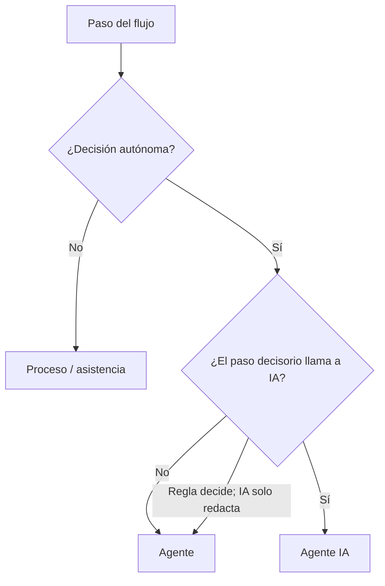
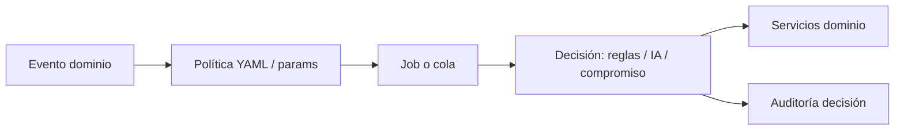

# Agentes autónomos — backlog de producto

> **Estado:** en implementación — ver [agentes-autonomos.md](../agentes-autonomos.md) y [plan](../planes/agentes-autonomos-implementacion.md). Ideas no comprometidas siguen en este archivo.

## De qué se trata

Un flujo con **paso de decisión autónoma** es uno — disparado por evento, cron o cola — en el que el sistema decide **en lugar de una persona en ese momento**, bajo al menos una de estas condiciones:

| Condición | Qué significa | Ejemplo |
|-----------|---------------|---------|
| **Compromiso** | Elige un desenlace concreto y **actúa** | Auto-reserva con opt-out; lab crítico → tarea staff |
| **Matices** | Factores contextuales que no bastan con una regla de un solo campo | Desempate entre slots válidos; priorizar async con triage + historial |
| **Volumen o datos no estructurados** | Cruzar muchos datos del HIS a tiempo, o interpretar texto/señales no tabuladas | Lista de espera multi-criterio; clasificar mensaje inicial en NL |

Si **ninguna** aplica → **proceso** o **asistencia**, no agente.

### Agente vs agente IA

| | **Agente** | **Agente IA** |
|---|------------|---------------|
| **Qué es** | Autonomía del sistema **sin** que el paso decisorio use IA | Autonomía del sistema **mediante** IA en el paso que elige o interpreta |
| **Cómo decide** | Reglas declaradas, scores en BD, políticas del efector, datos estructurados del paciente | Modelo de lenguaje u otro servicio IA sobre contenido del HIS (texto libre, síntesis) |
| **Auditoría** | Regla, score, candidatos — reproducible | Prompt, contexto acotado, salida + humano en el loop si aplica |
| **Costo / latencia** | Bajo; predecible | Mayor; planificar en catálogo de usos IA |

**Regla práctica:** si la decisión se puede expresar en metadata + SQL + servicios de dominio **sin** llamar a IA en ese paso → **agente**. Si **quitar la IA cambia el desenlace** (no solo el redactado del mensaje) → **agente IA**.

**Híbrido:** agente en el paso decisorio (p. ej. LOINC crítico) + IA solo para redactar el push → sigue siendo **agente**, no agente IA.

**Ejemplo (agente, no agente IA):** el paciente activa «reubicar automáticamente si cancelan mi turno» y comparte **datos estructurados**: franjas horarias preferidas, días laborables, modalidad tele/presencial, mismo PES si es posible. Ante una cancelación del médico, el sistema **elige un slot y reserva** con score declarado sobre agenda + preferencias en BD. No hace falta IA: hace falta **más datos del paciente en el HIS** y política del efector.

**Ejemplo (agente IA):** clasificar «me duele el pecho desde ayer» en banda y flujo, o **codificar CIE-10/SNOMED** desde la nota de evolución y persistir en `clinical_condition` — el paso decisorio **interpreta lenguaje natural** y **compromete** el código.

La implementación de ambos es servicio de dominio + job + metadata; no requiere un motor de «agents» comercial.

### Compromiso vs presentar opciones

| Paso | ¿Paso agente? | Por qué |
|------|---------------|---------|
| Push + grilla; paciente elige y reserva | No | Compromiso lo hace el **paciente**; la grilla ya expone candidatos |
| Push con 2–3 slots destacados | **No**, si es filtro trivial | Mismo PES, próximos huecos: atajo de UX |
| Push con 2–3 slots tras **score multi-criterio** en BD | **Sí** — agente D1 | Reglas + preferencias estructuradas; paciente puede confirmar |
| Sistema **reserva** un slot (opt-out) | **Sí** (compromiso) | Desenlace concreto sin elección previa del paciente |
| Lista de espera: a **quién** contactar primero | **Sí** (matices + volumen) | Fairness, triage, antigüedad — datos HIS en cantidad |
| Borrador de resumen o codificación diagnóstica desde texto clínico | **Sí** — agente **IA** D1/D2 | Interpretación de lenguaje natural; D03 persiste sin confirmación por código |
| Orden sugerido en bandeja async | **Sí** si prioriza con SLA + triage + antigüedad a escala | **No** si es sort por fecha obvio |

### Ejemplos por tipo de decisión

| Tipo | Ejemplo | Hoy suele hacerlo una persona |
|------|---------|-------------------------------|
| **Reserva** | Elegir miércoles 9:00 con PES X y persistir (opt-out) | Secretaría agenda por teléfono |
| **Juicio + datos** | Priorizar solicitud async entre 40 pendientes | Coordinador «a ojo» |
| **Clasificación + acto** | Lab crítico → notificar y abrir tarea | Staff revisa bandeja |
| **Interpretación NL** | «Me duele el pecho desde ayer» → banda + flujo (agente **IA**) | Recepción clasifica |
| **Preferencias + agenda** | Cancelación médica → auto-reserva miércoles 9:00 (agente **reglas**) | Secretaría llama al paciente |
| **Emparejamiento** | Vincular lab al encounter más probable | Admisión arrastra manualmente |
| **Rama operativa** | Sin respuesta 72 h → cancelar vs escalar | Secretaría hace seguimiento |

### Procesos que no son agentes

- Recordatorio T−48 h sin rama según contexto.
- Secuencia fija de onboarding o educación.
- Export FHIR, pull LIS sin clasificar ni actuar.
- FAQ con cita de metadata del efector.
- Checklist determinista («falta TA») sin interpretar texto libre.

No es el asistente conversacional del chat (reactivo). Los agentes de este documento son proactivos y event-driven.

## Cuándo conviene que el sistema decida

Priorizar como agente cuando el paso reúne **compromiso, matices o volumen** y el efector puede auditar la política:

| Criterio | Por qué conviene |
|----------|------------------|
| **Volumen y repetición** | Misma decisión cientos de veces al mes; nadie la escala manualmente (post-lab, lista de espera, async). |
| **Ventana de tiempo corta** | Hueco de agenda o SLA: no hay tiempo humano para cruzar datos. |
| **Matices con datos estructurados** | Historial, triage, preferencias de agenda en BD — score en metadata |
| **Matices en texto libre** | Motivos, NL, nota clínica — **agente IA** con contexto acotado del HIS |
| **Reglas explícitas donde alcancen** | LOINC, PES, nomenclador: decisión defendible sin caja negra. |
| **Reversibilidad u opt-out** | Auto-reserva, borradores, sugerencias: alguien puede corregir. |
| **Libera rol no clínico** | Secretaría y coordinación para excepciones y trato humano. |

Cuándo **no** conviene (o solo humano / solo IA asistida sin autonomía):

| Criterio | Por qué no |
|----------|------------|
| **Juicio clínico con responsabilidad legal (D4)** | Diagnóstico, prescripción, derivación guardia sin reglas verificables. |
| **Datos que no están en el HIS** | Cobertura OS, situación social no registrada — preguntar o derivar. |
| **Preferencia personal simple** | Horario «el que me quede mejor» sin política: grilla en app. |
| **Regla obvia en un clic** | «Falta TA» en checklist; umbral SLA en tablero. |
| **Comunicación sensible** | Mal pronóstico, abuso — solo humano. |

**Agente IA** solo cuando el **paso que cambia el desenlace** usa IA. Redactar el texto del push después de una regla LOINC sigue siendo **agente**.

Priorizar **agente** (reglas) antes que **agente IA** cuando alcanza: más barato, auditable y alineado a «más datos en el HIS, no más modelo».

## Grados de decisión

| Grado | Nombre | Qué hace el sistema | La persona después |
|-------|--------|---------------------|-------------------|
| **D1** | Juicio | Pesa matices o volumen HIS; propone o acota (slots scoreados, banda NL, orden async, borrador) | Confirma, elige entre lo propuesto o publica |
| **D2** | Elegir y actuar | Desenlace concreto + persistencia (reserva, cancelación, alerta, vincular, bloquear) | Opt-out, reversión o no intervino |
| **D3** | Orquestar ramas | Varias decisiones D1/D2 en el tiempo (multicanal, cascada lista de espera, reintentos) | Supervisión por auditoría |
| **D4** | ~~Clínico sin humano~~ | Diagnóstico, prescripción, derivación guardia sola | **Fuera de alcance** |

**No son agente:** atajos de UI sin juicio (grilla con filtro obvio), recordatorios fijos, FAQ, plantillas sin interpretar texto.

## Principios de diseño (alineado a arquitectura Bioenlace)

- **Trigger** → servicio de dominio o job; no `if` en `ChatOrchestrator`.
- **Política de la decisión** (umbrales, canales, plazos, elegibilidad) en **metadata** (`params`, YAML catálogo, futuro `autonomous_agents/*.yaml`).
- **Handler** registrable pequeño (`agent_id → callable`) si hace falta extensión de rubro.
- **Trazabilidad del paso de decisión**: alternativas consideradas, score o regla aplicada, uso de IA si hubo, desenlace (`agent_run` o equivalente de dominio).
- **Idempotencia** en acciones D2/D3.

## Relación con lo existente (parcial hoy)

| Proceso actual | Tipo | Notas |
|----------------|------|--------|
| Turno `en resolución` + push | Proceso | Paciente reubica en app |
| Reubicar como paciente | Proceso | Paciente elige y confirma |
| Auto-reserva con preferencias (futuro) | **Agente** | Opt-in + franjas/modalidad en BD; score sin IA |
| Shortlist scoreado en reoferta | **Agente** D1 | Reglas sobre HIS |
| Captura encounter + `analisis-consulta` | **Agente IA** D1 | Texto libre; médico revisa extracción de campos |
| Guardado encounter + `encounter-codificacion-automatica` | **Agente IA** D2 | IA elige CIE-10/SNOMED y persiste — **implementado** |
| Touchpoint cohorte + `care-followup-branching` | **Agente** D2 | Reglas YAML → push staff / educativo — **implementado** |
| Pull LIS / export FHIR | Proceso | Sin paso decisorio |
| Post-lab + `post-lab-classification` | **Agente** D2 | LOINC + umbrales → push — **implementado** |
| Cancelación turno + `turno-waitlist-fill` | **Agente** D2–D3 | FIFO + cascada TTL → reserva — **implementado (v1)** |
| Resolución sin respuesta + `turno-resolucion-multicanal` | **Agente** D3 | push → email/SMS + link firmado — **implementado (v1)** |
| Timeout reubicación + `turno-resolucion-loop-close` | **Agente** D2 | cancelar / escalar staff — **implementado (v1)** |
| Turno pendiente + `turno-antinoshow` | **Agente** D2 | score riesgo → confirmar / liberar cupo — **implementado (v1)** |

---

## Backlog resumido (prioridad sugerida)

Solo ítems con **paso de decisión** (compromiso, matices o volumen de datos HIS). Los marcados *proceso* no cumplen los tres criterios en la práctica habitual.

| ID | Flujo | Tipo | Paso de decisión | Grado | Prioridad |
|----|-------|------|------------------|-------|-----------|
| A03 | Relleno de huecos / lista de espera | **Agente** | A quién ofrecer; cascada y reserva | D2–D3 | ~~P0~~ **Hecho (v1 FIFO)** |
| B03 | Post-lab: clasificar y notificar | **Agente** | Crítico vs normal; tarea staff (LOINC) | D2 | ~~P0~~ **Hecho** |
| B01 | Touchpoints cohorte / plan | **Agente** | Respuesta estructurada → rama | D2 | ~~P0~~ **Hecho** |
| A02 | Negociación multicanal + cierre | **Agente** | Canal, escalar, timeout | D3 | ~~P0~~ **Hecho (v1)** |
| A01 | Auto-reserva en resolución (opt-out) | **Agente** | Slot por score + preferencias en BD | D2 | P1 |
| A06 | Cierre de loop (sin respuesta) | **Agente** | Cancelar / mantener / escalar | D2 | ~~P1~~ **Hecho (v1)** |
| A04 | Anti no-show predictivo | **Agente** | Liberar slot vs recordatorio | D2 | ~~P1~~ **Hecho (v1)** |
| A05 | Ruteo post-triage sin cupo | **Agente** | Canal por triage + cupos (reglas) | D1–D2 | P1 |
| H01 | Bandeja async priorizada | **Agente** | Orden por SLA + triage en BD | D1 | P1 |
| E01 | Asociar lab a encounter | **Agente** | Match fecha/pedido/PES | D2 | P1 |
| E02 | Reintentos integración (FHIR/RDI) | **Agente** | Requeue / dead-letter | D3 | P1 |
| E03 | Validar receta pre-envío RDI | **Agente** | Bloquear envío | D2 | P2 |
| B02 | Seguimiento post-alta | **Agente** | Igual que B01 | D2 | P1 |
| F02 | Sugerencia de cama | **Agente** | Ranking por atributos de cama | D1 | P2 |
| — | *Shortlist scoreado reoferta* | **Agente** | Top 2–3 por score | D1 | P1 |
| C03 | Clasificar puerta de entrada (NL) | **Agente IA** | Banda desde texto libre | D1–D2 | P1 |
| D02 | Resumen paciente al cerrar encounter | **Agente IA** | Borrador desde nota HC | D1 | P1 |
| D03 | Codificación automática CIE-10/SNOMED | **Agente IA** | IA elige códigos y el HIS persiste | D2 | ~~P2~~ **Hecho** |
| — | *Reoferta: push + grilla* | Proceso | Paciente reserva | — | **P0** |
| — | *A05 / I02 solo link* | Proceso | Paciente elige | — | varias |
| — | *B04, C01, F01, F03, B05, C02, G*, H02, I01* | Proceso / asistencia | Ver fichas | — | varias |

---

## Familia A — Turnos y agenda

### A01 — Reoferta de turnos en resolución

> **Clasificación:** grilla + push = **proceso** (P0). **Shortlist scoreado** = **agente** D1 (P1). **Auto-reserva con preferencias** = **agente** D2 (P1) — ver ejemplo abajo.

#### Proceso (P0 UX) — push + reubicación en app

| Campo | Valor |
|-------|--------|
| **Qué hace** | Push `TURNO_REQUIERE_REUBICACION`; paciente abre flujo `reubicar-como-paciente` |
| **Agente** | No — el paciente compromete al confirmar |
| **Base hoy** | [turnos.md](../turnos.md) paso 6, `TurnoResolucionService` |

#### Paso agente (P1) — shortlist scoreado (D1)

| Campo | Valor |
|-------|--------|
| **Tipo** | **Agente** — score en metadata + BD |
| **Paso de decisión** | Cruzar candidatos (PES, tele, `urgency_band`, preferencias **estructuradas**) y proponer top 2–3 |
| **Datos extra del paciente** | Franjas horarias, días laborables, modalidad — catálogo en perfil, no texto libre |
| **IA** | No en el paso decisorio |

#### Agente (P1) — auto-reserva con preferencias (D2)

| Campo | Valor |
|-------|--------|
| **Tipo** | **Agente** |
| **Paso de decisión** | Elegir **un** slot y **persistir** reprogramación |
| **Consentimiento** | Opt-in del paciente: «Reubicar automáticamente si cancelan mi turno» + preferencias en perfil |
| **Datos en BD (ejemplos)** | Franjas preferidas, días sin atención (trabajo/estudio), modalidad tele/presencial, mismo PES prioritario |
| **Política** | Score declarado en metadata del efector; sin candidato unívoco → no reserva (grilla o shortlist) |
| **Grado** | D2 — opt-out: «Te movimos al miércoles 9:00; cambiá si no podés» |
| **IA** | No — la calidad depende de **capturar preferencias estructuradas**, no de un modelo |
| **Trigger** | `Turno` en resolución + `auto_reserva_resolucion: true` en política efector |
| **Métricas** | % rechazos opt-out, tiempo en resolución, abandono |

**Casos de uso (agente — auto-reserva)**

1. **Preferencias cargadas:** María marcó «solo tardes» y tele. Cancelan su dermatólogo; el sistema reserva el jueves 17:00 tele con otro del mismo servicio y avisa con opt-out.
2. **Sin candidato:** Ningún slot cumple franjas + PES; **no** reserva — push + grilla o shortlist.
3. **Licencia masiva:** Mismo score para cientos de turnos; auditoría por `regla_id` + candidatos descartados.

**Casos de uso (agente — shortlist D1)**

1. Muchos PES y fechas; score en BD; push con 3 opciones — paciente confirma una.

**Casos de uso (proceso UX)**

1. Push + grilla completa; paciente elige como hoy.
2. Push con tres botones; paciente toca uno — **decisión del paciente**, el sistema solo ejecuta.

---

### A02 — Negociación multicanal (reprogramar)

> **Estado:** **implementado (v1)** — [turnos.md](../turnos.md), [agentes-autonomos.md](../agentes-autonomos.md). WhatsApp pendiente; cierre A06 v1 hecho.

| Campo | Valor |
|-------|--------|
| **Decisión del sistema** | Qué canal usar después; escalar a administración; rama tras timeout (con A06) |
| **Grado** | D3 |
| **Trigger** | Sin respuesta tras push de reubicación; o paciente responde «no puedo» |
| **Política** | Orden de canales: push → WhatsApp/SMS → email; tope de intentos; horario legal |
| **Efecto** | Hilo estructurado: CONFIRMAR / REAGENDAR / CANCELAR; la **reserva** sigue siendo del paciente salvo auto-reserva A01 |
| **Métricas** | Tasa respuesta por canal, costo mensajería, conversión a turno confirmado |

**Casos de uso**

1. **Push ignorado:** Pedro no abre la app en 24 h. El sistema envía WhatsApp (siguiente canal en política). Pedro responde «el jueves no» — se deriva a grilla o a coordinación; **no** es agente recalcular tres slots para mostrar.
2. **Idioma simple:** SMS con link a página mínima (token firmado) para que **Pedro** confirme el horario que elija.
3. **Conflicto de obra social:** El paciente indica «mi OS no atiende ese día». El sistema deriva a bandeja administrativa con resumen (decisión de escalamiento).

---

### A03 — Relleno de huecos / lista de espera

> **Estado:** **implementado (v1 FIFO)** — [turnos.md](../turnos.md), [agentes-autonomos.md](../agentes-autonomos.md). Cascada por TTL; score multi-criterio pendiente.

| Campo | Valor |
|-------|--------|
| **Decisión del sistema** | Qué paciente de la lista de espera contactar primero; reservar al confirmar en cascada |
| **Grado** | D2–D3 |
| **Política** | Cola por score: banda triage, crónico, distancia lead time, fairness (no saltear urgencias) |
| **Efecto** | Oferta en cascada al primer «sí»; actualiza turno y notifica al que perdió la carrera |
| **Métricas** | % huecos rellenados, lead time reducido, quejas por «me cortaron» |

**Casos de uso**

1. **Cancelación de último momento:** Cancelación 8:00, turno 9:00. El sistema elige el primer candidato en lista de espera (score en BD), le ofrece el hueco; si no confirma en 15 min, pasa al siguiente hasta reservar o agotar cola.
2. **Sobreturno ético:** Lista de espera solo para controles crónicos banda C; el agente no ofrece huecos de urgencia banda A a la lista (regla dura).
3. **Profesional con agenda hueca:** Viernes tarde con 2 slots vacíos; el agente agrupa ofertas a pacientes con `control_cronico` del servicio que llevan &gt; 90 días sin control.

---

### A04 — Anti no-show predictivo

> **Estado:** **implementado (v1)** — [turnos.md](../turnos.md), [agentes-autonomos.md](../agentes-autonomos.md). ML y teleconsulta avanzada pendientes.

| Campo | Valor |
|-------|--------|
| **Decisión del sistema** | Liberar slot a lista de espera si no confirma (rama D2, política estricta) |
| **Grado** | D2 |
| **Trigger** | T−48 h, T−2 h (configurable); score de riesgo alto |
| **Política** | Modelo simple primero: historial no-show + distancia + primera vez; luego ML |
| **Efecto** | Recordatorio extra, pedido confirmación explícita, oferta reprogramar antes del día |
| **Métricas** | Tasa no-show vs baseline, `GET turnos/indicadores-agenda` |
| **Base hoy** | Indicadores KPI ya expuestos |

**Casos de uso**

1. **Paciente rezagado:** Historial de 2 ausencias en 6 meses. A las 48 h el agente pide «Confirmá con un toque»; si no confirma a las 24 h, libera slot a lista de espera (política estricta del efector).
2. **Primera consulta:** Sin historial, riesgo medio: solo recordatorio 2 h con mapa y documentación a llevar (IA redacta según servicio).
3. **Teleconsulta:** Riesgo alto: a las 2 h envía link de video + test de conectividad; si no abre el link, staff recibe alerta opcional.

---

### A05 — Ruteo de demanda post-triage

> **Clasificación:** **D1** si pondera canal según triage + cupos en BD y recomienda; **D2** si crea `SOLICITUD_ASYNC` o turno alternativo sin elección; **proceso** si solo mensaje + link.

| Campo | Valor |
|-------|--------|
| **Agente** | D1–D2 — matices (triage, elegibilidad) + compromiso si abre flujo |
| **Trigger** | Fin de triage reserva sin banda A; sin cupo en servicio elegido |
| **Política** | `TeleconsultaElegibilidadService`, async `SOLICITUD_ASYNC`, primaria |
| **Efecto** | Mensaje: «No hay dermatólogo en 30 días; te ofrecemos…» + deep link al flujo correcto |
| **Métricas** | Conversión a canal alternativo, abandono, guardia evitable |

**Casos de uso**

1. **Renovación crónica:** Triage `control_cronico` + sin slots. El agente ofrece consulta async o tele con clínico del hub en 72 h en lugar de lista de 4 meses con especialista.
2. **Trámite administrativo:** `tramite_admin` → deriva a flujo sin médico (certificado, duplicado receta) si el efector lo habilita.
3. **Banda B sin especialista:** Ofrece turno clínica general con nota «derivación a especialista si corresponde» y pre-carga motivos para el médico.

---

### A06 — Cierre de loop (sin respuesta)

> **Estado:** **implementado (v1)** — [turnos.md](../turnos.md), [agentes-autonomos.md](../agentes-autonomos.md). Rama `keep_in_resolution` por política de efector pendiente.

| Campo | Valor |
|-------|--------|
| **Decisión del sistema** | Cancelar turno, mantener en cola o escalar a coordinación humana |
| **Grado** | D2 |
| **Trigger** | Timeout tras reoferta / multicanal (A02, ej. 72 h) |
| **Política** | Cancelar vs mantener en resolución; liberar cupo; notificar efector |
| **Efecto** | Estado terminal auditado; paciente informado |
| **Métricas** | Turnos huérfanos, reclamos |

**Casos de uso**

1. **Sin respuesta tras reoferta:** Tras 3 intentos multicanal, el turno se cancela, el cupo vuelve a disponible y el paciente recibe «Volvé a reservar cuando puedas» con link.
2. **Alta demanda:** El efector configura «no cancelar» sino mantener en cola prioritaria para próxima apertura de agenda.
3. **Crónico prioritario:** Excepción: paciente diabético sin control → escala a coordinación humana en lugar de cancelar automático.

---

## Familia B — Seguimiento y continuidad

### B01 — Touchpoints cohorte / plan de tratamiento

> **Estado:** **implementado (v1)** — [agentes-autonomos.md](../agentes-autonomos.md). Rama por reglas en `care-followup-branching.yaml`; auditoría `agent_run`.

| Campo | Valor |
|-------|--------|
| **Grado** | D2 |
| **Trigger** | Calendario del care-pack / ítem del plan (día +3, +7…) |
| **Política** | Respuestas rojas → alerta staff; amarillas → mensaje educativo; verde → solo registro |
| **Efecto** | Push + formulario corto; persistir en HC |
| **Base hoy** | [asistencia-cohortes.md](../asistencia-cohortes.md), `care-pack-followup-batch` |

**Casos de uso**

1. **Post IAM:** Día 3 post infarto: «¿Dolor en pecho al caminar?» Responde sí → enfermería recibe alerta y llama.
2. **HTA:** Semana 2: «¿Tomaste la medicación todos los días?» Adherencia baja → mensaje educativo + oferta turno control (enlace A05).
3. **Embarazo de riesgo:** Touchpoint con peso y presión; valores fuera de rango → derivación a guardia obstétrica (regla, no IA).

---

### B02 — Seguimiento post-alta (internación)

| Campo | Valor |
|-------|--------|
| **Grado** | D2 |
| **Trigger** | `Encounter` IMP finalizado / alta estructurada |
| **Política** | Plantilla por motivo de internación; días 1, 7, 30 |
| **Efecto** | Preguntas + checklist medicación; escalamiento |
| **Base hoy** | [internacion.md](../internacion.md) |

**Casos de uso**

1. **Cirugía:** Día 1 en casa: «¿Fiebre &gt; 38? ¿Herida enrojecida?» Sí → instrucciones guardia + aviso cirujano de guardia.
2. **Neumonía:** Día 7: «¿Mejoró la tos? ¿Terminó antibiótico?» No terminó → recordatorio adherencia.
3. **Alta social compleja:** El agente detecta falta teléfono cuidador en MPI → pide completar antes de seguimiento (ver C01).

---

### B03 — Post-lab: clasificar y notificar

> **Estado:** **implementado (v1)** — [laboratorio.md](../laboratorio.md), [agentes-autonomos.md](../agentes-autonomos.md).

| Campo | Valor |
|-------|--------|
| **Tipo** | **Agente** — LOINC y umbrales; IA opcional solo para redactar el push |
| **Trigger** | Ingesta FHIR `DiagnosticReport` / analitos |
| **Política** | Reglas por LOINC + umbrales; IA solo redacta mensaje |
| **Efecto** | Push paciente; flag staff si crítico |
| **Base hoy** | [laboratorio.md](../laboratorio.md) |

**Casos de uso**

1. **HbA1c elevada:** Resultado ingesta de LIS; regla marca «control requerido». Paciente: «Tu estudio muestra glucosa elevada; el equipo te contactará» + oferta turno.
2. **Normal:** «Todo dentro de rangos esperados; tu médico lo verá en la próxima consulta» — reduce llamadas.
3. **Crítico:** Potasio crítico → no solo notifica paciente «acudí urgencias»; abre tarea en bandeja médico de cabecera con SLA.

---

### B04 — Adherencia y refill crónica

> **Clasificación:** recordatorio y link; no compromete renovación — **proceso**.

| Campo | Valor |
|-------|--------|
| **Agente** | No — proceso |
| **Trigger** | Receta con duración conocida; T−7 días fin tratamiento |
| **Política** | Solo crónicos en plan; no sustitutos controlados sin médico |
| **Efecto** | Recordatorio + link async renovación o turno |
| **Base hoy** | [receta-electronica.md](../receta-electronica.md), planes |

**Casos de uso**

1. **Losartán 30 días:** Día 23: «Te quedan ~7 días; ¿necesitás renovar?» → flujo async si política del efector lo permite.
2. **Insulina:** No ofrece renovación automática; solo recordatorio de turno control endocrino.
3. **Farmacia sin stock:** Paciente responde «no conseguí» → se registra barrera de adherencia y se notifica coordinación (no cambia dosis).

---

### B05 — Educación post-consulta diferida

> **Clasificación:** proceso automático, no agente — secuencia fija de contenido; no elige rama según contexto del paciente.

| Campo | Valor |
|-------|--------|
| **Agente** | No — proceso |
| **Trigger** | T+N según diagnóstico orientativo / servicio |
| **Política** | Contenido aprobado por protocolo; IA adapta redacción |
| **Efecto** | Secuencia educativa en app |
| **Ver** | [seguimiento-post-consulta-educacion.md](./seguimiento-post-consulta-educacion.md) |

**Casos de uso**

1. **Diabetes nuevo:** Día 3 post consulta: qué es HbA1c, señales hipoglucemia (sin cambiar tratamiento).
2. **Lumbalgia:** Día 1: ergonomía; día 14: cuándo volver si no mejoró.
3. **Pediatría fiebre:** Padre recibe «mitos y verdades» 12 h post consulta para reducir reconsulta ansiosa.

---

## Familia C — Demanda e intake

### C01 — Intake / completar MPI

> **Clasificación:** orden de campos en formulario — **proceso**.

| Campo | Valor |
|-------|--------|
| **Agente** | No — proceso |
| **Trigger** | Registro incompleto; pre-turno; pre-video |
| **Política** | Campos obligatorios por tipo de atención |
| **Efecto** | Mensajes progresivos hasta completar |

**Casos de uso**

1. **Sin teléfono:** Antes de teleconsulta, bloquea link de video hasta validar móvil.
2. **Obra social faltante:** Autogestión turno especialista requiere OS; agente pide foto credencial (futuro OCR) o selección catálogo.
3. **Representante:** Menor sin tutor vinculado → flujo delegación antes de confirmar turno.

---

### C02 — Briefing pre-atención al staff

> **Clasificación:** proceso automático, no agente — agrega y resume datos; el médico interpreta y decide en la consulta.

| Campo | Valor |
|-------|--------|
| **Agente** | No — asistencia |
| **Trigger** | T−15 min turno o al abrir «Pacientes del día» |
| **Política** | `PatientAiContextBuilder` perfiles `motivos` / `encounter` |
| **Efecto** | Panel: motivos resumidos, labs 90 días, meds, alergias, banda triage |
| **Base hoy** | `motivos-consulta-batch`, insights |

**Casos de uso**

1. **Clínica saturada:** El médico abre el turno de las 9:00 y ve 4 líneas: motivo IA, alergia penicilina, último LDL, «paciente ansioso por dolor torácico atípico» (del chat motivos).
2. **Primera vez:** Sin historial interno; briefing muestra datos Didit + «sin labs previos en sistema».
3. **Teleconsulta:** Incluye «elegibilidad remota: sugerida» y link directo a sala cuando corresponda.

---

### C03 — Clasificar puerta de entrada

> **Tipo:** **Agente IA** cuando el mensaje inicial es texto libre. **Agente** si el flujo solo consume triage estructurado (wizard con bandas fijas).

| Campo | Valor |
|-------|--------|
| **Tipo** | Agente IA (NL) / Agente (solo árbol estructurado) |
| **Trigger** | Mensaje inicial asistente / WhatsApp futuro / IVR |
| **Política** | Árbol + IA fallback; banda A → guardia |
| **Efecto** | Deep link al flujo correcto |

**Casos de uso**

1. **«Me duele el pecho»:** Clasificador + reglas → banda A → «Dirigite a guardia» sin ofrecer turno ambulatorio.
2. **«Quiero repetir la receta»:** → async o turno crónico según política.
3. **«¿Cuánto cuesta la consulta?»:** → FAQ administrativo, sin consumir slot clínico.

---

## Familia D — Documentación clínica (asistida)

### D01 — Huecos en nota + pedir completar

> **Clasificación:** asistencia (checklist); el médico completa o dicta — no agente.

| Campo | Valor |
|-------|--------|
| **Agente** | No — proceso |
| **Trigger** | Post `analisis-consulta`; checklist por `encounter_class` |
| **Política** | Campos obligatorios por servicio |
| **Efecto** | «Falta TA y peso» → prompt voz/texto antes de firmar |
| **Base hoy** | [captura-clinica.md](../captura-clinica.md) |

**Casos de uso**

1. **Control HTA:** Médico dicta evolución pero no tensiones; agente pide «decí TA ahora» antes de guardar.
2. **Pediatría:** Falta peso/talla percentil → bloqueo suave hasta completar.
3. **Guardia:** Campos triage ENARM incompletos → lista en sidebar.

---

### D02 — Resumen paciente al cerrar encounter

> **Tipo:** **Agente IA** — interpreta y redacta desde texto del encounter; publica el humano.

| Campo | Valor |
|-------|--------|
| **Tipo** | Agente IA |
| **Trigger** | Encounter `finished` |
| **Política** | Lenguaje simple; sin jerga; extiende resumen actual |
| **Efecto** | Borrador en `resumen-atencion-paciente` |
| **Base hoy** | [resumen-atencion-paciente.md](../resumen-atencion-paciente.md) |

**Casos de uso**

1. **Consulta aguda:** «Tomá ibuprofeno 3 días; volvé si fiebre &gt; 38» + link receta PDF.
2. **Estudios pedidos:** Explica en criollo qué es la resonancia y ayuno requerido.
3. **Derivación:** «Te derivamos a cardiología; reservá turno desde la app cuando te llegue el aviso».

---

### D03 — Codificación automática CIE-10 / SNOMED

> **Estado:** **implementado** — [captura-clinica.md](../captura-clinica.md), [agentes-autonomos.md](../agentes-autonomos.md).

> **Tipo:** **Agente IA** D2 — la IA **elige** códigos desde texto libre y el backend **persiste** en `clinical_condition`; no hay UI de sugerencias para confirmar código a código.

| Campo | Valor |
|-------|--------|
| **Tipo** | Agente IA |
| **Grado** | D2 — compromiso (código guardado) |
| **Trigger** | `EncounterDocumentationService::guardar` tras persistir datos extraídos |
| **Contexto IA** | `encounter-codificacion-automatica` (`EncounterAutomaticCodingService`) |
| **Política** | `encounter_auto_codificacion_habilitada` (params); `verification_status` = PROVISIONAL |
| **Efecto** | `Condition` con `code` + `code_system` (CIE-10 y/o SNOMED) |
| **Base hoy** | Prompt en `clinical-text-ia.yaml`; integrado en guardar encounter |

**Casos de uso**

1. **IVAS + sinusitis:** Tras guardar evolución, el sistema codifica J01.9 (+ SNOMED si aplica) sin paso extra del médico.
2. **Comorbilidades:** Secundarios para estadística hospitalaria codificados en el mismo guardado.
3. **Guardia:** Código motivo consulta para tablero epidemiológico al cerrar documentación.

**No es D03:** `motivos-consulta-insights` (hipótesis orientativas pre-consulta, sin persistir como Condition).

---

## Familia E — Integraciones e interoperabilidad

### E01 — Asociar lab a encounter

| Campo | Valor |
|-------|--------|
| **Grado** | D2 |
| **Trigger** | Lab ingestado sin `encounter_id` |
| **Política** | Match por fecha, pedido, profesional solicitante |
| **Efecto** | Vincula `DiagnosticReport` al encounter abierto más probable |

**Casos de uso**

1. **Pedido en consulta lunes:** Resultado miércoles → se adjunta al encounter del lunes automáticamente.
2. **Ambigüedad:** Dos encounters misma semana → staff elige en bandeja «pendientes vincular» (no auto-vincular).
3. **Sin encounter:** Guarda huérfano y B03 notifica igual al paciente.

---

### E02 — Reintentos integración (FHIR HC, RDI, LIS)

| Campo | Valor |
|-------|--------|
| **Grado** | D3 |
| **Trigger** | Job fallido; backoff exponencial |
| **Política** | `clinicalHistoryExchange.retry`, conectores |
| **Efecto** | Requeue, alerta ops, dead-letter |
| **Base hoy** | Plan interoperabilidad HC |

**Casos de uso**

1. **Ministerio caído:** Export Bundle falla 5 veces → dead-letter + ticket ops; reintento manual.
2. **Token OAuth expirado:** Refresh automático y un reintento antes de escalar.
3. **RDI rechazo validación:** No reintenta ciego; notifica farmacia clínica con motivo.

---

### E03 — Validar receta pre-envío RDI

| Campo | Valor |
|-------|--------|
| **Grado** | D2 |
| **Trigger** | Pre-submit receta digital |
| **Política** | Nomenclador, matrícula, campos obligatorios MSAL |
| **Efecto** | Bloquea envío; mensaje al prescriptor |

**Casos de uso**

1. **Genérico mal codificado:** Agente detecta antes de RDI; médico corrige en 1 clic.
2. **Receta controlada sin firma válida:** Bloqueo duro.
3. **Duplicado:** Misma molécula 24 h → advertencia interacción administrativa.

---

## Familia F — Guardia e internación

### F01 — Alerta SLA tablero guardia

> **Clasificación:** umbral visual — **asistencia**, no agente.

| Campo | Valor |
|-------|--------|
| **Agente** | No — asistencia |
| **Trigger** | Tiempo espera &gt; SLA por triage level |
| **Política** | Umbrales por efector; sonido futuro |
| **Efecto** | Highlight + sugerencia «atender box 3» |
| **Base hoy** | [urgencias-guardia.md](../urgencias-guardia.md) |

**Casos de uso**

1. **ESI 2 &gt; 15 min:** Tablero rojo; coordinador recibe push.
2. **Saturación:** Sugiere abrir box adicional (informe, no ejecuta).
3. **Falso positivo:** Enfermería marca «atendido en pasillo» y aprende excepción (log, no ML opaco).

---

### F02 — Sugerencia de cama

> **Clasificación:** paso agente **D1** — matices (aislamiento, O2, especialidad) sobre mapa de camas; enfermería confirma.

| Campo | Valor |
|-------|--------|
| **Agente** | D1 — matices + volumen |
| **Trigger** | Solicitud ingreso desde guardia |
| **Política** | Sexo, aislamiento, especialidad, oxígeno |
| **Efecto** | Ranking camas; humano confirma |
| **Base hoy** | Mapa camas |

**Casos de uso**

1. **Neumonía + O2:** Sugiere cama con toma de oxígeno en piso 3.
2. **Pediatría:** Solo camas pediátricas libres; si no hay, alerta gestión.
3. **COVID histórico:** Aislamiento según protocolo vigente en metadata.

---

### F03 — Borrador epicrisis + checklist alta

> **Clasificación:** borrador y checklist; cierra el humano — **asistencia**.

| Campo | Valor |
|-------|--------|
| **Agente** | No — proceso |
| **Trigger** | Inicio proceso alta |
| **Política** | Plantilla ABM epicrisis |
| **Efecto** | Borrador desde encounters + labs; checklist pendientes |

**Casos de uso**

1. **Alta médica:** Epicrisis 80 % completa; falta firma y receta egreso.
2. **Alta social:** Checklist «¿tiene domicilio? ¿cuidador?» antes de cerrar.
3. **Turno control:** Checklist sugiere pedir control; el staff o paciente reserva (proceso normal de turnos).

---

## Familia G — Población y dirección

### G01 — Identificar cohortes poblacionales

> **Clasificación:** proceso automático, no agente — query con reglas fijas; la campaña o intervención la define dirección.

| Campo | Valor |
|-------|--------|
| **Agente** | No — asistencia |
| **Trigger** | Job nocturno |
| **Política** | Queries + reglas (no LLM para elegibilidad) |
| **Efecto** | Lista para campañas / care-packs |

**Casos de uso**

1. **Diabéticos sin HbA1c 12 meses:** Lista para efector primaria.
2. **Embarazadas sin control 2do trimestre:** Campaña preventiva.
3. **No-show crónico:** Cohort para intervención social (no penalización automática).

---

### G02 — Informe narrativo dirección

> **Clasificación:** proceso automático, no agente — narrativa sobre KPIs agregados; sin decisión operativa sobre pacientes.

| Campo | Valor |
|-------|--------|
| **Agente** | No — asistencia |
| **Trigger** | Fin de mes |
| **Política** | Solo datos agregados; sin PHI en prompt |
| **Efecto** | PDF «En marzo bajó no-show 2 pp; subió tele 15 %» |

**Casos de uso**

1. **Director médico:** Narrativa + gráficos desde KPIs existentes.
2. **Ministerio:** Export agregado para reporte provincial.
3. **Comparación efectores:** Red multi-sede.

---

## Familia H — Staff y operaciones

### H01 — Bandeja async priorizada

> **Clasificación:** paso agente **D1** — orden entre muchas solicitudes con SLA, triage e historial en BD.

| Campo | Valor |
|-------|--------|
| **Agente** | D1 — volumen + matices |
| **Trigger** | Nueva `SOLICITUD_ASYNC` o mensaje paciente |
| **Política** | SLA, banda triage, antigüedad |
| **Efecto** | Orden sugerido en bandeja staff |
| **Base hoy** | [atencion-remota-async.md](../atencion-remota-async.md) etapa 3+ |

**Casos de uso**

1. **20 solicitudes pendientes:** Crónica simple abajo; «dolor pecho leve» sube con SLA corto.
2. **Vencimiento SLA:** Escalado a médico de guardia virtual.
3. **Cierre:** Si médico responde, agente notifica paciente y cierra encounter async.

---

### H02 — FAQ operativo del efector (staff)

> **Clasificación:** proceso automático, no agente — recupera metadata; no elige acción clínica ni administrativa.

| Campo | Valor |
|-------|--------|
| **Agente** | No — asistencia |
| **Trigger** | Pregunta staff en asistente |
| **Política** | Solo metadata efector; sin inventar clínica |
| **Efecto** | Respuesta con cita de fuente interna |

**Casos de uso**

1. **«¿Horario guardia verano?»** → respuesta desde config efector.
2. **«¿Cómo cargo sobreturno?»** → enlace intent operativo.
3. **Pregunta clínica:** Deriva «eso lo resuelve el protocolo X» con link, no improvisa.

---

## Familia I — Paciente: onboarding y navegación

### I01 — Onboarding post-registro Didit

> **Clasificación:** proceso automático, no agente — calendario fijo de mensajes; sin ramificación por perfil salvo variantes declaradas aparte.

| Campo | Valor |
|-------|--------|
| **Agente** | No — proceso |
| **Trigger** | Registro exitoso `RegistroService` |
| **Política** | Secuencia 3 días |
| **Efecto** | Tutoriales, completar perfil, primer uso asistente |

**Casos de uso**

1. **Paciente nuevo:** Día 0: cómo reservar turno; día 1: motivos pre-consulta.
2. **Médico nuevo:** Verificación REFEPS pendiente → mensajes distintos.
3. **Abandono:** Si no reserva en 14 días, mensaje suave sin spam.

---

### I02 — Guía «qué canal usar»

> **Clasificación:** recomendación + link; el paciente sigue el flujo — no agente salvo que el sistema **inicie** el canal sin elección.

| Campo | Valor |
|-------|--------|
| **Agente** | No — proceso |
| **Trigger** | «Necesito atención» sin claridad |
| **Política** | Árbol decisión: guardia / turno / async / admin |
| **Efecto** | Un solo camino recomendado con explicación |

**Casos de uso**

1. **Síntoma leve 3 días:** Recomienda turno ambulatorio, no guardia.
2. **Receta crónica:** Async si habilitado; si no, turno control.
3. **Trámite copia informe:** Administrativo digital sin médico.

---

## Fuera de alcance (D4 — decisión clínica sin humano)

| Acción | Por qué |
|--------|---------|
| Diagnosticar y prescribir sin médico | Responsabilidad legal y seguridad |
| Derivar a guardia solo por «IA sintió urgencia» | Debe pasar por bandas/reglas verificables |
| Modificar tratamiento activo | Siempre prescriptor humano |
| Priorizar guardia sin supervisión enfermería | Sesgo + riesgo |
| Decidir cobertura obra social | Motor del financiador |
| Comunicar mal pronóstico / abuso | Solo humano |

---

## Implementación sugerida (cuando se priorice)

Misma pila que cualquier job de dominio: evento → política en metadata → servicio que **decide y actúa** → auditoría de la decisión.

1. **Fase 0:** Preferencias de agenda en perfil paciente + política score; auditoría agente vs agente IA.
2. **Fase 1:** ~~Agentes P0~~ completada (~~B01~~ ~~B03~~ ~~A03~~ ~~A02 v1~~).
3. **Fase 2:** A01 auto-reserva + shortlist; H01; ~~A04~~ v1 hecho; ~~A06~~ v1 hecho.
4. **Fase 3:** Agentes E01/E02; C03/D02 como **agente IA** donde aplique NL.
5. **Fase 4:** D03 (codificación automática), F02; redacción IA en pushes ya decididos por regla.

Contextos **agente IA** (paso decisorio usa modelo): clasificación NL puerta de entrada, borrador resumen paciente, `encounter-codificacion-automatica`, `analisis-consulta`.

Contextos **agente** (solo redacción opcional con IA): texto del push post-LOINC, mensajes de touchpoint — la rama ya la fijó la regla.

Registrar en `catalogo-usos-ia.md` solo los **agente IA** y los subpasos de redacción si se facturan aparte.

---

## Documentos relacionados

- [Turnos](../turnos.md) · [Triage reserva](../triage-reserva-turno.md) · [Atención remota/async](../atencion-remota-async.md)
- [Asistencia cohortes](../asistencia-cohortes.md) · [Planes de tratamiento](../planes-de-tratamiento.md)
- [Catálogo usos IA](../catalogo-usos-ia.md) · [Arquitectura asistente](../../arquitectura/asistente-motores.md)
- [Seguimiento post-consulta](./seguimiento-post-consulta-educacion.md) · [Contexto asistencia dinámica](./contexto-asistencia-dinamica.md)
