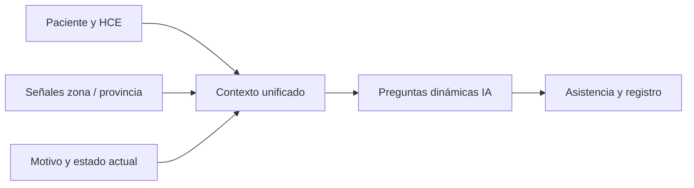

# Contexto clínico amplio y preguntas dinámicas al asistir

> **Estado:** idea a futuro — no implementado como flujo unificado.

## De qué se trata

Al **asistir a un paciente**, el sistema debería reunir la **mayor cantidad de contexto útil** antes y durante la interacción, y usar ese contexto para que las **preguntas de asistencia no sean fijas**: la IA las genera según la situación concreta del paciente y del entorno epidemiológico.

## Qué contexto queremos acumular

| Dimensión | Ejemplos |
|-----------|----------|
| **Persona y etapa de vida** | Edad, etapa vital, antecedentes conocidos. |
| **Estado actual** | Condición del paciente, motivo de consulta, síntomas en curso. |
| **Historia en Bioenlace** | Consultas previas, atenciones recientes, tratamientos y resultados ya cargados. |
| **Entorno epidemiológico** | Enfermedades que están **prevaleciendo** en la zona, provincia o red (señales agregadas, no solo el expediente individual). |

La hipótesis es que **más volumen de contexto bien estructurado** mejora la relevancia de lo que se pregunta y de lo que se sugiere, sin convertir la consulta en un cuestionario genérico largo.

## Comportamiento deseado

1. **Recopilar** contexto desde datos ya persistidos (HCE, turnos, laboratorio, motivos) y desde lo que el paciente o el profesional aporta en el momento.
2. **Enriquecer** con señales de prevalencia regional cuando existan fuentes confiables (catálogos, alertas sanitarias, agregados internos).
3. **Generar preguntas dinámicas** con IA: el siguiente paso del asistente o de la captura conversacional depende de lo que falte aclarar para esa persona en ese contexto, no de un script único para todos.
4. **Priorizar** lo clínicamente relevante y lo que desbloquea decisión (triage, derivación, registro estructurado), evitando fatiga por preguntas redundantes.

## Actores

- **Paciente** — responde en chat, motivos de consulta, app móvil.
- **Profesional** — captura clínica, valida y completa lo que la IA propone.
- **Sistema** — ensambla contexto, llama a modelos con políticas de uso y permisos, persiste solo lo autorizado.

## Principios de diseño

- **Una sola fuente de verdad clínica:** la API de dominio; el asistente no inventa hechos, solo guía y estructura.
- **RBAC y mínima exposición:** el contexto que ve la IA debe respetar rol (paciente vs staff) y efector.
- **Trazabilidad:** qué contexto se usó y qué preguntas se generaron, para auditoría y mejora del prompt.
- **Degradación:** si faltan datos epidemiológicos o historial, el flujo sigue con preguntas más acotadas.

## Relación con lo existente

- Motivos de consulta y triage de reserva: [triage-reserva-turno.md](../triage-reserva-turno.md).
- Captura en el encuentro: [captura-clinica.md](../captura-clinica.md).
- Contextos de IA ya instrumentados: [catalogo-usos-ia.md](../catalogo-usos-ia.md) (habría nuevos contextos si esto se implementa).

## Preguntas abiertas

- ¿De dónde vienen las **prevalencias** (integración externa, tablero interno, actualización manual)?
- ¿En qué **momentos** del circuito se generan preguntas (pre-turno, sala de espera, durante consulta, solo paciente móvil)?
- ¿Cómo se **valida** clínicamente una pregunta generada antes de mostrarla al paciente?
