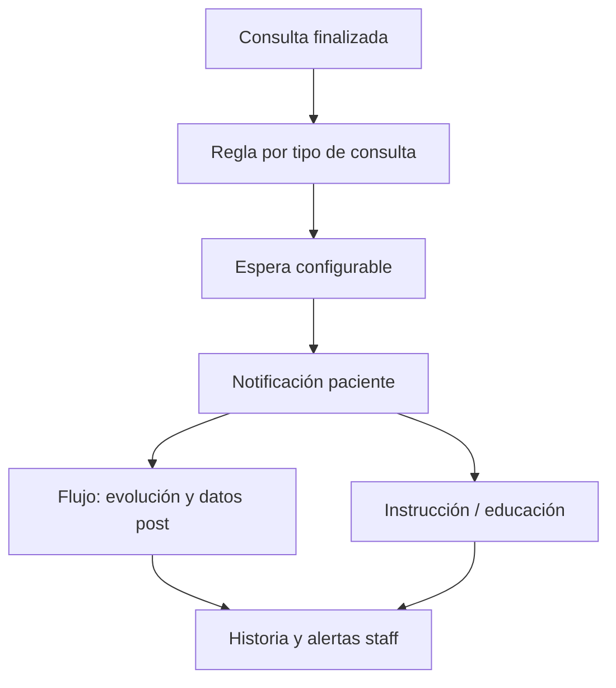

# Seguimiento post-consulta y educación al paciente

> **Estado:** idea a futuro — parcialmente alineado con resumen y care plans actuales, sin el circuito completo descrito aquí.

## De qué se trata

Además de atender en el momento de la consulta, Bioenlace podría **instruir a la población sobre sus enfermedades** y **seguir la evolución** después del encuentro: notificaciones diferidas, preguntas de cómo siguió el cuadro y espacio para que el paciente cargue información del post-consulta, aprovechando cada contacto para que el paciente **se vaya conociendo más** sobre su salud.

## Comportamiento deseado

1. **Tras la consulta**, según tipo de atención, diagnóstico orientativo o plan acordado, el sistema programa un **seguimiento en el tiempo** (no inmediato; depende del caso).
2. **Notificación al paciente** (push, y/o canal acordado): “¿Cómo evolucionó?” con enlace a un flujo breve en la app o asistente.
3. **Carga de información del post-consulta:** síntomas residuales, adherencia, efectos adversos, controles realizados — datos estructurados cuando sea posible.
4. **Capa educativa:** en el mismo contacto (o en secuencia), material o mensajes adaptados a **su** situación (no folleto genérico): qué esperar, cuándo volver a consultar, hábitos, señales de alarma.
5. **Cierre del ciclo:** lo reportado alimenta la HCE y puede disparar alertas al equipo si la evolución es desfavorable.

## Qué aporta respecto al resumen actual

Hoy, al cerrar una atención ambulatoria, el paciente recibe un **resumen legible** y notificación de publicación ([resumen-atencion-paciente.md](../resumen-atencion-paciente.md)). Esta idea **extiende** el vínculo en el tiempo:

| Hoy (resumen) | Idea (seguimiento) |
|---------------|-------------------|
| Entrega única al publicar | Contactos **programados** según el caso |
| Narrativa de lo ocurrido | **Pregunta activa** por evolución |
| Enlaces a recetas y estudios | **Educación** progresiva sobre la condición |
| Principalmente lectura | **Captura** de datos del post-consulta |

## Actores

- **Paciente** — responde notificaciones, completa flujos cortos, consume educación en su idioma y nivel.
- **Profesional / equipo** — define o hereda reglas de seguimiento; revisa respuestas y alertas.
- **Sistema** — agenda contactos, personaliza contenido con IA bajo supervisión clínica, respeta consentimiento y frecuencia.

## Principios de diseño

- **Timing clínico:** el delay y la frecuencia dependen del motivo (agudo vs crónico), no un solo “T+7 días” para todos.
- **No saturar:** pocas notificaciones, valor claro en cada una; opt-out y preferencias del paciente.
- **Contenido responsable:** educación revisable por protocolos; la IA redacta o adapta, no reemplaza criterio médico sin supervisión.
- **Misma API y mismos permisos:** lo que el paciente carga en el post-consulta es dominio clínico persistido como cualquier otro dato.

## Relación con lo existente

- Resumen y push post-consulta: [resumen-atencion-paciente.md](../resumen-atencion-paciente.md).
- Recordatorios y adherencia: [planes-de-tratamiento.md](../planes-de-tratamiento.md).
- Conversación y acciones: [asistente-y-chat.md](../asistente-y-chat.md).

## Preguntas abiertas

- ¿Quién **define las reglas** de seguimiento (plantillas por servicio, por diagnóstico, manual por profesional)?
- ¿El flujo post-consulta es **solo paciente** o también interviene staff ante respuestas de riesgo?
- ¿Cómo se mide **efectividad** (adherencia educativa, reconsultas evitables, detección temprana de empeoramiento)?
